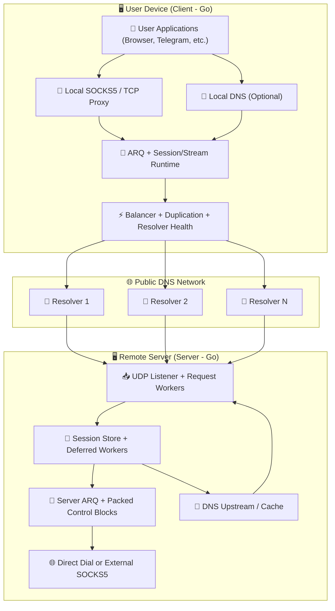
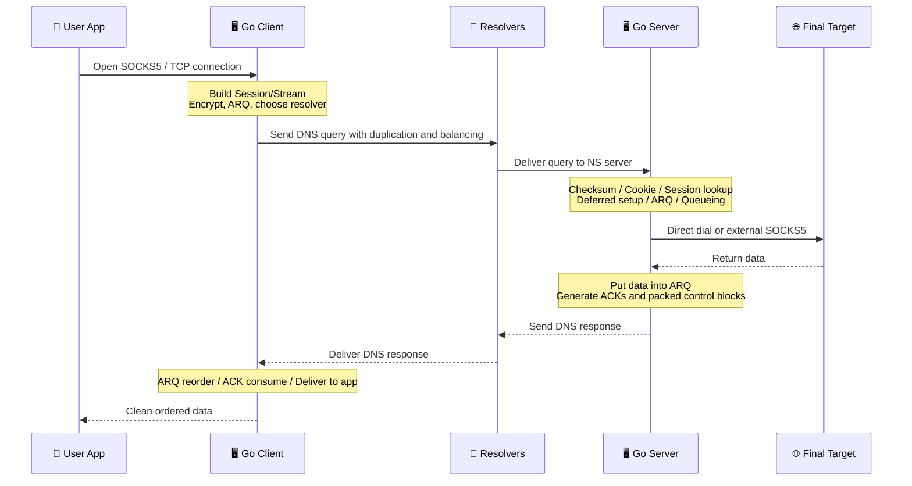

# MasterDnsVPN Project 🚀

## [نسخه فارسی](https://github.com/masterking32/MasterDnsVPN/blob/main/README_FA.MD) | [English Version](https://github.com/masterking32/MasterDnsVPN/blob/main/README.MD) | [Spanish Version](https://github.com/masterking32/MasterDnsVPN/blob/main/README_ES.MD)

The **MasterDnsVPN** project is a robust, low-overhead, and advanced DNS tunneling solution that carries TCP traffic inside DNS queries and responses. The current version is fully implemented in **Go**, and its primary optimized path is designed for **SOCKS5 over DNS**.

This system is specifically aimed at environments where classic VPN methods or well-known tunnels suffer from severe disruption, high packet loss, strict MTU limits, or aggressive resolver blocking.

The main goal of **MasterDnsVPN** is to provide a secure, reliable, and flexible tunnel with minimal protocol overhead and stable behavior even on poor-quality links.

---

❌ Disclaimer: This project is provided for educational and research purposes only. Its use may conflict with local laws or network policies, and users are solely responsible for how they use it.

---

# Announcement Channel 📢

### For the latest news, updates, and changes related to this project, please follow our Telegram channel: [Telegram Channel](https://t.me/masterdnsvpn)

---

You can support this project for free by starring the repository on GitHub ⭐

If you want to support it financially, you can use the following channels:

TON: `masterking32.ton`

EVM-compatible blockchains: `0x517f07305D6ED781A089322B6cD93d1461bF8652`

TRC20 chain: `TLApdY8APWkFHHoxebxGY8JhMeChiETqFH`

---

## Key Features & Advantages ✨

- **Bypassing strict censorship:** 🛡️ Purpose-built to increase the chance of crossing restrictive firewalls and network policies that block ordinary VPN protocols.
- **Fully implemented in Go:** ⚙️ The client, server, ARQ layer, queue runtime, resolver balancing, resolver health, and session handling are all implemented in Go in the current version.
- **Load balancing and resolver diversity:** ⚡ Supports multiple DNS resolvers with random, round-robin, least-loss, and lowest-latency selection strategies using real runtime feedback.
- **Multipath packet duplication:** 📡 The same packet can be sent through multiple resolvers at once. This increases bandwidth usage, but dramatically improves survivability on lossy links.
- **Custom protocol and custom ARQ with very low overhead:** 🔄 Instead of QUIC, this project uses its own protocol and ARQ layer. Because of that, packet overhead is kept extremely low and can go down to **7 bytes** in the lightest case.
- **Resolver health and auto-reactivation:** 🧠 Weak resolvers can be auto-disabled at runtime, rechecked in the background with the synced MTU, and added back once healthy again.
- **MTU discovery and synchronization:** 🧰 The client probes resolvers, measures upload/download MTU, filters out weak paths, and works on a shared synced MTU.
- **Dedicated SOCKS5 optimization:** 🧦 The primary runtime path is optimized for SOCKS5, and its setup, ACK flow, and control path are more refined than the generic path.
- **Packed Control Blocks:** 📦 The server can batch small ACK and control packets together into compact blocks to reduce response count and overhead.
- **Stream-aware resolver routing:** 🌐 Each stream can keep a preferred resolver and fail over in a controlled way after repeated resends.
- **Compression and small-packet packing:** 🗜️ Optional compression and batching help reduce request count and make better use of each MTU.
- **Strong and flexible encryption:** 🔐 Supports `XOR`, `ChaCha20`, `AES-128-GCM`, `AES-192-GCM`, and `AES-256-GCM`.
- **Optional local DNS on the client:** 📛 The client can expose a local DNS service and forward local DNS queries through the tunnel if needed.

---

# Setup Guide 🧑‍💻

## Section 1: Network Prerequisites (DNS Configuration) 🛠️

For your server to receive and process DNS queries directly, you must delegate a subdomain to your own server. Open your DNS management panel and create the following two records:

### Step 1.1: Create an A Record (Server IP) 🅰️

- **Record Type:** `A`
- **Name:** a short arbitrary name such as `ns`
- **IPv4 Address:** your server IP

> **Result:** `ns.example.com -> 1.2.3.4`

### Step 1.2: Create an NS Record (Tunnel Subdomain) 🏷️

- **Record Type:** `NS`
- **Name:** the tunnel subdomain, for example `v`
- **Target / Nameserver:** the A record from the previous step

> **Result:** `v.example.com -> ns.example.com`

---

## Section 1.3: Important Warning for Cloudflare Users ⚠️

If you use Cloudflare, the `A` record for your nameserver **must** be set to **DNS only**. If proxying is enabled, UDP port `53` will not pass through and the tunnel will not work.

## Section 1.4: Golden Tip for Better Speed (MTU) 💡

In DNS, domain length consumes part of the limited payload space of each request. The shorter your domain and labels are, the more room remains for actual data.

---

## Section 2: Installation and Execution (Client and Server) 🚀

You can run this project in two ways:

1. Use the prebuilt binaries
2. Build and run directly from the **Go** source

### Step 2.1: Use the Prebuilt Binaries (Recommended ✅)

For convenience, the client and server binaries are published in the release page. Download the correct build for your operating system and extract it.

> 💡 **Note:** Release archives usually include the executable and sample config files.

#### Client Download Links 📥

| Operating System | Architecture | Suitable For | Direct Download |
| :--- | :--- | :--- | :--- |
| Windows 🪟 | `AMD64` (64-bit) | Windows 10 and 11 | [Download Windows Client ⬇️](https://github.com/masterking32/MasterDnsVPN/releases/latest/download/MasterDnsVPN_Client_Windows_AMD64.zip) |
| macOS 🍎 | `ARM64` | Apple Silicon Macs (M1 / M2 / M3) | [Download macOS Client ⬇️](https://github.com/masterking32/MasterDnsVPN/releases/latest/download/MasterDnsVPN_Client_MacOS_ARM64.zip) |
| Linux 🐧 | `AMD64` (64-bit) | Modern distros (Ubuntu 22.04+, Debian 12+) | [Download Linux Client ⬇️](https://github.com/masterking32/MasterDnsVPN/releases/latest/download/MasterDnsVPN_Client_Linux_AMD64.zip) |
| Linux Legacy 🐧 | `AMD64` (64-bit) | Older distros (Ubuntu 20.04, Debian 11) | [Download Linux Legacy Client ⬇️](https://github.com/masterking32/MasterDnsVPN/releases/latest/download/MasterDnsVPN_Client_Linux-Legacy_AMD64.zip) |
| Linux ARM 🐧 | `ARM64` | ARM servers, Raspberry Pi, similar boards | [Download Linux ARM Client ⬇️](https://github.com/masterking32/MasterDnsVPN/releases/latest/download/MasterDnsVPN_Client_Linux_ARM64.zip) |

#### Server Download Links 📤

| Operating System | Architecture | Suitable For | Direct Download |
| :--- | :--- | :--- | :--- |
| Windows 🪟 | `AMD64` (64-bit) | Windows Server, Windows 10 and 11 | [Download Windows Server ⬇️](https://github.com/masterking32/MasterDnsVPN/releases/latest/download/MasterDnsVPN_Server_Windows_AMD64.zip) |
| Linux 🐧 | `AMD64` (64-bit) | Ubuntu 22.04+, Debian 12+ servers | [Download Linux Server ⬇️](https://github.com/masterking32/MasterDnsVPN/releases/latest/download/MasterDnsVPN_Server_Linux_AMD64.zip) |
| Linux Legacy 🐧 | `AMD64` (64-bit) | Older servers (Ubuntu 20.04, Debian 11) | [Download Linux Legacy Server ⬇️](https://github.com/masterking32/MasterDnsVPN/releases/latest/download/MasterDnsVPN_Server_Linux-Legacy_AMD64.zip) |
| Linux ARM 🐧 | `ARM64` | ARM servers | [Download Linux ARM Server ⬇️](https://github.com/masterking32/MasterDnsVPN/releases/latest/download/MasterDnsVPN_Server_Linux_ARM64.zip) |
| macOS 🍎 | `ARM64` | Apple Silicon Macs | [Download macOS Server ⬇️](https://github.com/masterking32/MasterDnsVPN/releases/latest/download/MasterDnsVPN_Server_MacOS_ARM64.zip) |

---

### Step 2.2: Prepare and Run on Linux 🗂️

After downloading the ZIP file on Linux:

```bash
sudo apt update
sudo apt install unzip nano
```

Extract it:

```bash
unzip MasterDnsVPN_Client_Linux_AMD64.zip
ls
```

Grant execute permissions if needed:

```bash
chmod +x MasterDnsVPN_Client_Linux_AMD64
chmod +x MasterDnsVPN_Server_Linux_AMD64
```

Edit your config files:

```bash
nano client_config.toml
nano server_config.toml
```

Then run:

```bash
./MasterDnsVPN_Client_Linux_AMD64
./MasterDnsVPN_Server_Linux_AMD64
```

---

### Step 2.3: Build and Run from Source (Current Go Version) 🧑‍💻

> ⚠️ **Note:** This section is intended for developers or users who want to run the current Go source directly.

#### Prerequisite

- Go `1.24` or newer

#### Build from source

```bash
git clone https://github.com/masterking32/MasterDnsVPN.git
cd MasterDnsVPN

go build -o masterdnsvpn-client ./cmd/client
go build -o masterdnsvpn-server ./cmd/server
```

On Windows:

```powershell
git clone https://github.com/masterking32/MasterDnsVPN.git
cd MasterDnsVPN

go build -o masterdnsvpn-client.exe .\cmd\client
go build -o masterdnsvpn-server.exe .\cmd\server
```

#### Create config files

On Linux and macOS:

```bash
cp client_config.toml.simple client_config.toml
cp server_config.toml.simple server_config.toml
cp client_resolvers.simple client_resolvers.txt
```

On Windows:

```powershell
Copy-Item client_config.toml.simple client_config.toml
Copy-Item server_config.toml.simple server_config.toml
Copy-Item client_resolvers.simple client_resolvers.txt
```

#### Run the server and client

```bash
./masterdnsvpn-server -config server_config.toml
./masterdnsvpn-client -config client_config.toml
```

On Windows:

```powershell
.\masterdnsvpn-server.exe -config server_config.toml
.\masterdnsvpn-client.exe -config client_config.toml
```

#### Command-line parameters

Both binaries support these parameters:

| Parameter | Description |
| :--- | :--- |
| `-config` | Path to the configuration file |
| `-log` | Optional path to a log file |
| `-version` | Print version and exit |

Example:

```bash
./masterdnsvpn-server -config server_config.toml -log server.log
./masterdnsvpn-client -config client_config.toml -log client.log
```

---

# Section 3: Configuration Files Structure 🛠️

## Section 3.1: Important Project Files 📂

| File | Purpose |
| :--- | :--- |
| `client_config.toml` | Main client configuration |
| `server_config.toml` | Main server configuration |
| `client_resolvers.txt` | Resolver list |
| `encrypt_key.txt` | Shared server-side key |
| `client_config.toml.simple` | Complete sample client config for the current Go version |
| `server_config.toml.simple` | Complete sample server config for the current Go version |

Accepted formats in `client_resolvers.txt`:

- `IP`
- `IP:PORT`
- `CIDR`
- `CIDR:PORT`

Example:

```text
8.8.8.8
1.1.1.1:53
9.9.9.0/24
208.67.222.0/24:5353
```

---

## Section 3.2: Quick Client Configuration 🚀

These items are required on the client:

1. **`ENCRYPTION_KEY`** must match the content of the server's `encrypt_key.txt`
2. **`DOMAINS`** must match the server `DOMAIN`
3. **`client_resolvers.txt`** must contain valid resolvers
4. For normal use, keep **`PROTOCOL_TYPE = "SOCKS5"`**

---

## Section 3.3: Quick Server Configuration ⚙️

These server settings are critical:

1. Set **`DOMAIN`** to your delegated domain
2. **`DATA_ENCRYPTION_METHOD`** must match the client
3. **`ENCRYPTION_KEY_FILE`** defines the server key file path
4. If you want direct outbound connections, keep **`USE_EXTERNAL_SOCKS5 = false`**
5. If you want to chain through an upstream SOCKS5, set `USE_EXTERNAL_SOCKS5 = true` and fill `FORWARD_IP` / `FORWARD_PORT`

---

## Section 3.4: Client Configuration Variables (`client_config.toml`) 📖

### Tunnel Identity and Security

| Parameter | Sample Value | Allowed Values | Description |
| :--- | :--- | :--- | :--- |
| `DOMAINS` | `["v.domain.com"]` | String list | Domains used to build tunnel queries. Must match the server domain. |
| `DATA_ENCRYPTION_METHOD` | `1` | `0` to `5` | `0=None`, `1=XOR`, `2=ChaCha20`, `3=AES-128-GCM`, `4=AES-192-GCM`, `5=AES-256-GCM` |
| `ENCRYPTION_KEY` | `""` | String | Shared key between client and server |

### Local Proxy

| Parameter | Sample Value | Allowed Values | Description |
| :--- | :--- | :--- | :--- |
| `PROTOCOL_TYPE` | `"SOCKS5"` | `"SOCKS5"`, `"TCP"` | `SOCKS5` is the main and recommended mode |
| `LISTEN_IP` | `"127.0.0.1"` | Valid IP | Local proxy bind address |
| `LISTEN_PORT` | `18000` | Valid port | Local proxy port |
| `SOCKS5_AUTH` | `false` | `true/false` | Enables authentication on the local proxy |
| `SOCKS5_USER` | `"master_dns_vpn"` | String | Proxy username |
| `SOCKS5_PASS` | `"master_dns_vpn"` | String | Proxy password |

### Local DNS

| Parameter | Sample Value | Allowed Values | Description |
| :--- | :--- | :--- | :--- |
| `LOCAL_DNS_ENABLED` | `false` | `true/false` | Enables a local DNS service on the client |
| `LOCAL_DNS_IP` | `"127.0.0.1"` | Valid IP | Local DNS bind address |
| `LOCAL_DNS_PORT` | `53` | Valid port | Local DNS port |
| `LOCAL_DNS_CACHE_MAX_RECORDS` | `10000` | Positive integer | Local DNS cache limit |
| `LOCAL_DNS_CACHE_TTL_SECONDS` | `14400.0` | Positive number | Local DNS cache TTL |
| `LOCAL_DNS_PENDING_TIMEOUT_SECONDS` | `300.0` | Positive number | Timeout for locally pending DNS requests |
| `DNS_RESPONSE_FRAGMENT_TIMEOUT_SECONDS` | `60.0` | Positive number | Timeout for reassembling fragmented DNS tunnel responses |
| `LOCAL_DNS_CACHE_PERSIST_TO_FILE` | `true` | `true/false` | Persists local DNS cache to disk |
| `LOCAL_DNS_CACHE_FLUSH_INTERVAL_SECONDS` | `60.0` | Positive number | Flush interval for persisted local DNS cache |

### Resolver Selection, Duplication, and Health

| Parameter | Sample Value | Allowed Values | Description |
| :--- | :--- | :--- | :--- |
| `RESOLVER_BALANCING_STRATEGY` | `0` | `0` to `4` | `0/2=Round Robin`, `1=Random`, `3=Least Loss`, `4=Lowest Latency` |
| `PACKET_DUPLICATION_COUNT` | `2` | `1` to `8` | Normal outgoing packet duplication count |
| `SETUP_PACKET_DUPLICATION_COUNT` | `2` | `1` to `8` | Setup packet duplication count |
| `STREAM_RESOLVER_FAILOVER_RESEND_THRESHOLD` | `2` | Positive integer | Failover threshold for a stream's preferred resolver |
| `STREAM_RESOLVER_FAILOVER_COOLDOWN` | `1.0` | Positive number | Minimum delay between two failovers |
| `RECHECK_INACTIVE_SERVERS_ENABLED` | `true` | `true/false` | Background recheck of inactive resolvers |
| `RECHECK_INACTIVE_INTERVAL_SECONDS` | `60.0` | Positive number | Full recheck cycle interval |
| `RECHECK_SERVER_INTERVAL_SECONDS` | `3.0` | Positive number | Delay between individual rechecks |
| `RECHECK_BATCH_SIZE` | `5` | Positive integer | Number of resolvers checked per batch |
| `AUTO_DISABLE_TIMEOUT_SERVERS` | `true` | `true/false` | Runtime auto-disable for timeout-only resolvers |
| `AUTO_DISABLE_TIMEOUT_WINDOW_SECONDS` | `60.0` | Positive number | Time window for timeout-only auto-disable |
| `AUTO_DISABLE_MIN_OBSERVATIONS` | `6` | Positive integer | Minimum observations before auto-disable |
| `AUTO_DISABLE_CHECK_INTERVAL_SECONDS` | `3.0` | Positive number | Evaluation interval for auto-disable |
| `BASE_ENCODE_DATA` | `false` | `true/false` | Base-safe encodes payload before tunneling |

### Compression

| Parameter | Sample Value | Allowed Values | Description |
| :--- | :--- | :--- | :--- |
| `UPLOAD_COMPRESSION_TYPE` | `0` | `0` to `3` | `0=OFF`, `1=ZSTD`, `2=LZ4`, `3=ZLIB` |
| `DOWNLOAD_COMPRESSION_TYPE` | `0` | `0` to `3` | Download compression type |
| `COMPRESSION_MIN_SIZE` | `120` | Positive integer | Minimum payload size before compression |

### MTU and Initial Testing

| Parameter | Sample Value | Allowed Values | Description |
| :--- | :--- | :--- | :--- |
| `MIN_UPLOAD_MTU` | `40` | Positive integer | Minimum accepted upload MTU |
| `MIN_DOWNLOAD_MTU` | `100` | Positive integer | Minimum accepted download MTU |
| `MAX_UPLOAD_MTU` | `150` | Positive integer | Upper upload MTU search bound |
| `MAX_DOWNLOAD_MTU` | `500` | Positive integer | Upper download MTU search bound |
| `MTU_TEST_RETRIES` | `2` | Positive integer | Probe retries |
| `MTU_TEST_TIMEOUT` | `2.0` | Positive number | Probe timeout |
| `MTU_TEST_PARALLELISM` | `24` | Positive integer | MTU test parallelism |
| `SAVE_MTU_SERVERS_TO_FILE` | `false` | `true/false` | Saves successful MTU-tested resolvers to file |
| `MTU_SERVERS_FILE_NAME` | `"masterdnsvpn_success_test_{time}.log"` | String | Output file name |
| `MTU_SERVERS_FILE_FORMAT` | `"{IP} - UP: {UP_MTU} DOWN: {DOWN-MTU}"` | String | Output format for successful resolvers |
| `MTU_USING_SECTION_SEPARATOR_TEXT` | `""` | String | Optional separator text in the output file |
| `MTU_REMOVED_SERVER_LOG_FORMAT` | `"Resolver {IP} removed at {TIME} due to {CAUSE}"` | String | Format for removed resolver logging |
| `MTU_ADDED_SERVER_LOG_FORMAT` | `"Resolver {IP} added back at {TIME} (UP {UP_MTU}, DOWN {DOWN_MTU})"` | String | Format for restored resolver logging |

### Runtime Workers, Queues, and Timers

| Parameter | Sample Value | Allowed Values | Description |
| :--- | :--- | :--- | :--- |
| `TUNNEL_READER_WORKERS` | `8` | Positive integer | Number of tunnel reader workers |
| `TUNNEL_WRITER_WORKERS` | `8` | Positive integer | Number of tunnel writer workers |
| `TUNNEL_PROCESS_WORKERS` | `6` | Positive integer | Number of tunnel processing workers |
| `TUNNEL_PACKET_TIMEOUT_SECONDS` | `10.0` | Positive number | Overall tunnel packet timeout |
| `DISPATCHER_IDLE_POLL_INTERVAL_SECONDS` | `0.020` | Positive number | Dispatcher idle poll interval |
| `TX_CHANNEL_SIZE` | `8192` | Positive integer | TX channel capacity |
| `RX_CHANNEL_SIZE` | `8192` | Positive integer | RX channel capacity |
| `RESOLVER_UDP_CONNECTION_POOL_SIZE` | `128` | Positive integer | UDP pool size per resolver |
| `STREAM_QUEUE_INITIAL_CAPACITY` | `256` | Positive integer | Initial stream queue capacity |
| `ORPHAN_QUEUE_INITIAL_CAPACITY` | `64` | Positive integer | Initial orphan queue capacity |
| `DNS_RESPONSE_FRAGMENT_STORE_CAPACITY` | `512` | Positive integer | DNS response fragment store capacity |
| `SOCKS_UDP_ASSOCIATE_READ_TIMEOUT_SECONDS` | `30.0` | Positive number | UDP ASSOCIATE read timeout |
| `CLIENT_TERMINAL_STREAM_RETENTION_SECONDS` | `45.0` | Positive number | Terminal stream retention time |
| `CLIENT_CANCELLED_SETUP_RETENTION_SECONDS` | `120.0` | Positive number | Retention time for cancelled setup streams |
| `SESSION_INIT_RETRY_BASE_SECONDS` | `1.0` | Positive number | Base retry delay for session init |
| `SESSION_INIT_RETRY_STEP_SECONDS` | `1.0` | Positive number | Retry step increase |
| `SESSION_INIT_RETRY_LINEAR_AFTER` | `5` | Positive integer | Switches to linear backoff after this many retries |
| `SESSION_INIT_RETRY_MAX_SECONDS` | `60.0` | Positive number | Maximum retry delay |
| `SESSION_INIT_BUSY_RETRY_INTERVAL_SECONDS` | `60.0` | Positive number | Retry delay for SESSION_BUSY |

### Ping / Keepalive

| Parameter | Sample Value | Description |
| :--- | :--- | :--- |
| `PING_AGGRESSIVE_INTERVAL_SECONDS` | `0.300` | Ping interval in the hottest state |
| `PING_LAZY_INTERVAL_SECONDS` | `1.0` | Normal ping interval |
| `PING_COOLDOWN_INTERVAL_SECONDS` | `3.0` | Cooldown ping interval |
| `PING_COLD_INTERVAL_SECONDS` | `30.0` | Cold ping interval |
| `PING_WARM_THRESHOLD_SECONDS` | `5.0` | Warm threshold |
| `PING_COOL_THRESHOLD_SECONDS` | `10.0` | Cool threshold |
| `PING_COLD_THRESHOLD_SECONDS` | `20.0` | Cold threshold |

### ARQ and Packing

| Parameter | Sample Value | Description |
| :--- | :--- | :--- |
| `MAX_PACKETS_PER_BATCH` | `5` | Max packed control blocks in one batch |
| `ARQ_WINDOW_SIZE` | `600` | ARQ window size |
| `ARQ_INITIAL_RTO_SECONDS` | `0.5` | Initial data RTO |
| `ARQ_MAX_RTO_SECONDS` | `6.0` | Maximum data RTO |
| `ARQ_CONTROL_INITIAL_RTO_SECONDS` | `0.5` | Initial control RTO |
| `ARQ_CONTROL_MAX_RTO_SECONDS` | `6.0` | Maximum control RTO |
| `ARQ_MAX_CONTROL_RETRIES` | `120` | Max control retries |
| `ARQ_INACTIVITY_TIMEOUT_SECONDS` | `1800.0` | Inactivity timeout |
| `ARQ_DATA_PACKET_TTL_SECONDS` | `2400.0` | Data packet TTL |
| `ARQ_CONTROL_PACKET_TTL_SECONDS` | `1200.0` | Control packet TTL |
| `ARQ_MAX_DATA_RETRIES` | `1200` | Max data retries |
| `ARQ_TERMINAL_DRAIN_TIMEOUT_SECONDS` | `120.0` | Terminal drain timeout |
| `ARQ_TERMINAL_ACK_WAIT_TIMEOUT_SECONDS` | `90.0` | Terminal ACK wait timeout |

### Logging

| Parameter | Sample Value | Allowed Values | Description |
| :--- | :--- | :--- | :--- |
| `LOG_LEVEL` | `"INFO"` | `DEBUG`, `INFO`, `WARN`, `ERROR` | Client log level |

---

## Section 3.5: Server Configuration Variables (`server_config.toml`) 📖

### Tunnel Policy

| Parameter | Sample Value | Allowed Values | Description |
| :--- | :--- | :--- | :--- |
| `DOMAIN` | `["v.domain.com"]` | String list | Tunnel domains handled by the server. Must match the client. |
| `SUPPORTED_UPLOAD_COMPRESSION_TYPES` | `[0,1,2,3]` | List from `0` to `3` | Allowed upload compression types |
| `SUPPORTED_DOWNLOAD_COMPRESSION_TYPES` | `[0,1,2,3]` | List from `0` to `3` | Allowed download compression types |

### UDP Listener and Front-Door Capacity

| Parameter | Sample Value | Description |
| :--- | :--- | :--- |
| `UDP_HOST` | `"0.0.0.0"` | Server bind address |
| `UDP_PORT` | `53` | Server UDP port |
| `UDP_READERS` | `4` | Number of UDP reader goroutines |
| `DNS_REQUEST_WORKERS` | `24` | Number of DNS request workers |
| `MAX_CONCURRENT_REQUESTS` | `32768` | Request queue capacity |
| `SOCKET_BUFFER_SIZE` | `8388608` | Socket buffer size |
| `MAX_PACKET_SIZE` | `65535` | Packet pool buffer size |
| `DROP_LOG_INTERVAL_SECONDS` | `2.0` | Overload/drop log interval |

### Deferred Session Runtime

| Parameter | Sample Value | Description |
| :--- | :--- | :--- |
| `DEFERRED_SESSION_WORKERS` | `12` | Number of deferred session workers |
| `DEFERRED_SESSION_QUEUE_LIMIT` | `8192` | Deferred queue capacity |
| `SESSION_ORPHAN_QUEUE_INITIAL_CAPACITY` | `128` | Initial orphan queue capacity |
| `STREAM_QUEUE_INITIAL_CAPACITY` | `256` | Initial stream queue capacity |
| `DNS_FRAGMENT_STORE_CAPACITY` | `512` | DNS fragment store capacity |
| `SOCKS5_FRAGMENT_STORE_CAPACITY` | `1024` | SOCKS5 fragment store capacity |

### Session and Stream Lifecycle

| Parameter | Sample Value | Description |
| :--- | :--- | :--- |
| `INVALID_COOKIE_WINDOW_SECONDS` | `2.0` | Invalid-cookie tracking window |
| `INVALID_COOKIE_ERROR_THRESHOLD` | `10` | Invalid-cookie error threshold |
| `SESSION_TIMEOUT_SECONDS` | `300.0` | Session inactivity timeout |
| `SESSION_CLEANUP_INTERVAL_SECONDS` | `30.0` | Session cleanup interval |
| `CLOSED_SESSION_RETENTION_SECONDS` | `600.0` | Closed-session retention time |
| `SESSION_INIT_REUSE_TTL_SECONDS` | `600.0` | Accepted session-init reuse TTL |
| `RECENTLY_CLOSED_STREAM_TTL_SECONDS` | `600.0` | Retention time for recently closed streams |
| `RECENTLY_CLOSED_STREAM_CAP` | `2000` | Cap for recently closed stream records |
| `TERMINAL_STREAM_RETENTION_SECONDS` | `45.0` | Terminal stream retention time |

### DNS Tunnel Upstream

| Parameter | Sample Value | Description |
| :--- | :--- | :--- |
| `DNS_UPSTREAM_SERVERS` | `["1.1.1.1:53", "1.0.0.1:53"]` | Upstream resolvers for DNS-over-tunnel |
| `DNS_UPSTREAM_TIMEOUT` | `4.0` | Upstream lookup timeout |
| `DNS_INFLIGHT_WAIT_TIMEOUT_SECONDS` | `8.0` | Inflight follower wait timeout |
| `DNS_FRAGMENT_ASSEMBLY_TIMEOUT` | `300.0` | DNS fragment assembly timeout |
| `DNS_CACHE_MAX_RECORDS` | `50000` | Tunnel DNS cache size |
| `DNS_CACHE_TTL_SECONDS` | `300.0` | Tunnel DNS cache TTL |

### Forwarding and External SOCKS

| Parameter | Sample Value | Description |
| :--- | :--- | :--- |
| `SOCKS_CONNECT_TIMEOUT` | `8.0` | Outbound connect timeout |
| `USE_EXTERNAL_SOCKS5` | `false` | Whether to chain through an external SOCKS5 |
| `SOCKS5_AUTH` | `false` | Auth for external SOCKS5 |
| `SOCKS5_USER` | `"admin"` | External SOCKS5 username |
| `SOCKS5_PASS` | `"123456"` | External SOCKS5 password |
| `FORWARD_IP` | `""` | External SOCKS5 IP |
| `FORWARD_PORT` | `0` | External SOCKS5 port |

### Security

| Parameter | Sample Value | Allowed Values | Description |
| :--- | :--- | :--- | :--- |
| `DATA_ENCRYPTION_METHOD` | `1` | `0` to `5` | Must match the client |
| `ENCRYPTION_KEY_FILE` | `"encrypt_key.txt"` | File path | Path to the server key file |

### ARQ, Packing, and Control TTLs

| Parameter | Sample Value | Description |
| :--- | :--- | :--- |
| `MAX_PACKETS_PER_BATCH` | `20` | Max packed control packets per response |
| `PACKET_BLOCK_CONTROL_DUPLICATION` | `2` | Repeats the last packed control block for extra turns |
| `STREAM_SETUP_ACK_TTL_SECONDS` | `400.0` | Setup ACK TTL |
| `STREAM_RESULT_PACKET_TTL_SECONDS` | `300.0` | Result packet TTL |
| `STREAM_FAILURE_PACKET_TTL_SECONDS` | `120.0` | Failure packet TTL |
| `ARQ_WINDOW_SIZE` | `600` | ARQ window size |
| `ARQ_INITIAL_RTO_SECONDS` | `0.5` | Initial data RTO |
| `ARQ_MAX_RTO_SECONDS` | `6.0` | Maximum data RTO |
| `ARQ_CONTROL_INITIAL_RTO_SECONDS` | `0.5` | Initial control RTO |
| `ARQ_CONTROL_MAX_RTO_SECONDS` | `6.0` | Maximum control RTO |
| `ARQ_MAX_CONTROL_RETRIES` | `120` | Max control retries |
| `ARQ_INACTIVITY_TIMEOUT_SECONDS` | `1800.0` | Inactivity timeout |
| `ARQ_DATA_PACKET_TTL_SECONDS` | `2400.0` | Data packet TTL |
| `ARQ_CONTROL_PACKET_TTL_SECONDS` | `1200.0` | Control packet TTL |
| `ARQ_MAX_DATA_RETRIES` | `1200` | Max data retries |
| `ARQ_TERMINAL_DRAIN_TIMEOUT_SECONDS` | `120.0` | Terminal drain timeout |
| `ARQ_TERMINAL_ACK_WAIT_TIMEOUT_SECONDS` | `90.0` | Terminal ACK wait timeout |

### Logging

| Parameter | Sample Value | Allowed Values | Description |
| :--- | :--- | :--- | :--- |
| `LOG_LEVEL` | `"INFO"` | `DEBUG`, `INFO`, `WARN`, `ERROR` | Server log level |

---

## Section 3.6: Better MTU Understanding and Practical Tuning ⚡

The current Go version still depends heavily on a good MTU range. If you set MTU too high:

- more resolvers will fail
- startup takes longer
- fragmentation and loss increase

If you set it too low:

- speed drops
- but stability usually improves

### Practical suggestion

1. Start from the sample config
2. Let the client test the resolvers
3. Review the MTU results and valid resolver count
4. If quality is poor, lower `MIN_UPLOAD_MTU` and `MIN_DOWNLOAD_MTU`
5. If startup is too slow, narrow the `MIN/MAX` MTU range

---

## Section 4: Mobile Usage Guide (Android and iPhone) 📱

There is currently no direct Android or iOS app, but you can still use the tunnel on mobile through one of these methods:

### Method 1: Share the proxy from your computer 📶

1. Set `LISTEN_IP` to `0.0.0.0`
2. Run the client on your computer
3. Put your phone and computer on the same network
4. Configure a **SOCKS5** proxy on the phone using the computer IP and `LISTEN_PORT`

### Method 2: Run the client on an intermediate server 🏗️

1. Run the main server on the final destination side
2. Run the client on an intermediate server
3. Set `LISTEN_IP` to `0.0.0.0`
4. Point your phone to the SOCKS5 proxy on that server

### Method 3: Combine it with another panel or transport 🛠️

If you already use another panel or proxy system, you can point its outbound path to the local SOCKS5 port of the MasterDnsVPN client.

### ⚠️ Important security notes for mobile use

- If `LISTEN_IP = "0.0.0.0"`, always enable SOCKS5 authentication
- If devices cannot connect, check the local firewall

---

## Section 5: Emergency Tips and Troubleshooting 🚨

### Section 5.1: Recommended settings for very lossy networks ⚠️

If your network is highly unstable:

1. Increase the number of resolvers
2. Raise `PACKET_DUPLICATION_COUNT`
3. Try balancing strategies `3` or `4`
4. Lower MTU
5. Keep the resolver health system enabled

On very harsh networks, duplication values between `3` and `6` are often reasonable, at the cost of extra bandwidth and CPU.

### Section 5.2: Fixing port 53 conflicts on Linux 🛑

On many Linux distributions, `systemd-resolved` already occupies port `53`. If the server cannot bind to the port:

```bash
sudo nano /etc/systemd/resolved.conf
```

Set:

```text
DNSStubListener=no
```

Then restart:

```bash
sudo systemctl restart systemd-resolved
```

> ⚠️ **Important warning:** You cannot run multiple DNS tunnel projects at the same time on port `53` on the same server.

---

## Section 6: System Architecture and How It Works 🛠️

**MasterDnsVPN** combines session multiplexing, resolver balancing, packet duplication, a custom ARQ layer, and a deferred session runtime on top of UDP/DNS to avoid the usual weaknesses of typical tunnels.

### Section 6.1: High-Level Architecture Diagram 🌐



### Section 6.2: Packet Lifecycle and Flow 🔄



### Section 6.3: Core Concepts 🧠

| Concept | Description |
| :--- | :--- |
| **Session** | One overall connection between client and server |
| **Stream** | One logical independent channel carried inside a session |
| **Resolver Runtime** | Resolver selection, duplication, health tracking, auto-disable, and recheck |
| **ARQ** | Ordering, ACK, retransmission, timeout, and terminal handling |
| **Deferred Session Runtime** | Ordering-sensitive tasks such as setup, DNS query handling, and sensitive packet flows |
| **Packed Control Blocks** | Multiple small ACK/control packets packed together |
| **Synced MTU** | The shared MTU chosen across the valid resolver pool |

---

## Section 7: Advanced Technical Notes ⚙️

- ⚡ **Direct connect or external SOCKS5:** If `USE_EXTERNAL_SOCKS5 = false`, the server dials targets directly. If `true`, it chains through an external SOCKS5 proxy.
- 🔄 **Adaptive ping and polling:** The client keeps idle load lower using its ping profile and dispatcher polling controls.
- 🧠 **Per-stream resolver failover:** If a stream gets stuck on a weak resolver, its preferred resolver can be switched.
- 📦 **Repeated packed control blocks:** The server can repeat the last packed control block for additional dispatcher turns to improve reliability on lossy links.
- 🔒 **Server-side key generation:** If `encrypt_key.txt` does not exist, the server creates it during startup.

---

## 🤝 Contributing

We welcome contributions. If you have an idea, bug fix, or performance improvement, please open an issue or a pull request.

[Issues](https://github.com/masterking32/MasterDnsVPN/issues)

[Pull Requests](https://github.com/masterking32/MasterDnsVPN/pulls)

---

## 📄 License

This project is released under the **MIT** license. See the `LICENSE` file for details.

---

## 👨‍💻 Developer

Developed with ❤️ by: [**MasterkinG32**](https://github.com/masterking32)
