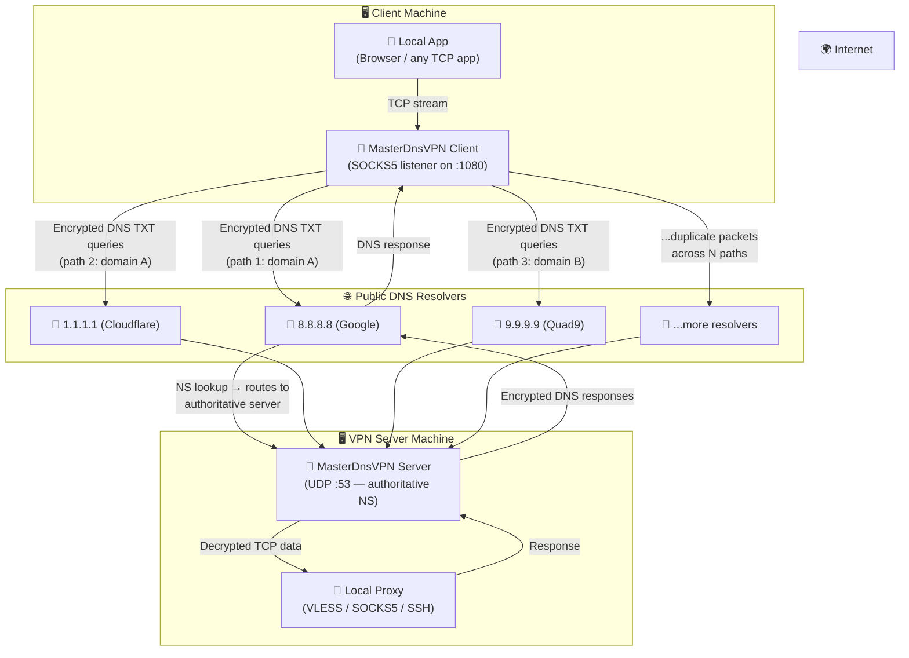
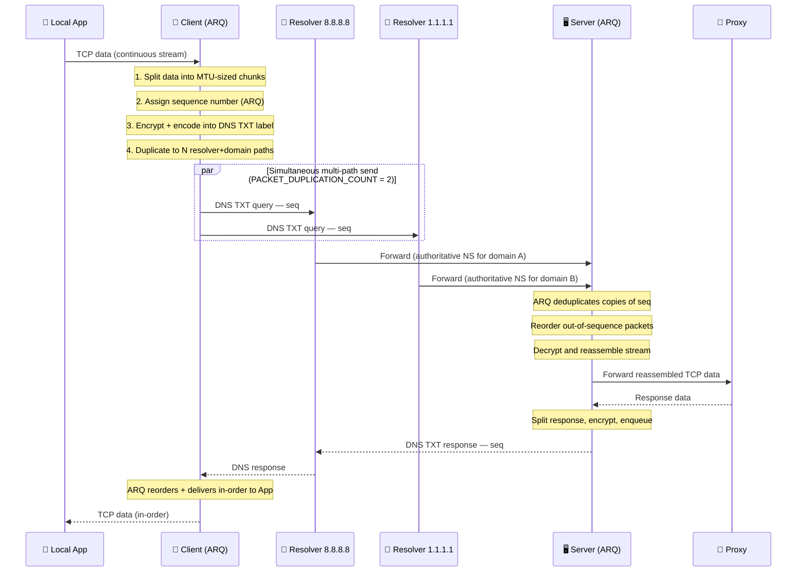

# 🚀 MasterDnsVPN

## [نسخه فارسی](https://github.com/masterking32/MasterDnsVPN/blob/main/README_FA.MD) | [English Version](https://github.com/masterking32/MasterDnsVPN/blob/main/README.MD) | [Spanish Version](https://github.com/masterking32/MasterDnsVPN/blob/main/README_ES.MD)


MasterDnsVPN is a high-performance DNS tunneling tool designed to encapsulate VPN traffic within DNS queries. This project is specifically engineered to bypass strict network censorship and firewalls where traditional VPN protocols are blocked.

It features a custom **ARQ (Automatic Repeat Request)** implementation, ensuring TCP-like reliability and packet ordering over the inherently unreliable UDP-based DNS protocol.

---

⭐ If you find this project useful or interesting, please support it by giving a star to the repository! ⭐

---

## ✨ Key Features
- 🛡️ **Censorship Circumvention:** Leverages the DNS protocol to tunnel traffic through restricted environments.
- 🔐 **Robust Security:** Supports multiple encryption methods including XOR, ChaCha20, AES-128-CTR, AES-192-CTR, and AES-256-CTR.
- ⚙️ **Smart MTU Management:** Automatically probes and synchronizes the optimal Maximum Transmission Unit (MTU) for both upload and download.
- 🔄 **Custom ARQ Protocol:** Solves packet loss and out-of-order delivery issues with dynamic retransmission and flow control.
- ⚡ **Resolver Load Balancing:** Supports multiple DNS resolvers with adaptive balancing strategies (Random, Round-robin, Best-loss).
- 🌐 **TCP Multiplexing:** Allows multiple local TCP connections to be multiplexed over a single DNS session.
- 📡 **Multi-Path Packet Duplication:** Each packet can be sent simultaneously through multiple resolver+domain paths for maximum reliability under extreme network conditions.

---

## 🛠️ Network Prerequisites (DNS Configuration)

To make the tunnel functional, you must own a domain and configure the following records in your DNS management panel (e.g., Cloudflare):

1. **A Record:** Create an **A** record pointing to your server's public IP.
   - Example: `s.example.com` -> `1.2.3.4`
2. **NS Record:** Create an **NS** record for your tunnel subdomain pointing to the A record created above.
   - Example: `v.example.com` -> `s.example.com`

> 💡 **Pro Tip:** The shorter your domain and subdomain names are (e.g., `v.ex.com`), the more space remains for actual data payloads in each DNS packet, significantly increasing throughput.

---

## 📦 Requirements

- 🐍 Python 3.7 or higher
- 🔐 `cryptography` (Required for AES/ChaCha20 encryption methods)
- 📝 `loguru` (For enhanced logging)

---

## 🚀 Installation & Usage

### 1. Install Dependencies

Clone the repository and install the required Python libraries:
```bash
git clone https://github.com/masterking32/MasterDnsVPN.git
cd MasterDnsVPN
pip install -r requirements.txt
```

#### 🔌 Offline Installation (Server Without Internet Access)

If your **server has no internet access** and you cannot run `pip install` directly, follow these steps from a machine that **does** have internet access:

**Step 1 — Download Python installer (if Python is not installed on the server):**
```bash
# On the internet-connected machine, download the Python installer for Linux
wget https://www.python.org/ftp/python/3.11.9/Python-3.11.9.tgz
# Transfer it to your offline server using scp, USB, or any available method
scp Python-3.11.9.tgz user@your-server:/tmp/
```

**Step 2 — Install Python from source on the offline server:**
```bash
# On the offline server
cd /tmp
tar xzf Python-3.11.9.tgz
cd Python-3.11.9
./configure --enable-optimizations
make -j$(nproc)
sudo make altinstall
# Verify
python3.11 --version
```

**Step 3 — Download pip packages on the internet-connected machine:**
```bash
# On the internet-connected machine
mkdir pip_packages
pip download -r requirements.txt -d ./pip_packages
# Transfer the entire folder to your offline server
scp -r pip_packages user@your-server:/tmp/
```

**Step 4 — Install packages from the downloaded folder on the offline server:**
```bash
# On the offline server
pip install --no-index --find-links=/tmp/pip_packages -r requirements.txt
```

> 💡 Make sure the Python version and OS architecture on both machines match (e.g., both Linux x86_64) so the downloaded wheel files are compatible.

---

### 2. Server Configuration

Copy the sample configuration:

```bash
cp server_config.py.simple server_config.py
```

Edit `server_config.py` to include your domain and target forwarding IP/Port:
- Install a proxy server (e.g., SOCKS5, VLESS, VMESS, SSH, MTProto, OpenVPN TCP, etc.) on the server machine to forward traffic to the internet.
- Configure `FORWARD_IP` and `FORWARD_PORT` in `server_config.py` to point to your proxy server.
- Configure `DOMAIN` to match the subdomain you set up in your DNS records (e.g., `v.example.com`). You can add multiple domains for redundancy.
- Set `UDP_HOST` to `"0.0.0.0"` to listen on all interfaces (required for a public server).
- After the first run, note the optimal MTU values for download and upload, then set `MAX_UPLOAD_MTU` and `MAX_DOWNLOAD_MTU` accordingly. This will significantly speed up subsequent runs.

### 3. Run the Server

```bash
python server.py
```

On the first run, the server will generate an encryption key. **Save this key**; you will need it to configure the client.

### 4. Configure the Client

Copy the sample client configuration:

```bash
cp client_config.py.simple client_config.py
```

Edit `client_config.py`:

- **`DOMAINS`**: Your tunnel subdomain(s) (e.g., `v.example.com`). Add multiple for redundancy.
- **`ENCRYPTION_KEY`**: The key printed by your server on first run.
- **`RESOLVER_DNS_SERVERS`**: List of public DNS resolvers to use (e.g., `8.8.8.8`, `1.1.1.1`, `9.9.9.9`). Add as many as possible for better reliability.
- **`PACKET_DUPLICATION_COUNT`**: How many resolver+domain paths to use per packet (see emergency tip below).

### 5. Run the Client

```bash
python client.py
```

The client starts a local SOCKS5 proxy on `127.0.0.1:1080` (configurable via `LISTEN_IP` / `LISTEN_PORT`). Point your browser or application to this proxy to route traffic through the tunnel.

---

## 🚨 Emergency Tip: Severe Network Disruption

> **When the network is almost completely down and only DNS queries are getting through (extremely high packet loss and disruption):**

1. **Collect as many DNS resolver IP addresses as possible.** Add them all to `RESOLVER_DNS_SERVERS` in `client_config.py`. You can use public resolvers from Google (`8.8.8.8`, `8.8.4.4`), Cloudflare (`1.1.1.1`, `1.0.0.1`), Quad9 (`9.9.9.9`), OpenDNS (`208.67.222.222`, `208.67.220.220`), and others.

2. **Increase `PACKET_DUPLICATION_COUNT`** in `client_config.py`. This parameter controls how many different resolver+domain paths each packet is sent through **simultaneously**.

   - With 6 resolvers and 2 domains, you have **12 potential paths**.
   - Setting `PACKET_DUPLICATION_COUNT = 6` means every packet is sent across 6 different paths at once.
   - Even if 5 out of 6 paths fail, the packet still arrives via the surviving path.

   > ⚠️ **Trade-off:** Higher duplication increases bandwidth usage and CPU load proportionally. A value of `3`–`6` is a good balance during disruptions. The ARQ layer on the server automatically deduplicates received copies so your application only sees each packet once.

3. **Add multiple tunnel domains** (`DOMAINS` list) to further multiply the number of available paths.

---

## 🛠️ How It Works

### System Architecture



### Packet Flow (Sequence Diagram)



### Key Concepts

| Concept | Description |
|---|---|
| **Session** | One client connection; up to 255 concurrent sessions per server |
| **Stream** | A single TCP connection multiplexed over a session |
| **MTU Probing** | Binary search at startup to find the maximum DNS payload size for your path |
| **ARQ** | Sequence numbers + retransmission ensure no data loss over UDP/DNS |
| **PACKET_DUPLICATION_COUNT** | Each packet is sent through this many resolver+domain paths simultaneously |
| **Resolver Balancing** | Strategies: Random (1), Round-Robin (2), Least-Loss (3) |

---

## 📝 Technical Notes

- ⚡ **MTU Optimization:** Upon connection, the client performs a binary search to find the maximum possible MTU for your specific path. This ensures maximum speed without packet fragmentation.

- 🔄 **Adaptive Polling:** The client uses smart backoff and idle-check mechanisms to reduce DNS overhead when no traffic is being transmitted.

- 🔒 **Encryption:** For AES/ChaCha20 methods the `cryptography` library is required. For low-resource devices, XOR (Method 1) is recommended.

- 🔁 **Multiple Concurrent Servers:** You can run multiple independent MasterDnsVPN server instances, each with a different tunnel domain, and list all domains in the client's `DOMAINS` array. The client will treat each domain+resolver combination as a separate path, automatically distributing and duplicating traffic across all of them.

---

## 🤝 Contributing
Contributions are welcome! Please fork the repository and create a pull request with your changes.

---

## 📄 License
This project is licensed under the MIT License. See the LICENSE file for details.

---

## 👨‍💻 Developer
Developed by [MasterkinG32](https://github.com/masterking32)
