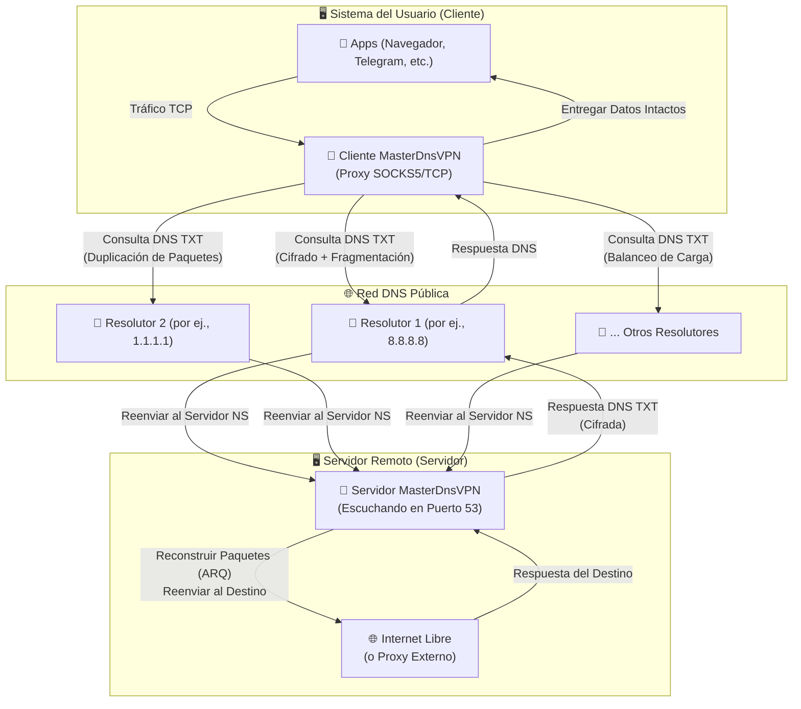
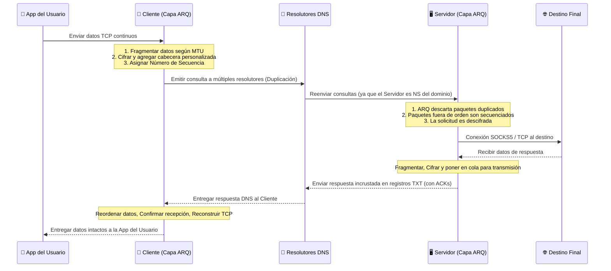

# Proyecto MasterDnsVPN 🚀

## [نسخه فارسی](https://github.com/masterking32/MasterDnsVPN/blob/main/README_FA.MD) | [English Version](https://github.com/masterking32/MasterDnsVPN/blob/main/README.MD) | [Spanish Version](https://github.com/masterking32/MasterDnsVPN/blob/main/README_ES.MD)

El proyecto **MasterDnsVPN** es una solución robusta, de bajo overhead y avanzada para eludir la censura y el filtrado de internet, ocultando y encapsulando tráfico TCP dentro de consultas DNS.

Este sistema está diseñado específicamente para sortear firewalls estrictos y restricciones de red severas donde los protocolos VPN tradicionales, o incluso servicios de tunelización DNS conocidos como **DNSTT** y **SlipStream**, están bloqueados o resultan inútiles debido a grandes interrupciones y limitaciones de los resolutores DNS.

El objetivo principal de **MasterDnsVPN** es proveer un túnel seguro, confiable y flexible que minimice el overhead del protocolo y entregue un rendimiento estable y aceptable incluso en redes que sufren alta pérdida de paquetes o limitaciones estrictas de MTU.

---

❌ Descargo de responsabilidad: Este proyecto está destinado únicamente a fines educativos e investigativos. Su uso puede alterar las estructuras de la red, y está prohibido utilizarlo para eludir las leyes de los países. No asumimos ninguna responsabilidad por tales acciones.

---

# Canal de Anuncios 📢
Para las últimas noticias, actualizaciones y cambios relacionados con este proyecto, por favor seguí nuestro canal de Telegram: [Canal de Telegram](https://t.me/masterdnsvpn)

---

Si usás o te gusta este proyecto, por favor considerá apoyarnos dando una estrella al repositorio en GitHub. Esto ayuda a aumentar su visibilidad y alcance. ¡Si encontrás este proyecto útil o interesante, por favor considerá darle una estrella! ⭐

Si estás interesado en brindar apoyo financiero, puedes hacerlo a través de los siguientes canales:

TON: `masterking32.ton`

Cadenas compatibles con EVM: `0x517f07305D6ED781A089322B6cD93d1461bF8652`

Cadena TRC20: `TLApdY8APWkFHHoxebxGY8JhMeChiETqFH`

---

## ✨ Características Principales y Ventajas

- 🛡️ **Evasión de Censura Estricta:** Diseñado específicamente para aumentar la probabilidad de penetrar firewalls y políticas de red restrictivas que bloquean los protocolos VPN estándar.

- ⚡ **Balanceo de Carga y Diversidad de Resolutores:** Compatible con múltiples resolutores DNS con estrategias avanzadas de balanceo de carga de paquetes (incluyendo Aleatorio, Round-Robin y Menor Pérdida).

- 📡 **Duplicación de Paquetes (Multipath):** Capaz de enviar el mismo paquete simultáneamente a través de múltiples rutas (diferentes resolutores y dominios). El primero en llegar es procesado; si un paquete se pierde en una ruta, su duplicado llega de forma segura por otra. Esta técnica aumenta el uso del ancho de banda pero mejora drásticamente la confiabilidad y la estabilidad en redes muy perturbadas (ajustable y puede desactivarse).

- 🔄 **Protocolo ARQ Personalizado y Optimización de Overhead:** Implementa una capa ARQ (Automatic Repeat reQuest) personalizada sobre UDP/DNS para la retransmisión y secuenciación de paquetes en lugar de depender de QUIC. Esto elimina el pesado overhead de QUIC, reduce el MTU requerido y garantiza la compatibilidad con resolutores que carecen de soporte EDNS o tienen límites de MTU bajos. Las estructuras de paquetes se minimizan para reducir el overhead a nivel de aplicación.

- 🔐 **Seguridad Sólida y Cifrado Flexible:** Compatible con varios métodos de cifrado robustos para garantizar la privacidad del usuario, incluyendo: `XOR`, `ChaCha20`, `AES-128-GCM`, `AES-192-GCM` y `AES-256-GCM`.

- 🧰 **Escaneo Automático y Sondeo de MTU:** Al ejecutarse, el cliente escanea automáticamente todos los resolutores configurados, prueba su calidad, muestra los resultados y calcula el MTU óptimo para las rutas de tu red.

- 🌐 **Multiplexación TCP:** Multiplexa múltiples conexiones TCP locales sobre una única sesión DNS para una gestión óptima de recursos.

- 🗜️ **Compresión/Empaquetado de Paquetes Pequeños:** Si se configura, el sistema puede fusionar varios paquetes pequeños en un único payload hasta el límite del MTU. Esto reduce drásticamente el número de peticiones DNS salientes y libera espacio para los datos de payload reales.

- 🧦 **Optimización Dedicada para SOCKS5:** En versiones recientes se han aplicado optimizaciones específicas para SOCKS5. El sistema gestiona automáticamente el reenvío SOCKS5, eliminando la necesidad de instalar herramientas de proxy de terceros como X-UI o Dante. Además, configurar el protocolo en SOCKS5 elimina los paquetes de handshake SOCKS redundantes sobre el túnel, reduciendo significativamente el tráfico.

- 🚀 **Reenvío de Diversos Protocolos TCP:** Además de la integración altamente optimizada con SOCKS5, también podés reenviar otros servicios basados en TCP como `VLESS`, `ShadowSocks`, `VMESS`, etc.

---

# Guía de Configuración 🧑‍💻

## Sección 1: Requisitos Previos de Red (Configuración DNS) 🛠️

Para que tu servidor reciba y procese directamente las consultas DNS, debés delegar un subdominio a tu servidor dedicado. Iniciá sesión en el panel de gestión DNS de tu dominio (por ejemplo, Cloudflare, ArvanCloud) y creá los siguientes dos registros:

### Paso 1.1: Crear un Registro A (IP del Servidor) 🅰️
Primero, creá un registro `A` que apunte un subdominio a la dirección IPv4 pública de tu servidor.
- **Tipo:** `A`
- **Nombre:** Un nombre corto y arbitrario (por ej., `ns`)
- **Dirección IPv4:** La dirección IP de tu servidor (por ej., `1.2.3.4`)
  > **Resultado:** `ns.example.com -> 1.2.3.4`

### Paso 1.2: Crear un Registro NS (Subdominio del Túnel) 🏷️
A continuación, creá un registro `NS` (Servidor de Nombres). Esto le indica a internet que el servidor definido en el paso anterior es responsable de gestionar las consultas para este subdominio específico.
- **Tipo:** `NS`
- **Nombre:** El subdominio principal del túnel (por ej., `v`)
- **Destino/Nameserver:** El registro A creado en el Paso 1.1 (por ej., `ns.example.com`)
  > **Resultado:** `v.example.com -> ns.example.com`

---

## Sección 1.3: Advertencia Crucial (Usuarios de Cloudflare) ⚠️
Si usás Cloudflare, el estado del Proxy para el registro `A` **DEBE** estar configurado como **Solo DNS (Nube Gris ☁️)**. Si el proxy está habilitado (Nube Naranja), Cloudflare bloqueará el tráfico UDP por el puerto 53 y tu túnel **¡no va a funcionar para nada!**

## Sección 1.4: Consejo de Oro para la Velocidad (MTU) 💡
En el protocolo DNS, la longitud del nombre de tu dominio consume parte de la muy limitada capacidad de payload de cada paquete. Usar nombres de dominio y subdominio **más cortos** (por ej., `v.ex.com` en lugar de `tunel.mi-dominio-largo.com`) deja más espacio libre para el payload real del usuario. Esto resulta directamente en mayor ancho de banda, mayor velocidad y menos caídas de conexión.

---

## Sección 2: Instalación y Ejecución (Cliente y Servidor) 🚀

Podés instalar y ejecutar este proyecto usando dos métodos: el método automatizado rápido con binarios precompilados (Recomendado), o directamente desde el código fuente de Python.

### Paso 2.1: Configuración Rápida del Servidor en Linux 🐧

Si desea configurar el servidor en una máquina Linux, la forma más sencilla es usando el script de instalación automatizado. Simplemente ejecutá el siguiente comando en la terminal de tu servidor:

```bash
bash <(curl -Ls https://raw.githubusercontent.com/masterking32/MasterDnsVPN/main/server_linux_install.sh)
```

Este comando descarga un script de GitHub y gestiona automáticamente todo el proceso de instalación y configuración. Una vez finalizado, el servidor arrancará y se mostrará una **Clave de Cifrado** en los registros del terminal. Asegurate de copiar esta clave (también se guarda en `encrypt_key.txt` junto al ejecutable del servidor para mayor comodidad), ya que la vas a necesitar para conectar el cliente.

> ⚠️ **Nota Importante 1:** Antes de ejecutar este script, debés tener un dominio y haber configurado correctamente tus registros DNS (Sección 1).
>
> ⚠️ **Nota Importante 2:** Este script solo configura el servidor Linux y no incluye el cliente. Para ejecutar el cliente en tu máquina local, usá el "Paso 2.2" que está más abajo.
>
> ⚠️ **Nota Importante 3:** También podés usar este comando para actualizar tu servidor. Cuando se publique una nueva versión, volver a ejecutar este script actualizará tu servidor automáticamente.

---

### Paso 2.2: Uso de Binarios de Cliente Precompilados (Recomendado ✅)

Para tu comodidad, los ejecutables del cliente (y servidores para otros sistemas operativos) están precompilados. Simplemente descargá la versión correcta para tu sistema operativo y extraé el archivo ZIP.

> 💡 **Nota:** Cada ZIP del Cliente incluye el ejecutable, `client_config.toml` y `client_resolvers.txt` (archivo de resolutores).

#### Enlaces de Descarga del Cliente MasterDnsVPN 📥

| Sistema Operativo (SO) | Arquitectura | Apto Para... | Enlace de Descarga Directa |
| :--- | :--- | :--- | :--- |
| Windows 🪟 | `AMD64` (64-bit) | Windows 10 y 11 | [Descargar versión Windows ⬇️](https://github.com/masterking32/MasterDnsVPN/releases/latest/download/MasterDnsVPN_Client_Windows_AMD64.zip) |
| macOS 🍎 | `ARM64` | Macs nuevos (M1 / M2 / M3) | [Descargar Mac (Apple Silicon) ⬇️](https://github.com/masterking32/MasterDnsVPN/releases/latest/download/MasterDnsVPN_Client_MacOS_ARM64.zip) |
| Linux 🐧 | `AMD64` (64-bit) | Distros modernas (Ubuntu 22.04+, Debian 12+) | [Descargar Linux (Nuevo) ⬇️](https://github.com/masterking32/MasterDnsVPN/releases/latest/download/MasterDnsVPN_Client_Linux_AMD64.zip) |
| Linux (Legacy) 🐧 | `AMD64` (64-bit) | Distros antiguas (Ubuntu 20.04, Debian 11) | [Descargar Linux (Legacy) ⬇️](https://github.com/masterking32/MasterDnsVPN/releases/latest/download/MasterDnsVPN_Client_Linux-Legacy_AMD64.zip) |
| Linux (ARM) 🐧 | `ARM64` | Servidores ARM, Raspberry Pi, etc. | [Descargar Linux (ARM) ⬇️](https://github.com/masterking32/MasterDnsVPN/releases/latest/download/MasterDnsVPN_Client_Linux_ARM64.zip) |

*(Los usuarios de Windows y Mac pueden extraer el archivo y proceder directamente a la Sección 3 para la configuración).*

#### Enlaces de Descarga del Servidor MasterDnsVPN 📤
*(Solo si no usaste el script de instalación rápida)*

| Sistema Operativo (SO) | Arquitectura | Apto Para... | Enlace de Descarga Directa |
| :--- | :--- | :--- | :--- |
| Windows 🪟 | `AMD64` (64-bit) | Windows Server, Windows 10 y 11 | [Descargar Servidor Windows ⬇️](https://github.com/masterking32/MasterDnsVPN/releases/latest/download/MasterDnsVPN_Server_Windows_AMD64.zip) |
| Linux 🐧 | `AMD64` (64-bit) | Ubuntu 22.04+, Debian 12+ | [Descargar Servidor Linux (Nuevo) ⬇️](https://github.com/masterking32/MasterDnsVPN/releases/latest/download/MasterDnsVPN_Server_Linux_AMD64.zip) |
| Linux (Legacy) 🐧 | `AMD64` (64-bit) | Servidores antiguos (Ubuntu 20.04, Debian 11) | [Descargar Servidor Linux (Legacy) ⬇️](https://github.com/masterking32/MasterDnsVPN/releases/latest/download/MasterDnsVPN_Server_Linux-Legacy_AMD64.zip) |
| Linux (ARM) 🐧 | `ARM64` | Servidores cloud ARM | [Descargar Servidor Linux (ARM) ⬇️](https://github.com/masterking32/MasterDnsVPN/releases/latest/download/MasterDnsVPN_Server_Linux_ARM64.zip) |
| macOS 🍎 | `ARM64` | Macs nuevos (M1 / M2 / M3) | [Descargar Servidor Mac (Apple Silicon) ⬇️](https://github.com/masterking32/MasterDnsVPN/releases/latest/download/MasterDnsVPN_Server_MacOS_ARM64.zip) |

---

### Paso 2.2.1: Extracción y Preparación en Linux 🗂️

En Linux, después de descargar el archivo ZIP, asegurate de tener las herramientas de extracción y edición de texto necesarias:

```bash
sudo apt update
sudo apt install unzip nano
```

Extraé el ZIP descargado (cambiá el nombre del archivo según la versión que hayas descargado):

```bash
# Extraer el cliente (o servidor)
unzip MasterDnsVPN_Client_Linux_AMD64.zip

# Listar los archivos extraídos
ls
```

En Linux y macOS, debés otorgar permisos de ejecución al archivo binario. Ingresá el nombre exacto del archivo tal como aparece en la salida del comando `ls`:

```bash
chmod +x MasterDnsVPN_Client_Linux_AMD64
```

Ahora, abrí el archivo de configuración (`client_config.toml` o `server_config.toml`) con el editor `nano` y completá tus datos (consultá la Sección 3 para las variables de configuración):

```bash
nano client_config.toml
```

> **Nota:** En `nano`, presioná `Ctrl + O` y luego `Enter` para guardar, y `Ctrl + X` para salir.

Después de guardar la configuración, ejecutá el programa:

```bash
./MasterDnsVPN_Client_Linux_AMD64
```

---

### Paso 2.3: Configuración desde Código Fuente Python (Para Desarrolladores 🧑‍💻)

> ⚠️ **Aviso:** Si sos un usuario estándar, no necesitás esta sección. Por favor, usá el Paso 2.2 y avanzá directamente a la "Sección 3: Configuración". Este método es exclusivamente para desarrolladores que deseen modificar o ejecutar el código Python en bruto.

Para ejecutar el código fuente, Python debe estar instalado. Ejecutá los siguientes comandos en tu terminal:

```bash
# Clonar el repositorio e instalar dependencias
git clone https://github.com/masterking32/MasterDnsVPN.git
cd MasterDnsVPN
pip install -r requirements.txt

# Copiar plantillas de configuración
cp server_config.toml.simple server_config.toml
cp client_config.toml.simple client_config.toml
cp client_resolvers.simple.txt client_resolvers.txt

# Editar las configuraciones y luego ejecutar el servidor o cliente
python server.py
python client.py
```

---

# Sección 3: Estructura de Configuración (Config) 🛠️

## Sección 3.1: Configuración y Ejecución Rápida del Cliente 🚀

Si iniciaste tu servidor usando el script de Instalación Rápida (Paso 2.1), solo necesitás editar `client_config.toml` en tu máquina cliente. Los tres parámetros principales que DEBÉS configurar son:

1. **`ENCRYPTION_KEY`**: Pegá la clave de cifrado que se mostró en la terminal de tu servidor (o que se encuentra en `encrypt_key.txt` en el servidor). ¡La conexión será rechazada sin esta clave!
2. **`DOMAINS`**: Ingresá tu subdominio de túnel exactamente (por ej., `["v.example.com"]`). **Nota:** Por ahora, proporcioná únicamente UN dominio. El soporte para múltiples dominios se finalizará en futuras actualizaciones.
3. **`client_resolvers.txt`**: Archivo de resolutores con formatos `IP`, `IP:PORT`, `CIDR` y `CIDR:PORT` (por ej. `8.8.8.8`, `8.8.8.8:5353`, `1.1.1.0/24`, `1.1.1.0/24:99`). Las líneas vacías o inválidas se omiten. Si falta el archivo o no contiene entradas válidas, el cliente no inicia.

> ⚠️ **Nota Importante 1 (Cifrado):** El script de instalación rápida configura el cifrado del servidor en `XOR` por defecto. Asegurate de que `DATA_ENCRYPTION_METHOD` en la configuración de tu cliente también esté en `1` para que coincida con el servidor.
>
> ⚠️ **Nota Importante 2 (Conexión):** El protocolo predeterminado es `SOCKS5`. Una vez que el cliente esté corriendo, debés configurar tus aplicaciones (Navegador, Telegram, etc.) para que usen un proxy SOCKS5 apuntando a `127.0.0.1` y el puerto configurado (Predeterminado: `1080`). Por defecto, este proxy local requiere autenticación con el usuario y contraseña: `master_dns_vpn` (esto puede cambiarse en la configuración).
>
> ⚠️ **Soporte:** Si encontrás problemas, adjuntá tus registros de error y abrí un issue exclusivamente en nuestra página de [GitHub Issues](https://github.com/masterking32/MasterDnsVPN/issues).

---

## Sección 3.2: Configuración del Servidor (Instalación Manual) ⚙️

Si **no** usaste el script del Paso 2.1 y querés configurar el servidor manualmente, editá el archivo `server_config.toml`. Asegurate de que los parámetros críticos como el método de cifrado y el dominio coincidan **exactamente** tanto en el servidor como en el cliente.

---

## Sección 3.3: Variables de Configuración del Cliente (`client_config.toml`) 📖

La siguiente tabla está sincronizada con `client_config.toml.simple` y con el comportamiento actual de `client.py`:

| Parámetro | Valor Predeterminado | Valores Aceptados | Descripción |
|---------|--------------|------------------|-------|
| `PROTOCOL_TYPE` | `"SOCKS5"` | `"SOCKS5"`, `"TCP"` | Tipo de túnel entre cliente y servidor. `SOCKS5` es el modo principal y optimizado para navegador y apps. `TCP` se usa como túnel TCP bruto y normalmente tiene más overhead. Debe coincidir con el servidor. |
| `DOMAINS` | `["v.domain.com"]` | Lista de cadenas | Dominio o subdominio sobre el que el cliente envía consultas. Debe coincidir exactamente con `DOMAIN` del servidor y con tu registro `NS`. |
| `DATA_ENCRYPTION_METHOD` | `1` | `0` a `5` | Algoritmo de cifrado del payload del túnel. `0` apagado, `1` XOR, `2` ChaCha20, `3` AES-128-GCM, `4` AES-192-GCM, `5` AES-256-GCM. Debe coincidir con el servidor. |
| `ENCRYPTION_KEY` | `""` | Cadena | Clave compartida entre cliente y servidor. Sin ella no se crea la sesión. |
| `BASE_ENCODE_DATA` | `false` | `true` o `false` | Si está activo, el payload se convierte a un formato base-safe antes de viajar por DNS. Mejora compatibilidad pero aumenta overhead y uso de CPU. |
| `LISTEN_IP` | `"0.0.0.0"` | IP válida | Dirección donde escucha el proxy local del cliente. `127.0.0.1` expone solo al mismo equipo; `0.0.0.0` también lo expone a la red local. |
| `LISTEN_PORT` | `1080` | Puerto válido | Puerto al que se conectan las aplicaciones locales. |
| `SOCKS5_AUTH` | `true` | `true` o `false` | Activa o desactiva la autenticación del proxy SOCKS5 local. Solo aplica a quienes usan este proxy local; no es autenticación contra el servidor. |
| `SOCKS5_USER` | `"master_dns_vpn"` | Cadena | Usuario del proxy local cuando `SOCKS5_AUTH` está activo. |
| `SOCKS5_PASS` | `"master_dns_vpn"` | Cadena | Contraseña del proxy local cuando `SOCKS5_AUTH` está activo. |
| `SOCKS_HANDSHAKE_TIMEOUT` | `300.0` | Float (Segundos) | Tiempo máximo permitido para que un stream SOCKS local complete su activación antes de abortarlo. En enlaces lentos o con pérdida alta conviene mantenerlo algo más alto. |
| `client_resolvers.txt` (archivo) | Junto al binario/ZIP | `IP`, `IP:PORT`, `CIDR`, `CIDR:PORT` por línea | Fuente de resolutores. Las líneas vacías o inválidas se ignoran. Si el archivo falta o no contiene entradas válidas, el cliente no arranca. |
| `PACKET_DUPLICATION_COUNT` | `2` | Entero positivo | Cuántas veces se duplica cada query sobre resolutores distintos. `1` significa sin duplicación. `2` es el punto de partida recomendado en enlaces inestables. |
| `STREAM_RESOLVER_FAILOVER_RESEND_THRESHOLD` | `2` | Entero positivo | Si un stream acumula esta cantidad de `STREAM_RESEND` consecutivos, el cliente cambia el resolutor preferido de ese stream a otro resolutor sano. |
| `STREAM_RESOLVER_FAILOVER_COOLDOWN` | `1.0` | Float (Segundos) | Tiempo mínimo entre dos cambios de resolutor preferido para el mismo stream. Evita thrashing entre resolutores. |
| `MAX_PACKETS_PER_BATCH` | `100` | Entero positivo | Límite superior para fusionar control blocks pequeños en una sola operación DNS. El valor real en runtime también queda limitado por el MTU negociado. `1` lo desactiva. |
| `RESOLVER_BALANCING_STRATEGY` | `2` | `1`, `2`, `3`, `4` | Método de selección de resolutores: `1` aleatorio, `2` round-robin, `3` menor pérdida, `4` menor latencia. |
| `DNS_QUERY_TIMEOUT` | `5.0` | Float (Segundos) | Timeout base para una consulta DNS normal. Si la respuesta no llega dentro de esta ventana, entra en la contabilidad de salud como timeout. |
| `UPLOAD_COMPRESSION_TYPE` | `0` | `0`, `1`, `2`, `3` | Compresión de payload cliente -> servidor: `0` OFF, `1` ZSTD, `2` LZ4, `3` ZLIB. Los paquetes muy pequeños normalmente no se comprimen para ahorrar CPU. |
| `DOWNLOAD_COMPRESSION_TYPE` | `0` | `0`, `1`, `2`, `3` | Compresión de payload servidor -> cliente con el mismo enum anterior. Se negocia al crear la sesión. |
| `MIN_UPLOAD_MTU` | `70` | Entero (Bytes) | MTU mínimo aceptable de subida. Un resolutor por debajo de este valor se descarta. `0` desactiva este límite. |
| `MIN_DOWNLOAD_MTU` | `150` | Entero (Bytes) | MTU mínimo aceptable de bajada. Los resolutores por debajo de este valor quedan fuera. |
| `MAX_UPLOAD_MTU` | `150` | Entero (Bytes) | Tope inicial desde el que arranca la búsqueda binaria de MTU de subida. Conviene mantenerlo conservador para no alargar el arranque. |
| `MAX_DOWNLOAD_MTU` | `200` | Entero (Bytes) | Tope inicial de la prueba de MTU de bajada. Si es demasiado alto, el arranque se vuelve más lento e inestable. |
| `MTU_TEST_RETRIES` | `2` | Entero positivo | Número de reintentos por prueba MTU antes de declarar fallo. Aumentarlo mejora la precisión en redes malas pero alarga el arranque. |
| `MTU_TEST_TIMEOUT` | `2.0` | Float (Segundos) | Timeout de cada prueba MTU. Si los resolutores responden lento, conviene subirlo un poco. |
| `AUTO_SCALE_PROFILES` | `true` | `true` o `false` | Ajusta automáticamente algunos parámetros de startup y recheck según el tamaño de la lista de dominios/resolutores. |
| `MTU_TEST_PARALLELISM` | `6` | Entero positivo | Cantidad de pares resolutor-dominio probados en paralelo durante el escaneo MTU inicial. Más alto acelera el arranque pero sube la carga temporal de CPU/red. |
| `SAVE_MTU_SERVERS_TO_FILE` | `false` | `true` o `false` | Si está activo, guarda en archivo los resolutores que superaron la validación MTU. |
| `MTU_SERVERS_FILE_NAME` | `"masterdnsvpn_success_test_{time}.txt"` | Cadena | Nombre del archivo de salida de resultados MTU. Si contiene `{time}`, se reemplaza por timestamp. |
| `MTU_SERVERS_FILE_FORMAT` | `"{IP} - UP: {UP_MTU} DOWN: {DOWN-MTU}"` | Cadena | Formato por línea para cada resolutor válido. Soporta placeholders como `{IP}`, `{UP_MTU}`, `{DOWN-MTU}`, `{DOMAIN}` y `{TIME}`. |
| `MTU_USING_SECTION_SEPARATOR_TEXT` | `"---- Active MTU Testing Results ----"` | Cadena | Texto separador opcional que se añade una sola vez al terminar el escaneo MTU inicial. Cadena vacía lo desactiva. |
| `MTU_REMOVED_SERVER_LOG_FORMAT` | `"IP {IP} removed from list at {TIME} due to {CAUSE}"` | Cadena | Formato de línea que se escribe cuando un resolutor se desactiva en runtime. |
| `MTU_ADDED_SERVER_LOG_FORMAT` | `"Server {IP} re-added at {TIME} (UP MTU: {UP_MTU}, DOWN MTU: {DOWN_MTU})"` | Cadena | Formato de línea que se escribe cuando un resolutor inactivo vuelve a activarse correctamente. |
| `AUTO_DISABLE_TIMEOUT_SERVERS` | `true` | `true` o `false` | Si un par resolutor-dominio presenta 100% timeouts dentro de la ventana configurada y aún existe otro resolutor activo, se desactiva temporalmente. |
| `AUTO_DISABLE_TIMEOUT_WINDOW_SECONDS` | `120` | Float/Entero (Segundos) | Ventana deslizante usada por la lógica de salud para evaluar timeouts en runtime. |
| `AUTO_DISABLE_TIMEOUT_MIN_OBSERVATIONS` | `3` | Entero positivo | Cantidad mínima de observaciones timeout/success antes de permitir que el cliente desactive un resolutor-dominio. |
| `AUTO_DISABLE_CHECK_INTERVAL_SECONDS` | `1.0` | Float (Segundos) | Intervalo del worker de salud que revisa la ventana de timeouts. |
| `RECHECK_INACTIVE_SERVERS_ENABLED` | `true` | `true` o `false` | Activa el recheck periódico en segundo plano de resolutores rechazados por MTU o desactivados en runtime. |
| `RECHECK_INACTIVE_INTERVAL_SECONDS` | `300` | Float/Entero (Segundos) | Intervalo entre ciclos completos de recheck de resolutores inactivos. |
| `RECHECK_SERVER_INTERVAL_SECONDS` | `3.0` | Float (Segundos) | Pausa entre dos pruebas consecutivas dentro del worker de recheck. |
| `RECHECK_BATCH_SIZE` | `5` | Entero positivo | Máximo de pares resolutor-dominio inactivos probados en cada ciclo de recheck. |
| `MAX_CONNECTION_ATTEMPTS` | `10` | Entero positivo | Cantidad de intentos para crear la sesión inicial. Si la red está muy dañada, puede subirse. |
| `ARQ_WINDOW_SIZE` | `1000` | Entero positivo | Tamaño de ventana del ARQ de datos. Valores mayores permiten más datos en vuelo pero consumen más RAM. |
| `ARQ_INITIAL_RTO` | `0.5` | Float (Segundos) | Timeout inicial de retransmisión para datos en ARQ. |
| `ARQ_MAX_RTO` | `3.0` | Float (Segundos) | Límite máximo de backoff para retransmisiones de datos. |
| `ARQ_CONTROL_INITIAL_RTO` | `0.5` | Float (Segundos) | Timeout inicial para paquetes de control confiables como SYN/FIN/RST y mensajes de control SOCKS. |
| `ARQ_CONTROL_MAX_RTO` | `3.0` | Float (Segundos) | Límite máximo de backoff para el plano de control. |
| `ARQ_CONTROL_MAX_RETRIES` | `80` | Entero positivo | Tope de retries de control antes de abortar el camino del stream/sesión. |
| `NUM_RX_WORKERS` | `2` | Entero positivo | Cantidad de workers de recepción y parseo de respuestas entrantes. |
| `NUM_DNS_WORKERS` | `2` | Entero positivo | Cantidad de workers de envío de consultas DNS. |
| `CPU_WORKER_THREADS` | `0` | `-1`, `0`, entero positivo | Tamaño del pool de hilos para parse/codec/compresión. `0` usa auto-detección según la cantidad real de núcleos; `-1` lo desactiva. |
| `RX_SEMAPHORE_LIMIT` | `256` | Entero positivo | Límite de operaciones RX en vuelo. Más alto reduce backpressure y aumenta uso de RAM. |
| `MAX_CLOSED_STREAM_RECORDS` | `2000` | Entero positivo | Límite de registros de streams cerrados usados para evitar cierres duplicados y carreras tardías de limpieza. |
| `SOCKET_BUFFER_SIZE` | `8388608` | Entero (Bytes) | Tamaño del buffer UDP del socket del cliente. Ayuda en ráfagas y pérdida alta, pero consume más RAM. |
| `LOG_LEVEL` | `"INFO"` | `"DEBUG"`, `"INFO"`, `"WARNING"`, `"ERROR"`, `"CRITICAL"` | Nivel de detalle de los logs del cliente. |
| `CONFIG_VERSION` | `5.0` | Número | Versión del esquema de configuración usada para comprobar compatibilidad con el código actual. |

---

## Sección 3.4: Variables de Configuración del Servidor (`server_config.toml`) 📖

La siguiente tabla está sincronizada con `server_config.toml.simple` y con el comportamiento actual de `server.py`:

| Parámetro | Valor Predeterminado | Valores Aceptados | Descripción |
|---------|--------------|------------------|-------|
| `UDP_HOST` | `"0.0.0.0"` | IP válida | Dirección en la que el servidor escucha consultas DNS. |
| `UDP_PORT` | `53` | Puerto válido | Puerto DNS del servidor. En producción normalmente debe ser 53. |
| `DOMAIN` | `["v.domain.com"]` | Lista de cadenas | Dominios para los que el servidor es autoritativo. Debe coincidir con `DOMAINS` del cliente y con los registros `NS`. |
| `PROTOCOL_TYPE` | `"SOCKS5"` | `"SOCKS5"`, `"TCP"` | Tipo de forwarding del servidor. `SOCKS5` es el modo principal y optimizado. `TCP` es el túnel TCP bruto. Debe coincidir con el cliente. |
| `USE_EXTERNAL_SOCKS5` | `false` | `true` o `false` | Si es `false`, el servidor conecta directo al destino. Si es `true`, encadena tráfico a un upstream SOCKS5 externo en `FORWARD_IP:FORWARD_PORT`. |
| `FORWARD_IP` | `"127.0.0.1"` | IP válida | Dirección del upstream externo en modo `USE_EXTERNAL_SOCKS5=true` o del destino en modo `TCP`. |
| `FORWARD_PORT` | `1080` | Puerto válido | Puerto del upstream externo o del destino. |
| `SOCKS5_AUTH` | `false` | `true` o `false` | Si está activo, el servidor usa usuario y contraseña al conectarse al upstream SOCKS5 externo. |
| `SOCKS5_USER` | `"admin"` | Cadena | Usuario del SOCKS5 externo. |
| `SOCKS5_PASS` | `"123456"` | Cadena | Contraseña del SOCKS5 externo. |
| `SOCKS_HANDSHAKE_TIMEOUT` | `180.0` | Float (Segundos) | Tiempo máximo permitido para activar streams que están en connect o handshake. Si upstream o resolutores son lentos, evita cortar streams sanos demasiado pronto. |
| `MAX_CONCURRENT_SOCKS_CONNECTS` | `16` | Entero positivo | Límite de streams simultáneos en fase `CONNECTING` o `SOCKS_CONNECTING`. No limita streams ya conectados; solo controla las ráfagas de nuevas conexiones. |
| `INVALID_COOKIE_ERROR_THRESHOLD` | `10` | Entero positivo | Si para un `(session_id, expected_cookie, packet_cookie)` se registran esta cantidad de mismatches dentro de la ventana configurada, el servidor emite `ERROR_DROP` para forzar reinicio de sesión. |
| `INVALID_COOKIE_WINDOW_SECONDS` | `2.0` | Float (Segundos) | Ventana deslizante usada para contar errores de cookie inválida. |
| `DATA_ENCRYPTION_METHOD` | `1` | `0` a `5` | Algoritmo de cifrado del payload. Debe coincidir exactamente con el cliente. |
| `SUPPORTED_UPLOAD_COMPRESSION_TYPES` | `[0, 1, 2, 3]` | Lista de `0..3` | Algoritmos de compresión permitidos para tráfico cliente -> servidor. Los valores inválidos se descartan y `0` siempre queda como fallback válido. |
| `SUPPORTED_DOWNLOAD_COMPRESSION_TYPES` | `[0, 1, 2, 3]` | Lista de `0..3` | Algoritmos de compresión permitidos para tráfico servidor -> cliente. |
| `ARQ_WINDOW_SIZE` | `1000` | Entero positivo | Tamaño de ventana del ARQ de datos en el servidor. |
| `ARQ_INITIAL_RTO` | `0.5` | Float (Segundos) | Timeout inicial de retransmisión para datos en ARQ del servidor. |
| `ARQ_MAX_RTO` | `3.0` | Float (Segundos) | Límite máximo de backoff para retransmisiones de datos. |
| `ARQ_CONTROL_INITIAL_RTO` | `0.5` | Float (Segundos) | Timeout inicial para paquetes de control confiables del servidor como SYN/FIN/RST y controles SOCKS. |
| `ARQ_CONTROL_MAX_RTO` | `3.0` | Float (Segundos) | Límite máximo de backoff para el plano de control. |
| `ARQ_CONTROL_MAX_RETRIES` | `80` | Entero positivo | Tope de retries para paquetes de control antes de abortar el camino. |
| `SESSION_TIMEOUT` | `300` | Entero (Segundos) | Si una sesión permanece inactiva este tiempo, expira y sus recursos se liberan. |
| `SESSION_CLEANUP_INTERVAL` | `30` | Entero (Segundos) | Intervalo del loop de limpieza de sesiones expiradas. |
| `MAX_SESSIONS` | `255` | Entero positivo hasta `255` | Máximo de sesiones activas. El límite duro del protocolo es 255. |
| `MAX_CONCURRENT_REQUESTS` | `500` | Entero positivo | Tamaño de la cola limitada de requests DNS que esperan workers. Afecta directamente backpressure y uso de RAM. |
| `DNS_REQUEST_WORKERS` | `4` | Entero positivo | Cantidad fija de workers que procesan requests DNS. |
| `CPU_WORKER_THREADS` | `0` | `-1`, `0`, entero positivo | Tamaño del pool de hilos para parse/codec/compresión en el servidor. `0` usa auto-detección por núcleos reales. |
| `MAX_PACKETS_PER_BATCH` | `1000` | Entero positivo | Límite superior para empaquetar control blocks pequeños en una respuesta. En runtime también queda acotado por el MTU de descarga negociado. |
| `SOCKET_BUFFER_SIZE` | `8388608` | Entero (Bytes) | Buffer UDP del socket del servidor. Ayuda en ráfagas y pérdida alta. |
| `LOG_LEVEL` | `"INFO"` | `"DEBUG"`, `"INFO"`, `"WARNING"`, `"ERROR"`, `"CRITICAL"` | Nivel de detalle de los logs del servidor. |
| `CONFIG_VERSION` | `5.0` | Número | Versión del esquema de configuración usada para comprobar compatibilidad con el código actual. |

## Sección 3.5: Mejor Comprensión del MTU y Configuraciones de Oro para un Arranque Rápido ⚠️

### Sección 3.5.1: Concepto de MTU en la Tunelización DNS 📦
**MTU** significa **Unidad Máxima de Transmisión** (Maximum Transmission Unit): el tamaño máximo de un paquete de datos enviado a través de la red.
En redes con filtrado intensivo o perturbadas, los paquetes grandes son muy susceptibles de perderse. Reducir el MTU garantiza estabilidad. Por el contrario, establecer un MTU demasiado bajo fragmenta los datos en trozos diminutos, aumentando masivamente el Overhead del Protocolo y arruinando tu velocidad.

Los protocolos DNS tienen estrictas limitaciones de payload:
- **Subida (Consulta DNS):** Extremadamente restringida. Dependiendo de la longitud del nombre de dominio, un promedio seguro está entre `50` y `200` bytes.
- **Bajada (Respuesta DNS):** Más amplia. Normalmente entre `100` y `450` bytes, y hasta `4000` bytes si el resolutor soporta EDNS.

El cliente de este proyecto utiliza un inteligente algoritmo de *Búsqueda Binaria* al iniciarse para sondear el MTU máximo absoluto soportado por cada resolutor. Luego calcula el **Mínimo Común Denominador** para asegurar que el tráfico atraviese con éxito *todos* tus resolutores saludables sin errores de fragmentación.

---

### Sección 3.5.2: Guía de Optimización de MTU Paso a Paso 🚀

Sondear cada resolutor toma tiempo. Seguí estos pasos para encontrar los valores óptimos y reducir los tiempos de arranque del cliente a fracciones de segundo:

#### Paso 1: Arranque Inicial y Descubrimiento del Techo de MTU 🕵️‍♂️
Después de iniciar tu servidor, ejecutá el cliente con la configuración predeterminada. En el primer segundo, el cliente calcula el MTU máximo teórico basándose en la longitud de tu dominio y el overhead de cifrado, imprimiendo un log similar a:
```text
Domain: v.example.com -> MIN and MAX_UPLOAD_MTU = 133 | MIN and MAX_DOWNLOAD_MTU = 129
```

¡Una vez que veas esta línea, terminá el programa! Esos son tus valores de techo absoluto.
Abrí `client_config.toml` y establecé `MAX_UPLOAD_MTU` exactamente al número sugerido (por ej., `133`). Esto evita que el cliente pierda tiempo sondeando tamaños imposiblemente grandes en arranques futuros.

#### Paso 2: Sondeo Completo de Resolutores 🧪

Ahora agregá todos los resolutores DNS deseados al archivo de configuración y dejá que el cliente se ejecute por completo. Esto puede llevar un rato; tené paciencia mientras el sistema prueba cada resolutor.
Una vez completado, se imprimirá una tabla que muestra las capacidades únicas de MTU de subida y bajada de cada resolutor exitoso.

#### Paso 3: Establecer el Piso (Filtrar Resolutores Débiles) 🧹

Analizá la tabla impresa para encontrar un promedio lógico. Supongamos que la mayoría de los resolutores pasaron una subida de `133`, pero algunos débiles solo lograron `50`.
¡Como el sistema fuerza el *MTU mínimo común* globalmente en todo el túnel, esos resolutores débiles se convertirán en el cuello de botella de toda tu conexión!
Para solucionar esto, establecé `MIN_UPLOAD_MTU` en la configuración en `133`. El cliente descartará automáticamente cualquier resolutor que no alcance esta línea base, evitando cuellos de botella. Aplicá la misma lógica a `MIN_DOWNLOAD_MTU`.

> 💡 Nota: Cuanto menor sea el límite MIN, más resolutores se conectan, pero la velocidad y calidad general bajan. Cuanto mayor sea el MIN, mejor la calidad, pero puede que califiquen menos resolutores. Encontrá el punto de equilibrio.

### Sección 3.5.3: Truco de Oro para un Arranque Rápido ⚡

Si querés que tu cliente arranque **instantáneamente** sin perder tiempo buscando valores de MTU, aplicá esta técnica:

¡Establecé los valores MIN y MAX en tu configuración para que sean **exactamente iguales**!
Por ejemplo, si tus pruebas demostraron que `133` de subida y `129` de bajada funciona perfectamente en la mayoría de los resolutores, editá tu configuración así:

```toml
MIN_UPLOAD_MTU = 133
MAX_UPLOAD_MTU = 133

MIN_DOWNLOAD_MTU = 129
MAX_DOWNLOAD_MTU = 129
```

**¿Qué pasa?** El algoritmo de búsqueda binaria del cliente detecta que el piso y el techo son idénticos. Cancela la búsqueda y prueba ese número exacto *solo una vez*. Si el resolutor responde, queda validado; si no, se descarta instantáneamente. ¡Esto dispara la velocidad de inicio enormemente!

> ⚠️ Emergencias Extremas: Durante eventos catastróficos de censura/filtrado donde las conexiones caen constantemente, podés bloquear tanto el MIN como el MAX en valores muy bajos (por ej., 50 o 60). Tu velocidad se reducirá drásticamente, pero mantendrás una conexión estable e irrompible a través del firewall.

Calcular y asignar correctamente los valores de MTU es vital en este proyecto tanto para la velocidad como para la estabilidad. Completá este paso con cuidado para adaptarlo a tu entorno de red específico.

---

## Sección 4: Emergencias y Solución de Problemas 🚨

### Sección 4.1: Cortes Graves de Red (Intranet Nacional) ⚠️
Cuando internet esté completamente cortado, la pérdida de paquetes sea masiva y solo se permita el tráfico DNS, hacé los siguientes ajustes en `client_config.toml` para garantizar la conexión:

1. **Maximizar Resolutores:** Encontrá tantos resolutores DNS públicos válidos como sea posible y agregalos a `client_resolvers.txt`. Los formatos soportados son `IP`, `IP:PORT`, `CIDR` y `CIDR:PORT`. Combinar resolutores diversos (como Google `8.8.8.8`, Cloudflare `1.1.1.1`, Quad9 `9.9.9.9`, OpenDNS `208.67.222.222`) maximiza la diversidad de enrutamiento.

2. **Aumentar la Duplicación de Paquetes:** Subí el parámetro `PACKET_DUPLICATION_COUNT`. Este define cuántas veces cada fragmento de payload se envía **simultáneamente** por rutas diferentes.
- **Ejemplo:** Configurar esto en `5` significa que un paquete se lanza a 5 resolutores a la vez. ¡Incluso si 4 rutas están bloqueadas o pierden el paquete, la 5ª lo entrega! La capa ARQ del servidor detecta y descarta nativamente los duplicados, manteniendo el tráfico fluido.
- **Recomendación:** Valores entre `3` y `6` son ideales durante perturbaciones extremas. Sin embargo, una duplicación imprudente sin suficientes resolutores reales sobrecargará los pocos que tengas y degradará el rendimiento.

### Sección 4.2: Conflicto en el Puerto 53 (Servidor Linux) 🛑
En la mayoría de las distribuciones Linux (como Ubuntu), el Puerto `53` está ocupado por el servicio `systemd-resolved` de forma predeterminada. Si el servidor lanza un error de vinculación de puerto, debés deshabilitar el listener stub. Ejecutá estos comandos de forma secuencial en tu servidor:

1. Abrí el archivo de configuración para editarlo:
```bash
sudo nano /etc/systemd/resolved.conf
```
2. Encontrá `#DNSStubListener=yes`, eliminá el `#` y cambialo a `no` (así: `DNSStubListener=no`). Guardá y salí (`Ctrl+O`, `Enter`, `Ctrl+X`).

3. Reiniciá el servicio para aplicar los cambios:
```bash
sudo systemctl restart systemd-resolved
```
4. **Crucial:** Para asegurar que el servidor mismo siga teniendo acceso a internet y pueda resolver destinos externos, actualizá el enlace simbólico para `resolv.conf`:
```bash
sudo ln -sf /run/systemd/resolve/resolv.conf /etc/resolv.conf
```

> ⚠️ **Advertencia:** ¡No podés ejecutar múltiples herramientas de tunelización DNS (por ej., DNSTT, SlipStream y MasterDnsVPN) simultáneamente en el mismo servidor! El puerto 53 solo puede pertenecer a una aplicación.

---

## Sección 5: Arquitectura y Funcionamiento 🛠️

**MasterDnsVPN** rompe los límites de los túneles DNS estándar combinando Multiplexación de Sesiones y una capa de confiabilidad ARQ (Automatic Repeat reQuest) personalizada, todo sobre protocolos UDP/DNS sin conexión.

### Sección 5.1: Diagrama de Arquitectura de Alto Nivel



### Sección 5.2: Ciclo de Vida de un Paquete 🔄



### Sección 5.3: Conceptos Básicos Explicados 🧠

| Concepto | Función en el Sistema |
| :--- | :--- |
| **Sesión** | El enlace global entre cliente y servidor. Cada servidor puede gestionar hasta 255 Sesiones independientes de forma concurrente. |
| **Stream** | Cada conexión TCP individual (por ej., cargar una nueva pestaña del navegador) es un Stream, multiplexado eficientemente sobre una única Sesión. |
| **Protocolo ARQ** | Una alternativa liviana a QUIC. Garantiza la entrega de datos sobre UDP/DNS inestable rastreando Números de Secuencia y ACKs, gestionando las retransmisiones automáticamente. |
| **Balanceo** | El Cliente distribuye la carga entre múltiples resolutores usando algoritmos inteligentes de Aleatorio, Round-Robin o Menor Pérdida. |
| **Bloques de Control Empaquetados** | Para conservar ancho de banda, el servidor agrupa múltiples recibos de Confirmación (ACK) y los empaqueta juntos en un único payload. |

---

## Sección 6: Notas Técnicas Avanzadas ⚙️

- ⚡ **SOCKS5 Directo (Fast-Connect):** Configurar `USE_EXTERNAL_SOCKS5` en `false` en el servidor permite que el backend nativo de Python enrute el tráfico del Cliente directamente al destino sin intermediarios (como Dante o Xray), reduciendo enormemente la Latencia.
- 🔄 **Sondeo Adaptativo:** El Cliente incluye un sistema inteligente de back-off (Ping Manager). Durante los períodos de inactividad, reduce la frecuencia de transmisión de Keep-Alive, reduciendo significativamente el spam a la red DNS y la carga del servidor.
- 🔒 **Biblioteca de Criptografía:** Instalar esta biblioteca es necesario para cifrado de alto nivel (AES-GCM/ChaCha20). Sin embargo, para hardware de bajos recursos como routers básicos, el `XOR` integrado y altamente optimizado (Método 1) no requiere dependencias y se ejecuta de forma nativa a gran velocidad.

---

## 🤝 Contribuciones
¡Las contribuciones son absolutamente bienvenidas! Si tenés ideas, correcciones de errores o mejoras de rendimiento, por favor hacé un Fork del proyecto y enviá un Pull Request. Reportá errores o problemas exclusivamente en la sección de [Issues](https://github.com/masterking32/MasterDnsVPN/issues).

---

## 📄 Licencia
Este proyecto está publicado bajo la licencia **MIT**. El uso, la modificación y la distribución son libres bajo los términos de la licencia. Consultá el archivo `LICENSE` para obtener todos los detalles.

---

## 👨‍💻 Desarrollador
Desarrollado con ❤️ por: [**MasterkinG32**](https://github.com/masterking32)

