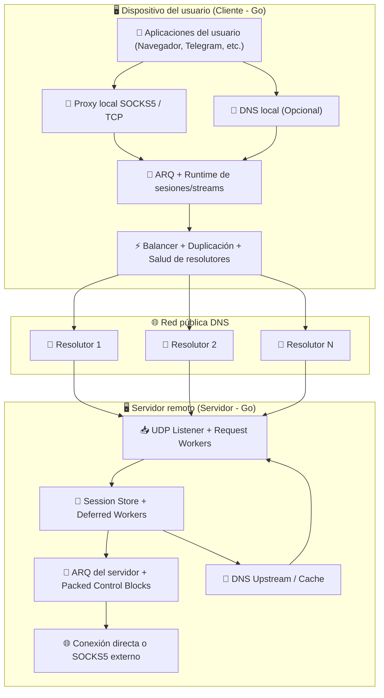
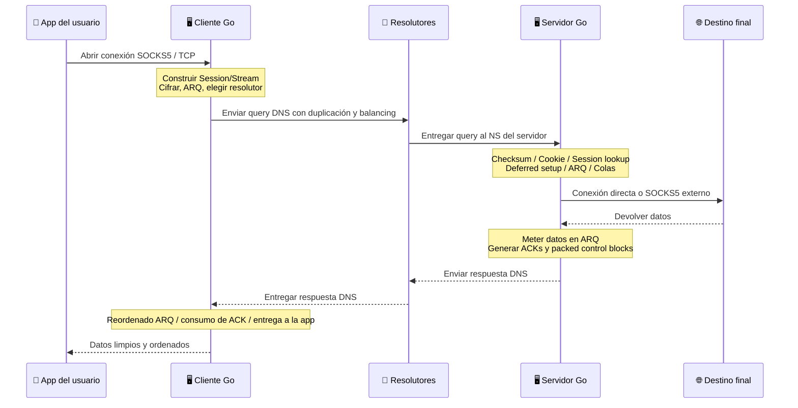

# Proyecto MasterDnsVPN 🚀

## [نسخه فارسی](https://github.com/masterking32/MasterDnsVPN/blob/main/README_FA.MD) | [English Version](https://github.com/masterking32/MasterDnsVPN/blob/main/README.MD) | [Spanish Version](https://github.com/masterking32/MasterDnsVPN/blob/main/README_ES.MD)

**MasterDnsVPN** es una solución avanzada y de bajo overhead para transportar tráfico TCP dentro de consultas y respuestas DNS. La versión actual está implementada completamente en **Go**, y su ruta principal y optimizada está pensada para **SOCKS5 over DNS**.

Este sistema está orientado a escenarios donde los métodos clásicos de VPN o túneles conocidos sufren interrupciones severas, alta pérdida de paquetes, límites estrictos de MTU o bloqueo agresivo de resolutores.

El objetivo principal de **MasterDnsVPN** es ofrecer un túnel seguro, confiable y flexible, con overhead mínimo y buen comportamiento incluso en enlaces de mala calidad.

---

❌ Descargo de responsabilidad: Este proyecto se publica únicamente con fines educativos y de investigación. Su uso puede entrar en conflicto con leyes o políticas de red locales, y cada usuario es responsable de cómo lo utilice.

---

# Canal de anuncios 📢

### Para las últimas noticias, actualizaciones y cambios relacionados con este proyecto, seguí nuestro canal de Telegram: [Canal de Telegram](https://t.me/masterdnsvpn)

---

Podés apoyar este proyecto gratis dejando una estrella en GitHub ⭐

Si querés apoyarlo económicamente, podés usar estos canales:

TON: `masterking32.ton`

Cadenas compatibles con EVM: `0x517f07305D6ED781A089322B6cD93d1461bF8652`

Cadena TRC20: `TLApdY8APWkFHHoxebxGY8JhMeChiETqFH`

---

## Características y ventajas principales ✨

- **Evasión de censura estricta:** 🛡️ Diseñado específicamente para aumentar la probabilidad de atravesar firewalls y políticas restrictivas que bloquean protocolos VPN comunes.
- **Implementación completa en Go:** ⚙️ El cliente, el servidor, la capa ARQ, el runtime de colas, el balancing, la salud de resolutores y el manejo de sesiones están implementados en Go en la versión actual.
- **Balanceo de carga y diversidad de resolutores:** ⚡ Soporta múltiples resolutores DNS con estrategias de selección aleatoria, round-robin, menor pérdida y menor latencia usando feedback real de runtime.
- **Duplicación multipath de paquetes:** 📡 El mismo paquete puede enviarse a varios resolutores a la vez. Esto sube el consumo de ancho de banda, pero mejora mucho la supervivencia del tráfico en enlaces con pérdida.
- **Protocolo propio y ARQ personalizado con overhead muy bajo:** 🔄 En lugar de QUIC, este proyecto usa su propio protocolo y su propia capa ARQ. Gracias a eso, el overhead puede bajar hasta **7 bytes** en el caso más liviano.
- **Salud de resolutores y reactivación automática:** 🧠 Los resolutores débiles pueden desactivarse en runtime, volver a probarse en segundo plano con el MTU sincronizado y regresar al pool activo cuando vuelven a estar sanos.
- **Descubrimiento y sincronización de MTU:** 🧰 El cliente prueba resolutores, mide MTU de subida y bajada, filtra rutas débiles y trabaja con un MTU sincronizado compartido.
- **Optimización dedicada para SOCKS5:** 🧦 La ruta principal del runtime está optimizada para SOCKS5, y su setup, flujo de ACK y ruta de control están más refinados que la ruta genérica.
- **Packed Control Blocks:** 📦 El servidor puede agrupar ACKs y pequeños paquetes de control en bloques compactos para reducir la cantidad de respuestas y el overhead.
- **Enrutamiento por stream con resolutor preferido:** 🌐 Cada stream puede mantener un resolutor preferido y hacer failover de forma controlada tras varios resends.
- **Compresión y empaquetado de paquetes pequeños:** 🗜️ La compresión y el batching opcionales ayudan a reducir la cantidad de requests y a aprovechar mejor cada MTU.
- **Cifrado fuerte y flexible:** 🔐 Soporta `XOR`, `ChaCha20`, `AES-128-GCM`, `AES-192-GCM` y `AES-256-GCM`.
- **DNS local opcional en el cliente:** 📛 El cliente puede exponer un servicio DNS local y reenviar consultas DNS locales a través del túnel.

---

# Guía de configuración 🧑‍💻

## Sección 1: Requisitos de red (configuración DNS) 🛠️

Para que tu servidor reciba y procese consultas DNS directamente, debés delegar un subdominio a tu propio servidor. Abrí el panel de gestión DNS y creá los dos registros siguientes:

### Paso 1.1: Crear un registro A (IP del servidor) 🅰️

- **Tipo de registro:** `A`
- **Nombre:** un nombre corto como `ns`
- **Dirección IPv4:** la IP de tu servidor

> **Resultado:** `ns.example.com -> 1.2.3.4`

### Paso 1.2: Crear un registro NS (subdominio del túnel) 🏷️

- **Tipo de registro:** `NS`
- **Nombre:** el subdominio del túnel, por ejemplo `v`
- **Target / Nameserver:** el registro A del paso anterior

> **Resultado:** `v.example.com -> ns.example.com`

---

## Sección 1.3: Advertencia importante para usuarios de Cloudflare ⚠️

Si usás Cloudflare, el registro `A` del nameserver **debe** estar en modo **DNS only**. Si el proxy está activado, el puerto UDP `53` no va a pasar y el túnel no funcionará.

## Sección 1.4: Consejo de oro para mejor velocidad (MTU) 💡

En DNS, la longitud del dominio consume parte del espacio útil de cada request. Cuanto más cortos sean el dominio y los labels, más espacio queda para los datos reales.

---

## Sección 2: Instalación y ejecución (cliente y servidor) 🚀

Podés usar este proyecto de dos maneras:

1. Usar binarios precompilados
2. Compilar y ejecutar directamente desde el código fuente en **Go**

### Paso 2.1: Usar binarios precompilados (recomendado ✅)

Para mayor comodidad, los binarios del cliente y del servidor se publican en la página de releases. Descargá la versión correcta para tu sistema operativo y extraela.

> 💡 **Nota:** Los archivos de release normalmente incluyen el ejecutable y archivos de configuración de ejemplo.

#### Enlaces de descarga del cliente 📥

| Sistema operativo | Arquitectura | Adecuado para | Descarga directa |
| :--- | :--- | :--- | :--- |
| Windows 🪟 | `AMD64` (64-bit) | Windows 10 y 11 | [Descargar cliente Windows ⬇️](https://github.com/masterking32/MasterDnsVPN/releases/latest/download/MasterDnsVPN_Client_Windows_AMD64.zip) |
| macOS 🍎 | `ARM64` | Macs Apple Silicon (M1 / M2 / M3) | [Descargar cliente macOS ⬇️](https://github.com/masterking32/MasterDnsVPN/releases/latest/download/MasterDnsVPN_Client_MacOS_ARM64.zip) |
| Linux 🐧 | `AMD64` (64-bit) | Distros modernas (Ubuntu 22.04+, Debian 12+) | [Descargar cliente Linux ⬇️](https://github.com/masterking32/MasterDnsVPN/releases/latest/download/MasterDnsVPN_Client_Linux_AMD64.zip) |
| Linux Legacy 🐧 | `AMD64` (64-bit) | Distros más viejas (Ubuntu 20.04, Debian 11) | [Descargar cliente Linux Legacy ⬇️](https://github.com/masterking32/MasterDnsVPN/releases/latest/download/MasterDnsVPN_Client_Linux-Legacy_AMD64.zip) |
| Linux ARM 🐧 | `ARM64` | Servidores ARM, Raspberry Pi y placas similares | [Descargar cliente Linux ARM ⬇️](https://github.com/masterking32/MasterDnsVPN/releases/latest/download/MasterDnsVPN_Client_Linux_ARM64.zip) |

#### Enlaces de descarga del servidor 📤

| Sistema operativo | Arquitectura | Adecuado para | Descarga directa |
| :--- | :--- | :--- | :--- |
| Windows 🪟 | `AMD64` (64-bit) | Windows Server, Windows 10 y 11 | [Descargar servidor Windows ⬇️](https://github.com/masterking32/MasterDnsVPN/releases/latest/download/MasterDnsVPN_Server_Windows_AMD64.zip) |
| Linux 🐧 | `AMD64` (64-bit) | Servidores Ubuntu 22.04+, Debian 12+ | [Descargar servidor Linux ⬇️](https://github.com/masterking32/MasterDnsVPN/releases/latest/download/MasterDnsVPN_Server_Linux_AMD64.zip) |
| Linux Legacy 🐧 | `AMD64` (64-bit) | Servidores más viejos (Ubuntu 20.04, Debian 11) | [Descargar servidor Linux Legacy ⬇️](https://github.com/masterking32/MasterDnsVPN/releases/latest/download/MasterDnsVPN_Server_Linux-Legacy_AMD64.zip) |
| Linux ARM 🐧 | `ARM64` | Servidores ARM | [Descargar servidor Linux ARM ⬇️](https://github.com/masterking32/MasterDnsVPN/releases/latest/download/MasterDnsVPN_Server_Linux_ARM64.zip) |
| macOS 🍎 | `ARM64` | Macs Apple Silicon | [Descargar servidor macOS ⬇️](https://github.com/masterking32/MasterDnsVPN/releases/latest/download/MasterDnsVPN_Server_MacOS_ARM64.zip) |

---

### Paso 2.2: Preparar y ejecutar en Linux 🗂️

Después de descargar el ZIP en Linux:

```bash
sudo apt update
sudo apt install unzip nano
```

Extraelo:

```bash
unzip MasterDnsVPN_Client_Linux_AMD64.zip
ls
```

Concedé permisos de ejecución si hace falta:

```bash
chmod +x MasterDnsVPN_Client_Linux_AMD64
chmod +x MasterDnsVPN_Server_Linux_AMD64
```

Editá los archivos de configuración:

```bash
nano client_config.toml
nano server_config.toml
```

Y luego ejecutá:

```bash
./MasterDnsVPN_Client_Linux_AMD64
./MasterDnsVPN_Server_Linux_AMD64
```

---

### Paso 2.3: Compilar y ejecutar desde el código fuente (versión actual en Go) 🧑‍💻

> ⚠️ **Nota:** Esta sección está pensada para desarrolladores o usuarios que quieran ejecutar directamente la versión actual en Go.

#### Requisito previo

- Go `1.24` o más nuevo

#### Compilar desde el código fuente

```bash
git clone https://github.com/masterking32/MasterDnsVPN.git
cd MasterDnsVPN

go build -o masterdnsvpn-client ./cmd/client
go build -o masterdnsvpn-server ./cmd/server
```

En Windows:

```powershell
git clone https://github.com/masterking32/MasterDnsVPN.git
cd MasterDnsVPN

go build -o masterdnsvpn-client.exe .\cmd\client
go build -o masterdnsvpn-server.exe .\cmd\server
```

#### Crear archivos de configuración

En Linux y macOS:

```bash
cp client_config.toml.simple client_config.toml
cp server_config.toml.simple server_config.toml
cp client_resolvers.simple client_resolvers.txt
```

En Windows:

```powershell
Copy-Item client_config.toml.simple client_config.toml
Copy-Item server_config.toml.simple server_config.toml
Copy-Item client_resolvers.simple client_resolvers.txt
```

#### Ejecutar el servidor y el cliente

```bash
./masterdnsvpn-server -config server_config.toml
./masterdnsvpn-client -config client_config.toml
```

En Windows:

```powershell
.\masterdnsvpn-server.exe -config server_config.toml
.\masterdnsvpn-client.exe -config client_config.toml
```

#### Parámetros de línea de comandos

Ambos binarios soportan estos parámetros:

| Parámetro | Descripción |
| :--- | :--- |
| `-config` | Ruta al archivo de configuración |
| `-log` | Ruta opcional a un archivo de log |
| `-version` | Muestra la versión y sale |

Ejemplo:

```bash
./masterdnsvpn-server -config server_config.toml -log server.log
./masterdnsvpn-client -config client_config.toml -log client.log
```

---

# Sección 3: Estructura de archivos de configuración 🛠️

## Sección 3.1: Archivos importantes del proyecto 📂

| Archivo | Propósito |
| :--- | :--- |
| `client_config.toml` | Configuración principal del cliente |
| `server_config.toml` | Configuración principal del servidor |
| `client_resolvers.txt` | Lista de resolutores |
| `encrypt_key.txt` | Clave compartida del lado del servidor |
| `client_config.toml.simple` | Configuración de ejemplo completa del cliente para la versión actual en Go |
| `server_config.toml.simple` | Configuración de ejemplo completa del servidor para la versión actual en Go |

Formatos aceptados en `client_resolvers.txt`:

- `IP`
- `IP:PORT`
- `CIDR`
- `CIDR:PORT`

Ejemplo:

```text
8.8.8.8
1.1.1.1:53
9.9.9.0/24
208.67.222.0/24:5353
```

---

## Sección 3.2: Configuración rápida del cliente 🚀

Estos elementos son obligatorios en el cliente:

1. **`ENCRYPTION_KEY`** debe coincidir con el contenido de `encrypt_key.txt` del servidor
2. **`DOMAINS`** debe coincidir con `DOMAIN` del servidor
3. **`client_resolvers.txt`** debe contener resolutores válidos
4. Para uso normal, mantené **`PROTOCOL_TYPE = "SOCKS5"`**

---

## Sección 3.3: Configuración rápida del servidor ⚙️

Estas configuraciones son críticas en el servidor:

1. Definí **`DOMAIN`** con tu dominio delegado
2. **`DATA_ENCRYPTION_METHOD`** debe coincidir con el cliente
3. **`ENCRYPTION_KEY_FILE`** define la ruta del archivo de clave
4. Si querés conexiones salientes directas, dejá **`USE_EXTERNAL_SOCKS5 = false`**
5. Si querés salir por un SOCKS5 upstream, poné `USE_EXTERNAL_SOCKS5 = true` y completá `FORWARD_IP` / `FORWARD_PORT`

---

## Sección 3.4: Variables de configuración del cliente (`client_config.toml`) 📖

### Identidad del túnel y seguridad

| Parámetro | Valor de ejemplo | Valores permitidos | Descripción |
| :--- | :--- | :--- | :--- |
| `DOMAINS` | `["v.domain.com"]` | Lista de strings | Dominios usados para construir queries del túnel. Deben coincidir con el servidor. |
| `DATA_ENCRYPTION_METHOD` | `1` | `0` a `5` | `0=None`, `1=XOR`, `2=ChaCha20`, `3=AES-128-GCM`, `4=AES-192-GCM`, `5=AES-256-GCM` |
| `ENCRYPTION_KEY` | `""` | String | Clave compartida entre cliente y servidor |

### Proxy local

| Parámetro | Valor de ejemplo | Valores permitidos | Descripción |
| :--- | :--- | :--- | :--- |
| `PROTOCOL_TYPE` | `"SOCKS5"` | `"SOCKS5"`, `"TCP"` | `SOCKS5` es el modo principal y recomendado |
| `LISTEN_IP` | `"127.0.0.1"` | IP válida | Dirección bind del proxy local |
| `LISTEN_PORT` | `18000` | Puerto válido | Puerto del proxy local |
| `SOCKS5_AUTH` | `false` | `true/false` | Activa autenticación en el proxy local |
| `SOCKS5_USER` | `"master_dns_vpn"` | String | Usuario del proxy |
| `SOCKS5_PASS` | `"master_dns_vpn"` | String | Contraseña del proxy |

### DNS local

| Parámetro | Valor de ejemplo | Valores permitidos | Descripción |
| :--- | :--- | :--- | :--- |
| `LOCAL_DNS_ENABLED` | `false` | `true/false` | Activa un servicio DNS local en el cliente |
| `LOCAL_DNS_IP` | `"127.0.0.1"` | IP válida | Dirección bind del DNS local |
| `LOCAL_DNS_PORT` | `53` | Puerto válido | Puerto del DNS local |
| `LOCAL_DNS_CACHE_MAX_RECORDS` | `10000` | Entero positivo | Límite del caché DNS local |
| `LOCAL_DNS_CACHE_TTL_SECONDS` | `14400.0` | Número positivo | TTL del caché DNS local |
| `LOCAL_DNS_PENDING_TIMEOUT_SECONDS` | `300.0` | Número positivo | Timeout para requests DNS locales pendientes |
| `DNS_RESPONSE_FRAGMENT_TIMEOUT_SECONDS` | `60.0` | Número positivo | Timeout para reensamblar respuestas DNS fragmentadas |
| `LOCAL_DNS_CACHE_PERSIST_TO_FILE` | `true` | `true/false` | Persiste el caché DNS local en disco |
| `LOCAL_DNS_CACHE_FLUSH_INTERVAL_SECONDS` | `60.0` | Número positivo | Intervalo de flush del caché persistido |

### Selección de resolutores, duplicación y health

| Parámetro | Valor de ejemplo | Valores permitidos | Descripción |
| :--- | :--- | :--- | :--- |
| `RESOLVER_BALANCING_STRATEGY` | `0` | `0` a `4` | `0/2=Round Robin`, `1=Random`, `3=Least Loss`, `4=Lowest Latency` |
| `PACKET_DUPLICATION_COUNT` | `2` | `1` a `8` | Cantidad de duplicación para paquetes normales |
| `SETUP_PACKET_DUPLICATION_COUNT` | `2` | `1` a `8` | Cantidad de duplicación para paquetes de setup |
| `STREAM_RESOLVER_FAILOVER_RESEND_THRESHOLD` | `2` | Entero positivo | Umbral de failover del resolutor preferido de un stream |
| `STREAM_RESOLVER_FAILOVER_COOLDOWN` | `1.0` | Número positivo | Demora mínima entre dos failovers |
| `RECHECK_INACTIVE_SERVERS_ENABLED` | `true` | `true/false` | Recheck en segundo plano de resolutores inactivos |
| `RECHECK_INACTIVE_INTERVAL_SECONDS` | `60.0` | Número positivo | Intervalo del ciclo completo de recheck |
| `RECHECK_SERVER_INTERVAL_SECONDS` | `3.0` | Número positivo | Demora entre rechecks individuales |
| `RECHECK_BATCH_SIZE` | `5` | Entero positivo | Cantidad de resolutores verificados por batch |
| `AUTO_DISABLE_TIMEOUT_SERVERS` | `true` | `true/false` | Auto-disable en runtime para resolutores timeout-only |
| `AUTO_DISABLE_TIMEOUT_WINDOW_SECONDS` | `60.0` | Número positivo | Ventana de tiempo para auto-disable |
| `AUTO_DISABLE_MIN_OBSERVATIONS` | `6` | Entero positivo | Observaciones mínimas antes de auto-disable |
| `AUTO_DISABLE_CHECK_INTERVAL_SECONDS` | `3.0` | Número positivo | Intervalo de evaluación del auto-disable |
| `BASE_ENCODE_DATA` | `false` | `true/false` | Codifica el payload en formato seguro antes del túnel |

### Compresión

| Parámetro | Valor de ejemplo | Valores permitidos | Descripción |
| :--- | :--- | :--- | :--- |
| `UPLOAD_COMPRESSION_TYPE` | `0` | `0` a `3` | `0=OFF`, `1=ZSTD`, `2=LZ4`, `3=ZLIB` |
| `DOWNLOAD_COMPRESSION_TYPE` | `0` | `0` a `3` | Tipo de compresión de descarga |
| `COMPRESSION_MIN_SIZE` | `120` | Entero positivo | Tamaño mínimo de payload para comprimir |

### MTU y pruebas iniciales

| Parámetro | Valor de ejemplo | Valores permitidos | Descripción |
| :--- | :--- | :--- | :--- |
| `MIN_UPLOAD_MTU` | `40` | Entero positivo | MTU mínimo aceptado de subida |
| `MIN_DOWNLOAD_MTU` | `100` | Entero positivo | MTU mínimo aceptado de bajada |
| `MAX_UPLOAD_MTU` | `150` | Entero positivo | Límite superior de búsqueda del MTU de subida |
| `MAX_DOWNLOAD_MTU` | `500` | Entero positivo | Límite superior de búsqueda del MTU de bajada |
| `MTU_TEST_RETRIES` | `2` | Entero positivo | Reintentos por prueba |
| `MTU_TEST_TIMEOUT` | `2.0` | Número positivo | Timeout por prueba |
| `MTU_TEST_PARALLELISM` | `24` | Entero positivo | Paralelismo de las pruebas MTU |
| `SAVE_MTU_SERVERS_TO_FILE` | `false` | `true/false` | Guarda en archivo los resolutores que pasaron MTU |
| `MTU_SERVERS_FILE_NAME` | `"masterdnsvpn_success_test_{time}.log"` | String | Nombre del archivo de salida |
| `MTU_SERVERS_FILE_FORMAT` | `"{IP} - UP: {UP_MTU} DOWN: {DOWN-MTU}"` | String | Formato de salida para resolutores exitosos |
| `MTU_USING_SECTION_SEPARATOR_TEXT` | `""` | String | Texto separador opcional en el archivo |
| `MTU_REMOVED_SERVER_LOG_FORMAT` | `"Resolver {IP} removed at {TIME} due to {CAUSE}"` | String | Formato de log para resolutores eliminados |
| `MTU_ADDED_SERVER_LOG_FORMAT` | `"Resolver {IP} added back at {TIME} (UP {UP_MTU}, DOWN {DOWN_MTU})"` | String | Formato de log para resolutores restaurados |

### Workers, colas y timers del runtime

| Parámetro | Valor de ejemplo | Valores permitidos | Descripción |
| :--- | :--- | :--- | :--- |
| `TUNNEL_READER_WORKERS` | `8` | Entero positivo | Cantidad de workers de lectura |
| `TUNNEL_WRITER_WORKERS` | `8` | Entero positivo | Cantidad de workers de escritura |
| `TUNNEL_PROCESS_WORKERS` | `6` | Entero positivo | Cantidad de workers de procesamiento |
| `TUNNEL_PACKET_TIMEOUT_SECONDS` | `10.0` | Número positivo | Timeout general del paquete en runtime |
| `DISPATCHER_IDLE_POLL_INTERVAL_SECONDS` | `0.020` | Número positivo | Intervalo de polling del dispatcher en idle |
| `TX_CHANNEL_SIZE` | `8192` | Entero positivo | Capacidad del canal TX |
| `RX_CHANNEL_SIZE` | `8192` | Entero positivo | Capacidad del canal RX |
| `RESOLVER_UDP_CONNECTION_POOL_SIZE` | `128` | Entero positivo | Tamaño del pool UDP por resolutor |
| `STREAM_QUEUE_INITIAL_CAPACITY` | `256` | Entero positivo | Capacidad inicial de la cola de stream |
| `ORPHAN_QUEUE_INITIAL_CAPACITY` | `64` | Entero positivo | Capacidad inicial de la cola orphan |
| `DNS_RESPONSE_FRAGMENT_STORE_CAPACITY` | `512` | Entero positivo | Capacidad del store de fragmentos DNS |
| `SOCKS_UDP_ASSOCIATE_READ_TIMEOUT_SECONDS` | `30.0` | Número positivo | Timeout de lectura UDP ASSOCIATE |
| `CLIENT_TERMINAL_STREAM_RETENTION_SECONDS` | `45.0` | Número positivo | Retención de streams terminales |
| `CLIENT_CANCELLED_SETUP_RETENTION_SECONDS` | `120.0` | Número positivo | Retención de setups cancelados |
| `SESSION_INIT_RETRY_BASE_SECONDS` | `1.0` | Número positivo | Delay base de retry para session init |
| `SESSION_INIT_RETRY_STEP_SECONDS` | `1.0` | Número positivo | Paso de incremento del retry |
| `SESSION_INIT_RETRY_LINEAR_AFTER` | `5` | Entero positivo | Después de este número cambia a backoff lineal |
| `SESSION_INIT_RETRY_MAX_SECONDS` | `60.0` | Número positivo | Delay máximo de retry |
| `SESSION_INIT_BUSY_RETRY_INTERVAL_SECONDS` | `60.0` | Número positivo | Retry delay para SESSION_BUSY |

### Ping / Keepalive

| Parámetro | Valor de ejemplo | Descripción |
| :--- | :--- | :--- |
| `PING_AGGRESSIVE_INTERVAL_SECONDS` | `0.300` | Intervalo de ping en el estado más agresivo |
| `PING_LAZY_INTERVAL_SECONDS` | `1.0` | Intervalo normal de ping |
| `PING_COOLDOWN_INTERVAL_SECONDS` | `3.0` | Intervalo de ping en cooldown |
| `PING_COLD_INTERVAL_SECONDS` | `30.0` | Intervalo de ping en estado cold |
| `PING_WARM_THRESHOLD_SECONDS` | `5.0` | Umbral warm |
| `PING_COOL_THRESHOLD_SECONDS` | `10.0` | Umbral cool |
| `PING_COLD_THRESHOLD_SECONDS` | `20.0` | Umbral cold |

### ARQ y Packing

| Parámetro | Valor de ejemplo | Descripción |
| :--- | :--- | :--- |
| `MAX_PACKETS_PER_BATCH` | `5` | Máximo de packed control blocks por batch |
| `ARQ_WINDOW_SIZE` | `600` | Tamaño de ventana ARQ |
| `ARQ_INITIAL_RTO_SECONDS` | `0.5` | RTO inicial de data |
| `ARQ_MAX_RTO_SECONDS` | `6.0` | RTO máximo de data |
| `ARQ_CONTROL_INITIAL_RTO_SECONDS` | `0.5` | RTO inicial de control |
| `ARQ_CONTROL_MAX_RTO_SECONDS` | `6.0` | RTO máximo de control |
| `ARQ_MAX_CONTROL_RETRIES` | `120` | Máximo de reintentos de control |
| `ARQ_INACTIVITY_TIMEOUT_SECONDS` | `1800.0` | Timeout de inactividad |
| `ARQ_DATA_PACKET_TTL_SECONDS` | `2400.0` | TTL de paquetes de data |
| `ARQ_CONTROL_PACKET_TTL_SECONDS` | `1200.0` | TTL de paquetes de control |
| `ARQ_MAX_DATA_RETRIES` | `1200` | Máximo de reintentos de data |
| `ARQ_TERMINAL_DRAIN_TIMEOUT_SECONDS` | `120.0` | Timeout de drain terminal |
| `ARQ_TERMINAL_ACK_WAIT_TIMEOUT_SECONDS` | `90.0` | Timeout de espera de ACK terminal |

### Logging

| Parámetro | Valor de ejemplo | Valores permitidos | Descripción |
| :--- | :--- | :--- | :--- |
| `LOG_LEVEL` | `"INFO"` | `DEBUG`, `INFO`, `WARN`, `ERROR` | Nivel de log del cliente |

---

## Sección 3.5: Variables de configuración del servidor (`server_config.toml`) 📖

### Política del túnel

| Parámetro | Valor de ejemplo | Valores permitidos | Descripción |
| :--- | :--- | :--- | :--- |
| `DOMAIN` | `["v.domain.com"]` | Lista de strings | Dominios del túnel manejados por el servidor. Deben coincidir con el cliente. |
| `SUPPORTED_UPLOAD_COMPRESSION_TYPES` | `[0,1,2,3]` | Lista de `0` a `3` | Tipos de compresión de subida permitidos |
| `SUPPORTED_DOWNLOAD_COMPRESSION_TYPES` | `[0,1,2,3]` | Lista de `0` a `3` | Tipos de compresión de bajada permitidos |

### UDP Listener y capacidad de entrada

| Parámetro | Valor de ejemplo | Descripción |
| :--- | :--- | :--- |
| `UDP_HOST` | `"0.0.0.0"` | Dirección bind del servidor |
| `UDP_PORT` | `53` | Puerto UDP del servidor |
| `UDP_READERS` | `4` | Cantidad de goroutines lectoras UDP |
| `DNS_REQUEST_WORKERS` | `24` | Cantidad de workers de requests DNS |
| `MAX_CONCURRENT_REQUESTS` | `32768` | Capacidad de la cola de requests |
| `SOCKET_BUFFER_SIZE` | `8388608` | Tamaño del buffer del socket |
| `MAX_PACKET_SIZE` | `65535` | Tamaño del buffer del packet pool |
| `DROP_LOG_INTERVAL_SECONDS` | `2.0` | Intervalo de log de overload/drop |

### Deferred Session Runtime

| Parámetro | Valor de ejemplo | Descripción |
| :--- | :--- | :--- |
| `DEFERRED_SESSION_WORKERS` | `12` | Cantidad de workers deferred por sesión |
| `DEFERRED_SESSION_QUEUE_LIMIT` | `8192` | Capacidad de la cola deferred |
| `SESSION_ORPHAN_QUEUE_INITIAL_CAPACITY` | `128` | Capacidad inicial de orphan queue |
| `STREAM_QUEUE_INITIAL_CAPACITY` | `256` | Capacidad inicial de stream queue |
| `DNS_FRAGMENT_STORE_CAPACITY` | `512` | Capacidad del store de fragmentos DNS |
| `SOCKS5_FRAGMENT_STORE_CAPACITY` | `1024` | Capacidad del store de fragmentos SOCKS5 |

### Ciclo de vida de sesiones y streams

| Parámetro | Valor de ejemplo | Descripción |
| :--- | :--- | :--- |
| `INVALID_COOKIE_WINDOW_SECONDS` | `2.0` | Ventana del tracker de invalid-cookie |
| `INVALID_COOKIE_ERROR_THRESHOLD` | `10` | Umbral de error por invalid-cookie |
| `SESSION_TIMEOUT_SECONDS` | `300.0` | Timeout de inactividad de sesión |
| `SESSION_CLEANUP_INTERVAL_SECONDS` | `30.0` | Intervalo de cleanup de sesiones |
| `CLOSED_SESSION_RETENTION_SECONDS` | `600.0` | Retención de sesiones cerradas |
| `SESSION_INIT_REUSE_TTL_SECONDS` | `600.0` | TTL de reuse de session-init |
| `RECENTLY_CLOSED_STREAM_TTL_SECONDS` | `600.0` | Retención de streams recientemente cerrados |
| `RECENTLY_CLOSED_STREAM_CAP` | `2000` | Tope de registros de streams cerrados |
| `TERMINAL_STREAM_RETENTION_SECONDS` | `45.0` | Retención de streams terminales |

### DNS Tunnel Upstream

| Parámetro | Valor de ejemplo | Descripción |
| :--- | :--- | :--- |
| `DNS_UPSTREAM_SERVERS` | `["1.1.1.1:53", "1.0.0.1:53"]` | Resolvedores upstream para DNS-over-tunnel |
| `DNS_UPSTREAM_TIMEOUT` | `4.0` | Timeout de lookup upstream |
| `DNS_INFLIGHT_WAIT_TIMEOUT_SECONDS` | `8.0` | Timeout de espera de followers inflight |
| `DNS_FRAGMENT_ASSEMBLY_TIMEOUT` | `300.0` | Timeout de ensamblado de fragmentos DNS |
| `DNS_CACHE_MAX_RECORDS` | `50000` | Tamaño del caché DNS del túnel |
| `DNS_CACHE_TTL_SECONDS` | `300.0` | TTL del caché DNS del túnel |

### Forwarding y SOCKS externo

| Parámetro | Valor de ejemplo | Descripción |
| :--- | :--- | :--- |
| `SOCKS_CONNECT_TIMEOUT` | `8.0` | Timeout de conexión saliente |
| `USE_EXTERNAL_SOCKS5` | `false` | Si debe encadenarse por un SOCKS5 externo |
| `SOCKS5_AUTH` | `false` | Autenticación del SOCKS5 externo |
| `SOCKS5_USER` | `"admin"` | Usuario del SOCKS5 externo |
| `SOCKS5_PASS` | `"123456"` | Contraseña del SOCKS5 externo |
| `FORWARD_IP` | `""` | IP del SOCKS5 externo |
| `FORWARD_PORT` | `0` | Puerto del SOCKS5 externo |

### Seguridad

| Parámetro | Valor de ejemplo | Valores permitidos | Descripción |
| :--- | :--- | :--- | :--- |
| `DATA_ENCRYPTION_METHOD` | `1` | `0` a `5` | Debe coincidir con el cliente |
| `ENCRYPTION_KEY_FILE` | `"encrypt_key.txt"` | Ruta de archivo | Ruta al archivo de clave del servidor |

### ARQ, Packing y TTLs de control

| Parámetro | Valor de ejemplo | Descripción |
| :--- | :--- | :--- |
| `MAX_PACKETS_PER_BATCH` | `20` | Máximo de control packets agrupados por respuesta |
| `PACKET_BLOCK_CONTROL_DUPLICATION` | `2` | Repite el último packed control block por turnos extra |
| `STREAM_SETUP_ACK_TTL_SECONDS` | `400.0` | TTL de ACKs de setup |
| `STREAM_RESULT_PACKET_TTL_SECONDS` | `300.0` | TTL de packets de resultado |
| `STREAM_FAILURE_PACKET_TTL_SECONDS` | `120.0` | TTL de packets de fallo |
| `ARQ_WINDOW_SIZE` | `600` | Tamaño de ventana ARQ |
| `ARQ_INITIAL_RTO_SECONDS` | `0.5` | RTO inicial de data |
| `ARQ_MAX_RTO_SECONDS` | `6.0` | RTO máximo de data |
| `ARQ_CONTROL_INITIAL_RTO_SECONDS` | `0.5` | RTO inicial de control |
| `ARQ_CONTROL_MAX_RTO_SECONDS` | `6.0` | RTO máximo de control |
| `ARQ_MAX_CONTROL_RETRIES` | `120` | Máximo de reintentos de control |
| `ARQ_INACTIVITY_TIMEOUT_SECONDS` | `1800.0` | Timeout de inactividad |
| `ARQ_DATA_PACKET_TTL_SECONDS` | `2400.0` | TTL de paquetes de data |
| `ARQ_CONTROL_PACKET_TTL_SECONDS` | `1200.0` | TTL de paquetes de control |
| `ARQ_MAX_DATA_RETRIES` | `1200` | Máximo de reintentos de data |
| `ARQ_TERMINAL_DRAIN_TIMEOUT_SECONDS` | `120.0` | Timeout de drain terminal |
| `ARQ_TERMINAL_ACK_WAIT_TIMEOUT_SECONDS` | `90.0` | Timeout de espera de ACK terminal |

### Logging

| Parámetro | Valor de ejemplo | Valores permitidos | Descripción |
| :--- | :--- | :--- | :--- |
| `LOG_LEVEL` | `"INFO"` | `DEBUG`, `INFO`, `WARN`, `ERROR` | Nivel de log del servidor |

---

## Sección 3.6: Mejor entendimiento del MTU y ajuste práctico ⚡

La versión actual en Go sigue dependiendo mucho de un buen rango de MTU. Si configurás un MTU demasiado alto:

- más resolutores van a fallar
- el arranque tarda más
- aumentan la fragmentación y la pérdida

Si lo configurás demasiado bajo:

- baja la velocidad
- pero normalmente mejora la estabilidad

### Sugerencia práctica

1. Empezá con la configuración de ejemplo
2. Dejá que el cliente pruebe los resolutores
3. Revisá los resultados MTU y la cantidad de resolutores válidos
4. Si la calidad es mala, bajá `MIN_UPLOAD_MTU` y `MIN_DOWNLOAD_MTU`
5. Si el arranque es lento, acotá el rango `MIN/MAX`

---

## Sección 4: Guía de uso en móviles (Android e iPhone) 📱

Actualmente no hay una app directa para Android o iOS, pero podés usar el túnel en móvil por alguno de estos métodos:

### Método 1: Compartir el proxy desde tu computadora 📶

1. Poné `LISTEN_IP` en `0.0.0.0`
2. Ejecutá el cliente en tu computadora
3. Conectá el teléfono y la computadora a la misma red
4. Configurá un proxy **SOCKS5** en el teléfono con la IP de la computadora y `LISTEN_PORT`

### Método 2: Ejecutar el cliente en un servidor intermedio 🏗️

1. Ejecutá el servidor principal en el destino final
2. Ejecutá el cliente en un servidor intermedio
3. Poné `LISTEN_IP` en `0.0.0.0`
4. Apuntá el teléfono al proxy SOCKS5 de ese servidor

### Método 3: Combinarlo con otro panel o transporte 🛠️

Si ya usás otro panel o sistema proxy, podés apuntar su outbound al puerto SOCKS5 local del cliente MasterDnsVPN.

### ⚠️ Notas importantes de seguridad para uso móvil

- Si `LISTEN_IP = "0.0.0.0"`, activá siempre autenticación SOCKS5
- Si los dispositivos no se conectan, revisá el firewall local

---

## Sección 5: Consejos de emergencia y resolución de problemas 🚨

### Sección 5.1: Ajustes recomendados para redes con mucha pérdida ⚠️

Si tu red es muy inestable:

1. Aumentá la cantidad de resolutores
2. Subí `PACKET_DUPLICATION_COUNT`
3. Probá estrategias `3` o `4`
4. Bajá el MTU
5. Mantené activado el sistema de health de resolutores

En redes muy difíciles, valores de duplicación entre `3` y `6` suelen ser razonables, a costa de más ancho de banda y CPU.

### Sección 5.2: Solución de conflictos con el puerto 53 en Linux 🛑

En muchas distribuciones Linux, `systemd-resolved` ya ocupa el puerto `53`. Si el servidor no puede bindear ese puerto:

```bash
sudo nano /etc/systemd/resolved.conf
```

Configurá:

```text
DNSStubListener=no
```

Y luego reiniciá:

```bash
sudo systemctl restart systemd-resolved
```

> ⚠️ **Advertencia importante:** No podés ejecutar varios proyectos de túnel DNS al mismo tiempo sobre el puerto `53` en el mismo servidor.

---

## Sección 6: Arquitectura del sistema y funcionamiento 🛠️

**MasterDnsVPN** combina multiplexación de sesiones, balanceo de resolutores, duplicación de paquetes, una capa ARQ propia y un deferred session runtime sobre UDP/DNS para evitar las debilidades típicas de otros túneles.

### Sección 6.1: Diagrama general de arquitectura 🌐



### Sección 6.2: Flujo y ciclo de vida de paquetes 🔄



### Sección 6.3: Conceptos principales 🧠

| Concepto | Descripción |
| :--- | :--- |
| **Session** | Una conexión general entre cliente y servidor |
| **Stream** | Un canal lógico independiente transportado dentro de una sesión |
| **Resolver Runtime** | Selección de resolutores, duplicación, health tracking, auto-disable y recheck |
| **ARQ** | Ordenamiento, ACK, retransmisión, timeout y manejo terminal |
| **Deferred Session Runtime** | Tareas sensibles al orden, como setup, manejo de queries DNS y flujos delicados |
| **Packed Control Blocks** | Varios paquetes pequeños de ACK/control agrupados |
| **Synced MTU** | El MTU compartido elegido entre el pool de resolutores válidos |

---

## Sección 7: Notas técnicas avanzadas ⚙️

- ⚡ **Conexión directa o SOCKS5 externo:** Si `USE_EXTERNAL_SOCKS5 = false`, el servidor conecta directo al destino. Si es `true`, encadena por un SOCKS5 externo.
- 🔄 **Ping y polling adaptativos:** El cliente reduce la carga en idle usando su perfil de ping y los controles de polling del dispatcher.
- 🧠 **Failover por stream:** Si un stream queda atascado en un resolutor débil, su resolutor preferido puede cambiarse.
- 📦 **Repetición de packed control blocks:** El servidor puede repetir el último packed control block durante turnos extra para mejorar la confiabilidad en enlaces con pérdida.
- 🔒 **Generación de clave en el servidor:** Si `encrypt_key.txt` no existe, el servidor lo crea al arrancar.

---

## 🤝 Contribuciones

Recibimos contribuciones con gusto. Si tenés una idea, una corrección o una mejora de rendimiento, abrí un issue o un pull request.

[Issues](https://github.com/masterking32/MasterDnsVPN/issues)

[Pull Requests](https://github.com/masterking32/MasterDnsVPN/pulls)

---

## 📄 Licencia

Este proyecto se publica bajo la licencia **MIT**. Mirá el archivo `LICENSE` para más detalles.

---

## 👨‍💻 Desarrollador

Desarrollado con ❤️ por: [**MasterkinG32**](https://github.com/masterking32)
