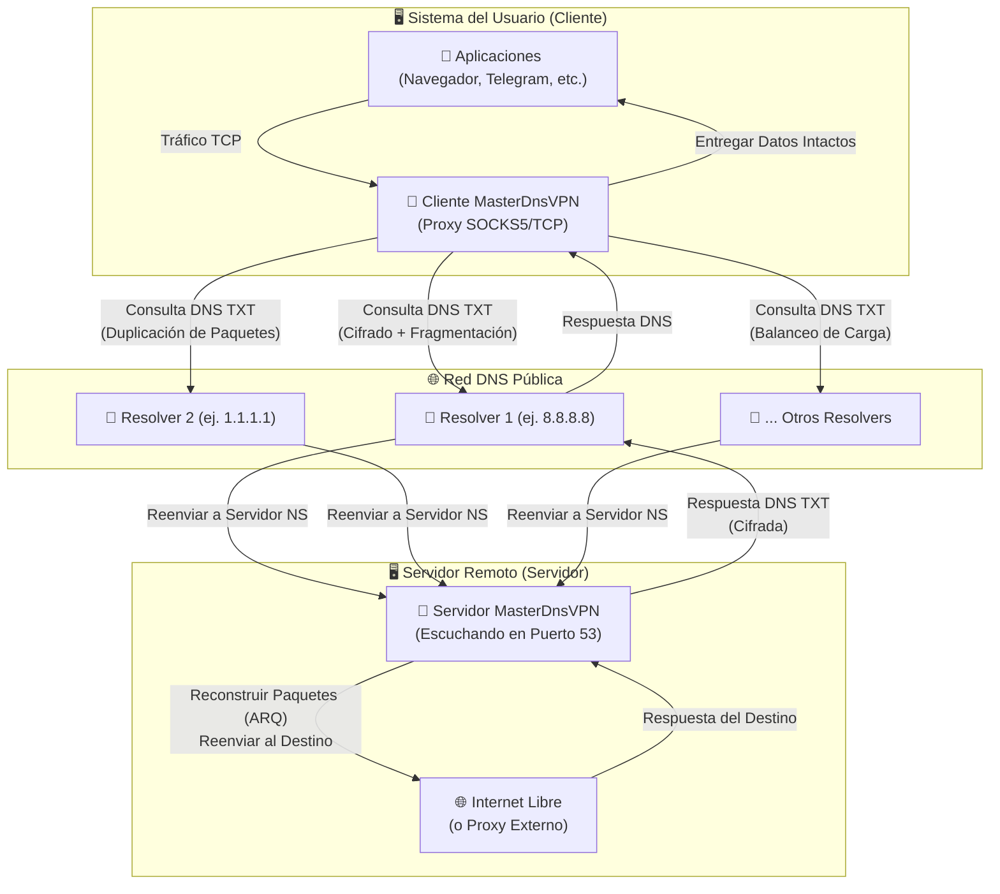
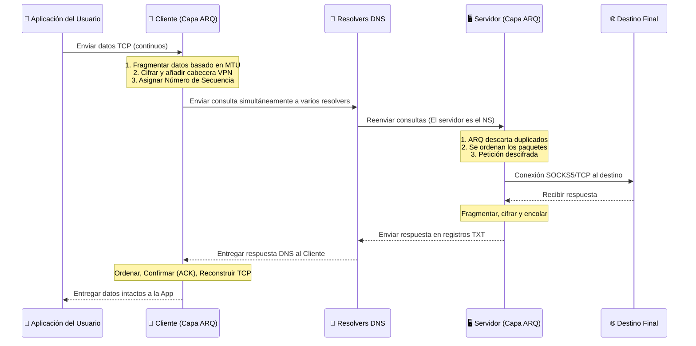

# Proyecto MasterDnsVPN 🚀

## [نسخه فارسی](https://github.com/masterking32/MasterDnsVPN/blob/main/README_FA.MD) | [English Version](https://github.com/masterking32/MasterDnsVPN/blob/main/README.MD) | [Spanish Version](https://github.com/masterking32/MasterDnsVPN/blob/main/README_ES.MD)

El proyecto **MasterDnsVPN** es una solución robusta, de baja sobrecarga y avanzada para eludir la censura y el filtrado de internet, ocultando y encapsulando el tráfico TCP dentro de consultas DNS.

Este sistema está diseñado específicamente para eludir cortafuegos (firewalls) estrictos y restricciones severas de red donde los protocolos VPN tradicionales, o incluso los servicios conocidos de tunelización DNS como **DNSTT** y **SlipStream**, están bloqueados o son ineficaces debido a interrupciones masivas y limitaciones en los resolvers DNS.

El objetivo principal de **MasterDnsVPN** es proporcionar un túnel seguro, confiable y flexible que minimice la sobrecarga (overhead) del protocolo y ofrezca un rendimiento estable y aceptable, incluso en redes que sufren de alta pérdida de paquetes (Packet Loss) o limitaciones estrictas de MTU.

---

## ✨ Características Principales y Ventajas

- 🛡️ **Evasión de Censura Estricta:**  Diseñado específicamente para aumentar la probabilidad de penetrar firewalls y políticas de red restrictivas que bloquean los protocolos VPN estándar.

- ⚡ **Balanceo de Carga y Diversidad de Resolvers:** Soporta múltiples resolvers DNS con estrategias avanzadas de balanceo de carga de paquetes (incluyendo Aleatorio, Round-Robin y Menor Pérdida).

- 📡 **Duplicación de Paquetes (Multiruta):** Capaz de enviar el mismo paquete simultáneamente a través de múltiples rutas (diferentes resolvers y dominios). El paquete que llega primero es procesado; si un paquete se pierde en una ruta, su duplicado llega a salvo por otra. Esta técnica aumenta el uso de ancho de banda, pero mejora drásticamente la confiabilidad en redes altamente interrumpidas (ajustable y se puede desactivar).

- 🔄 **Protocolo ARQ Personalizado y Optimización de Sobrecarga:** Implementa una capa ARQ (Solicitud de Repetición Automática) personalizada sobre UDP/DNS para la retransmisión y secuenciación de paquetes en lugar de depender de QUIC. Esto elimina la pesada sobrecarga de QUIC, reduce el MTU requerido y garantiza la compatibilidad con resolvers que carecen de soporte EDNS o tienen límites bajos de MTU.

- 🔐 **Seguridad Robusta y Cifrado Flexible:** Soporta varios métodos de cifrado robustos para garantizar la privacidad del usuario, incluyendo: `XOR`, `ChaCha20`, `AES-128-GCM`, `AES-192-GCM` y `AES-256-GCM`.

- 🧰 **Escaneo Automático y Sondeo de MTU:** Al ejecutarse, el cliente escanea automáticamente todos los resolvers configurados, prueba su calidad, muestra los resultados y calcula el MTU óptimo para sus rutas de red.

- 🌐 **Multiplexación TCP:** Multiplexa múltiples conexiones TCP locales en una sola sesión DNS para una gestión óptima de los recursos.

- 🗜️ **Compresión/Empaquetado de Paquetes Pequeños:** Si se configura, el sistema puede fusionar múltiples paquetes pequeños en una sola carga útil (payload) hasta el límite de MTU. Esto reduce drásticamente el número de solicitudes DNS salientes.

- 🧦 **Optimización SOCKS5 Dedicada:** El sistema maneja automáticamente el reenvío SOCKS5, eliminando la necesidad de instalar herramientas proxy de terceros como X-UI o Dante. Además, establecer el protocolo en SOCKS5 elimina los paquetes de enlace (handshake) redundantes a través del túnel, reduciendo significativamente el tráfico.

- 🚀 **Reenvío de Varios Protocolos TCP:** Además de la integración SOCKS5, también puede reenviar otros servicios basados en TCP como `VLESS`, `ShadowSocks`, `VMESS`, etc.

---

⭐ ¡Si utilizas o te gusta este proyecto, por favor apóyanos dándole una estrella al repositorio! ⭐

---

# Guía de Configuración 🧑‍💻

## Sección 1: Requisitos Previos de Red (Configuración DNS) 🛠️

Para que su servidor reciba y procese directamente las consultas DNS, debe delegar un subdominio a su servidor dedicado. Inicie sesión en el panel de administración DNS de su dominio (ej., Cloudflare, ArvanCloud) y cree los siguientes dos registros:

### Paso 1.1: Crear un Registro A (IP del Servidor) 🅰️
Primero, cree un registro `A` que apunte un subdominio a la dirección IPv4 pública de su servidor.
- **Tipo:** `A`
- **Nombre:** Un nombre corto arbitrario (ej., `ns`)
- **Dirección IPv4:** La dirección IP de su servidor (ej., `1.2.3.4`)
  > **Resultado:** `ns.example.com -> 1.2.3.4`

### Paso 1.2: Crear un Registro NS (Subdominio del Túnel) 🏷️
A continuación, cree un registro `NS` (Name Server). Esto le dice a internet que el servidor que definió en el paso anterior es el responsable de manejar las consultas para este subdominio específico.
- **Tipo:** `NS`
- **Nombre:** El subdominio principal del túnel (ej., `v`)
- **Objetivo/Nameserver:** El registro A que creó en el Paso 1.1 (ej., `ns.example.com`)
  > **Resultado:** `v.example.com -> ns.example.com`

---

## Sección 1.3: Advertencia Crucial (Usuarios de Cloudflare) ⚠️
Si está utilizando Cloudflare, el estado del Proxy para el registro `A` **DEBE** estar configurado en **DNS only (Nube Gris ☁️)**. Si el proxy está habilitado (Nube Naranja), Cloudflare bloqueará el tráfico UDP del puerto 53, y su túnel **¡no funcionará en absoluto!**

## Sección 1.4: Consejo de Oro para la Velocidad (MTU) 💡
En el protocolo DNS, la longitud de su nombre de dominio consume parte de la capacidad limitada de carga útil de cada paquete. El uso de nombres de dominio y subdominio **más cortos** (ej., `v.ex.com` en lugar de `tunnel.mi-dominio-largo.com`) deja más espacio libre para la carga útil real del usuario, lo que resulta directamente en mayor velocidad y menos caídas.

---

## Sección 2: Instalación y Ejecución (Cliente y Servidor) 🚀

Puede instalar y ejecutar este proyecto utilizando dos métodos: el método rápido y automatizado precompilado (Recomendado), o directamente desde el código fuente de Python.

### Paso 2.1: Configuración Rápida del Servidor en Linux 🐧

Si desea configurar el servidor en una máquina Linux, la forma más sencilla es utilizar el script de instalación automatizado. Simplemente ejecute el siguiente comando en la terminal de su servidor:

```bash
curl -sL [https://raw.githubusercontent.com/masterking32/MasterDnsVPN/main/server_linux_install.sh](https://raw.githubusercontent.com/masterking32/MasterDnsVPN/main/server_linux_install.sh) | sudo bash
```

Este comando descarga un script de GitHub y maneja automáticamente todo el proceso de instalación y configuración. Una vez finalizado, el servidor se iniciará y se mostrará una **Clave de Cifrado (Encryption Key)** en los registros de la terminal. Asegúrese de copiar esta clave (también se guarda en `encrypt_key.txt` junto al ejecutable del servidor), ya que la necesitará para conectar el cliente.

> ⚠️ **Nota Importante 1:** Antes de ejecutar este script, debe poseer un dominio y haber configurado correctamente sus registros DNS (Sección 1).
> 
> ⚠️ **Nota Importante 2:** Este script solo configura el servidor Linux y no incluye el cliente. Para ejecutar el cliente en su máquina local, use el "Paso 2.2".
> 
> ⚠️ **Nota Importante 3:** También puede usar este comando para actualizar su servidor a la última versión.

---

### Paso 2.2: Uso de Binarios de Cliente Precompilados (Recomendado ✅)

Para su comodidad, los ejecutables del cliente están precompilados. Simplemente descargue la versión correcta para su sistema operativo y extraiga el archivo ZIP.

> 💡 **Nota:** Cada archivo ZIP del Cliente contiene el ejecutable y una plantilla de configuración predeterminada llamada `client_config.toml`. 

#### Enlaces de Descarga del Cliente (Client) 📥

| Sistema Operativo (OS) | Arquitectura | Adecuado Para... | Enlace de Descarga Directa |
| :--- | :--- | :--- | :--- |
| Windows 🪟 | `AMD64` (64-bit) | Windows 10 y 11 | [Descargar versión Windows ⬇️](https://github.com/masterking32/MasterDnsVPN/releases/latest/download/MasterDnsVPN_Client_Windows_AMD64.zip) |
| macOS 🍎 | `ARM64` | Macs nuevos (M1 / M2 / M3) | [Descargar Mac (Apple Silicon) ⬇️](https://github.com/masterking32/MasterDnsVPN/releases/latest/download/MasterDnsVPN_Client_MacOS_ARM64.zip) |
| Linux 🐧 | `AMD64` (64-bit) | Distros nuevas (Ubuntu 22.04+, Debian 12+) | [Descargar Linux (Nuevo) ⬇️](https://github.com/masterking32/MasterDnsVPN/releases/latest/download/MasterDnsVPN_Client_Linux_AMD64.zip) |
| Linux (Legacy) 🐧 | `AMD64` (64-bit) | Distros antiguas (Ubuntu 20.04, Debian 11) | [Descargar Linux (Legacy) ⬇️](https://github.com/masterking32/MasterDnsVPN/releases/latest/download/MasterDnsVPN_Client_Linux-Legacy_AMD64.zip) |
| Linux (ARM) 🐧 | `ARM64` | Servidores ARM, Raspberry Pi, etc. | [Descargar Linux (ARM) ⬇️](https://github.com/masterking32/MasterDnsVPN/releases/latest/download/MasterDnsVPN_Client_Linux_ARM64.zip) |

#### Enlaces de Descarga del Servidor (Server) 📤
*(Solo si no utilizó el script de instalación rápida)*

| Sistema Operativo (OS) | Arquitectura | Adecuado Para... | Enlace de Descarga Directa |
| :--- | :--- | :--- | :--- |
| Windows 🪟 | `AMD64` (64-bit) | Windows Server, Windows 10 y 11 | [Descargar Servidor Windows ⬇️](https://github.com/masterking32/MasterDnsVPN/releases/latest/download/MasterDnsVPN_Server_Windows_AMD64.zip) |
| Linux 🐧 | `AMD64` (64-bit) | Servidores Ubuntu 22.04+, Debian 12+ | [Descargar Servidor Linux (Nuevo) ⬇️](https://github.com/masterking32/MasterDnsVPN/releases/latest/download/MasterDnsVPN_Server_Linux_AMD64.zip) |
| Linux (Legacy) 🐧 | `AMD64` (64-bit) | Servidores antiguos (Ubuntu 20.04, Debian 11) | [Descargar Servidor Linux (Legacy) ⬇️](https://github.com/masterking32/MasterDnsVPN/releases/latest/download/MasterDnsVPN_Server_Linux-Legacy_AMD64.zip) |
| Linux (ARM) 🐧 | `ARM64` | Servidores en la nube ARM | [Descargar Servidor Linux (ARM) ⬇️](https://github.com/masterking32/MasterDnsVPN/releases/latest/download/MasterDnsVPN_Server_Linux_ARM64.zip) |
| macOS 🍎 | `ARM64` | Macs nuevos (M1 / M2 / M3) | [Descargar Servidor Mac (Apple Silicon) ⬇️](https://github.com/masterking32/MasterDnsVPN/releases/latest/download/MasterDnsVPN_Server_MacOS_ARM64.zip) |

---

### Paso 2.2.1: Extracción y Preparación en Linux 🗂️

En Linux, asegúrese de tener las herramientas de extracción y edición de texto instaladas:

```bash
sudo apt update
sudo apt install unzip nano
```

Extraiga el archivo ZIP descargado:

```bash
# Extraer el cliente (o servidor)
unzip MasterDnsVPN_Client_Linux_AMD64.zip

# Listar los archivos extraídos
ls
```

En Linux y macOS, debe otorgar permisos de ejecución al archivo binario:

```bash
chmod +x MasterDnsVPN_Client_Linux_AMD64
```

Ahora, abra el archivo de configuración (`client_config.toml` o `server_config.toml`) con el editor `nano` y complete sus detalles (consulte la Sección 3):

```bash
nano client_config.toml
```

> **Nota:** En `nano`, presione `Ctrl + O` y luego `Enter` para guardar, y `Ctrl + X` para salir.

Después de guardar la configuración, ejecute el programa:

```bash
./MasterDnsVPN_Client_Linux_AMD64
```

---

### Paso 2.3: Instalación desde el Código Fuente (Para Desarrolladores 🧑‍💻)

> ⚠️ **Atención:** Si es un usuario normal, no necesita esta sección. Utilice el Paso 2.2. Este método es estrictamente para desarrolladores que desean modificar o ejecutar el código de Python directamente.

Para ejecutar el código fuente, Python debe estar instalado:

```bash
# Clonar el repositorio e instalar dependencias
git clone [https://github.com/masterking32/MasterDnsVPN.git](https://github.com/masterking32/MasterDnsVPN.git)
cd MasterDnsVPN
pip install -r requirements.txt

# Copiar plantillas de configuración
cp server_config.toml.simple server_config.toml
cp client_config.toml.simple client_config.toml

# Editar configuraciones, luego ejecutar el servidor o cliente
python server.py
python client.py
```

---

# Sección 3: Estructura de Configuración (Config) 🛠️

## Sección 3.1: Configuración y Ejecución Rápida del Cliente 🚀

Si inició su servidor utilizando el script de Instalación Rápida (Paso 2.1), solo necesita editar `client_config.toml` en su máquina cliente. Los tres parámetros principales que DEBE configurar son:

1. **`ENCRYPTION_KEY`**: Pegue la clave de cifrado que se mostró en la terminal de su servidor. ¡La conexión será rechazada sin esta clave!
2. **`DOMAINS`**: Ingrese exactamente su subdominio de túnel (ej., `["v.example.com"]`). **Nota:** Actualmente, proporcione solo UN dominio.
3. **`RESOLVER_DNS_SERVERS`**: Una lista de resolvers DNS públicos para enrutar el tráfico (ej., `["8.8.8.8", "1.1.1.1"]`).

> ⚠️ **Nota Importante 1 (Cifrado):** El script de instalación rápida establece el cifrado del servidor en `XOR`. Asegúrese de que `DATA_ENCRYPTION_METHOD` en la configuración de su cliente también esté en `1`.
> 
> ⚠️ **Nota Importante 2 (Conexión):** El protocolo predeterminado es `SOCKS5`. Una vez que el cliente se esté ejecutando, configure sus aplicaciones (Navegador, Telegram) para usar un proxy SOCKS5 apuntando a `127.0.0.1` en el puerto `1080`. Por defecto, requiere usuario/contraseña: `master_dns_vpn`.
> 
> ⚠️ **Soporte:** Si encuentra problemas, adjunte sus registros de errores (logs) y abra un Issue exclusivamente en [GitHub Issues](https://github.com/masterking32/MasterDnsVPN/issues).

---

## Sección 3.2: Configuración del Servidor (Instalación Manual) ⚙️

Si **no** utilizó el script del Paso 2.1, debe editar manualmente el archivo `server_config.toml`. Asegúrese de que los parámetros críticos como el método de cifrado y el dominio coincidan **exactamente** en ambos lados.

---

## Sección 3.3: Variables de Configuración del Cliente (`client_config.toml`) 📖

| Parámetro | Valor Predeterminado | Valores Aceptados | Descripción |
|---------|--------------|------------------|-------|
| `PROTOCOL_TYPE` | `"SOCKS5"` | `"SOCKS5"`, `"TCP"` | **Tipo de Protocolo del Túnel:**<br><br>• `"SOCKS5"`: Altamente recomendado. Optimizado para máxima velocidad.<br>• `"TCP"`: Usado para reenviar puertos sin procesar (ej., VLESS o OpenVPN). |
| `DOMAINS` | `["v.domain.com"]` | Matriz (ej., `["sub.site.com"]`) | El subdominio <br>NS<br> configurado en la Sección 1. Debe ser idéntico al del servidor. |
| `DATA_ENCRYPTION_METHOD` | `1` | `0` a `5` | **Algoritmo de Cifrado:**<br><br>`0`: Desactivado<br>`1`: Algoritmo XOR (Recomendado - Alta velocidad)<br>`2`: ChaCha20<br>`3`: AES-128-GCM<br>`4`: AES-192-GCM<br>`5`: AES-256-GCM |
| `ENCRYPTION_KEY` | `""` | Cadena (String) | Clave de cifrado coincidente con la del servidor. |
| `LISTEN_IP` | `"0.0.0.0"` | IP Válida | Dirección IP local en la que el cliente escucha. `"127.0.0.1"` para mayor seguridad. |
| `LISTEN_PORT` | `1080` | Puerto | El puerto local para conectar sus aplicaciones. |
| `SOCKS5_AUTH` | `true` | `true` o `false` | Habilita la autenticación local <br>SOCKS5<br>. (Solo afecta la conexión entre su navegador y su propio cliente local). |
| `SOCKS5_USER` | `"master_dns_vpn"` | Cadena | Nombre de usuario para el proxy SOCKS local. |
| `SOCKS5_PASS` | `"master_dns_vpn"` | Cadena | Contraseña para el proxy SOCKS local. |
| `RESOLVER_DNS_SERVERS` | `["8.8.8.8", "1.1.1.1"]` | Lista de IPs | Lista de servidores DNS públicos. Agregue más IPs para mayor estabilidad. |
| `PACKET_DUPLICATION_COUNT` | `3` | Entero positivo | Número de veces que se duplica un paquete simultáneamente. Aumentar reduce caídas pero consume ancho de banda. |
| `RESOLVER_BALANCING_STRATEGY` | `1` | `1`, `2`, `3` | **Estrategia de Balanceo:**<br>`1`: **Aleatorio**<br>`2`: **Round-Robin**<br>`3`: **Menor Pérdida** |
| `MIN_UPLOAD_MTU` | `40` | Entero (Bytes) | MTU de subida mínimo requerido para usar un resolver. |
| `MIN_DOWNLOAD_MTU` | `40` | Entero (Bytes) | MTU de bajada mínimo requerido para usar un resolver. |
| `MAX_UPLOAD_MTU` | `220` | Entero (Bytes) | Límite superior para el escaneo automático de MTU. |
| `ARQ_WINDOW_SIZE` | `3000` | Entero | Tamaño de ventana ARQ. Ajustar según la RAM del dispositivo. |
| `LOG_LEVEL` | `"INFO"` | `"DEBUG"`, `"INFO"`, etc. | Nivel de registro del cliente. |

---

## Sección 3.4: Variables de Configuración del Servidor (`server_config.toml`) 📖

| Parámetro | Valor Predeterminado | Valores Aceptados | Descripción |
|---------|--------------|------------------|-------|
| `UDP_HOST` | `"0.0.0.0"` | IP Válida | Dirección IP a la que se vincula el servidor. |
| `UDP_PORT` | `53` | Puerto | Puerto del servidor. **Debe ser 53** para que la resolución DNS funcione. |
| `DOMAIN` | `["v.domain.com"]` | Matriz | El dominio para el que este servidor es autoritativo. |
| `DATA_ENCRYPTION_METHOD` | `1` | `0` a `5` | **Algoritmo de Cifrado.** Debe coincidir exactamente con el Cliente. |
| `PROTOCOL_TYPE` | `"SOCKS5"` | `"SOCKS5"`, `"TCP"` | Debe coincidir con la configuración del Cliente. |
| `USE_EXTERNAL_SOCKS5` | `false` | `true` o `false` | `false`: El servidor Python maneja el proxy directamente (Más rápido). `true`: Se conecta a un proxy de terceros. |
| `FORWARD_IP` | `"127.0.0.1"` | IP Válida | IP del proxy externo (si `USE_EXTERNAL_SOCKS5=true`). |
| `FORWARD_PORT` | `1080` | Puerto | Puerto del proxy externo. |

---

## Sección 3.5: Mejor Comprensión de MTU y Ajustes Dorados para Inicio Rápido ⚠️

### Sección 3.5.1: Concepto de MTU en Túneles DNS 📦
**MTU** significa **Unidad Máxima de Transmisión**—el tamaño máximo de un paquete de datos enviado por la red.
En redes muy filtradas, los paquetes grandes suelen perderse (Drop). Reducir el MTU garantiza la estabilidad. Sin embargo, establecerlo demasiado bajo divide los datos en fragmentos diminutos, reduciendo su velocidad.

### Sección 3.5.2: Guía para Optimizar el MTU 🚀
El cliente utiliza una "Búsqueda Binaria" (Binary Search) para encontrar el MTU exacto en el primer inicio. Este proceso toma tiempo. Para acelerarlo:

1. Ejecute el cliente y observe el registro inicial que dice:
   `Domain: v.example.com -> MIN and MAX_UPLOAD_MTU = 133 | MIN and MAX_DOWNLOAD_MTU = 129`
2. Cierre el programa inmediatamente.
3. Abra `client_config.toml` y establezca `MAX_UPLOAD_MTU` exactamente en el número sugerido (`133`).

### Sección 3.5.3: Truco de Oro para un Inicio Instantáneo (Fast Boot) ⚡
Para evitar por completo la fase de prueba, establezca los valores MIN y MAX **exactamente iguales** en su configuración:

```toml
MIN_UPLOAD_MTU = 133
MAX_UPLOAD_MTU = 133

MIN_DOWNLOAD_MTU = 129
MAX_DOWNLOAD_MTU = 129
```
El cliente omitirá la búsqueda, probará este número solo una vez y se conectará en fracciones de segundo.

---

## Sección 4: Emergencias y Solución de Problemas 🚨

### Sección 4.1: Cortes Severos de Red (Intranet Nacional) ⚠️
Cuando la internet está bloqueada y solo pasa el tráfico DNS:
1. Añada tantos resolvers DNS públicos válidos como pueda a `RESOLVER_DNS_SERVERS`.
2. Aumente el `PACKET_DUPLICATION_COUNT` (ej. a `5` o `6`). Esto envía el mismo paquete simultáneamente a múltiples servidores, garantizando la entrega incluso si la mayoría fallan.

### Sección 4.2: Conflicto del Puerto 53 (Servidor Linux) 🛑
Si el puerto 53 está ocupado por `systemd-resolved`:
1. `sudo nano /etc/systemd/resolved.conf`
2. Cambie a: `DNSStubListener=no`
3. `sudo systemctl restart systemd-resolved`
4. **Crítico:** Actualice `resolv.conf`: `sudo ln -sf /run/systemd/resolve/resolv.conf /etc/resolv.conf`

---

## Sección 5: Arquitectura y Flujo de Trabajo 🛠️

### Sección 5.1: Diagrama de Arquitectura de Alto Nivel



### Sección 5.2: Ciclo de Vida del Paquete 🔄



---

## Sección 6: Notas Técnicas Avanzadas ⚙️

- ⚡ **SOCKS5 Directo (Fast-Connect):** Configurar `USE_EXTERNAL_SOCKS5` como `false` permite que el código en Python enrute el tráfico directamente al destino, reduciendo drásticamente la latencia.
- 🔄 **Sondeo Adaptativo:** El cliente reduce la frecuencia de sus consultas `Keep-Alive` cuando no hay tráfico, para evitar saturar la red DNS.
- 🔒 **Biblioteca Cryptography:** Requiere instalación para algoritmos AES-GCM. Sin embargo, para hardware limitado como routers, el método interno `XOR` no requiere dependencias adicionales y es extremadamente rápido.

---

## 🤝 Contribuciones (Contributing)
¡Las contribuciones son absolutamente bienvenidas! Si tiene ideas, correcciones o mejoras de rendimiento, haga un Fork del proyecto y envíe un Pull Request. Reporte cualquier problema exclusivamente en la sección de [Issues](https://github.com/masterking32/MasterDnsVPN/issues).

---

## 📄 Licencia (License)
Este proyecto está publicado bajo la Licencia **MIT**. Consulte el archivo `LICENSE` para todos los detalles.

---

## 👨‍💻 Desarrollador
Desarrollado con ❤️ por: [**MasterkinG32**](https://github.com/masterking32)