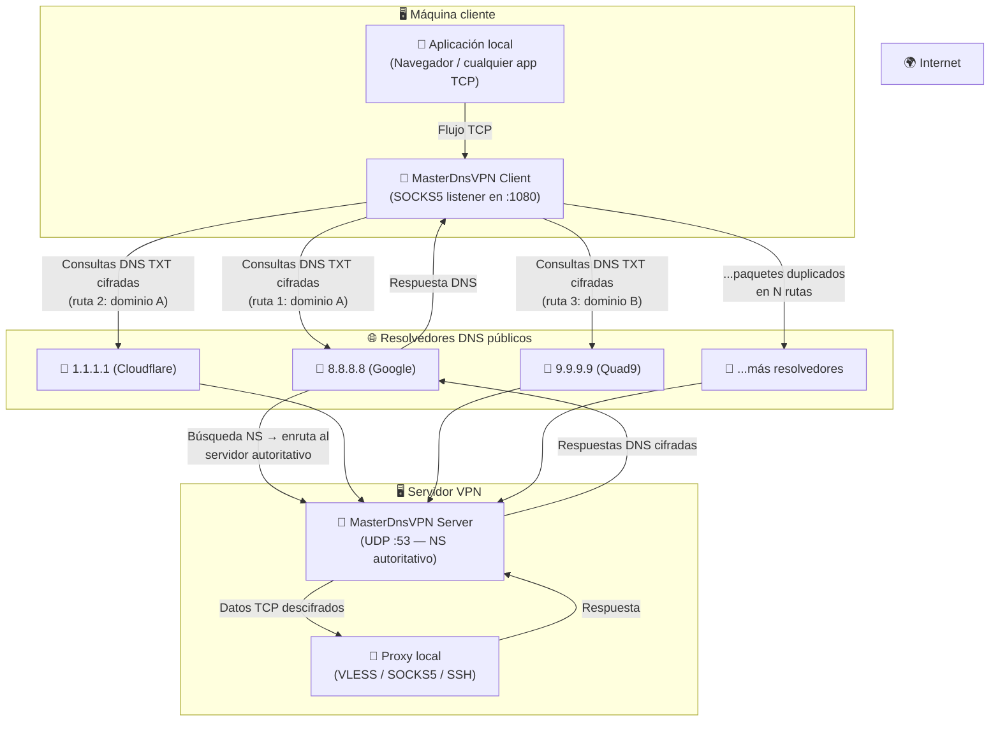
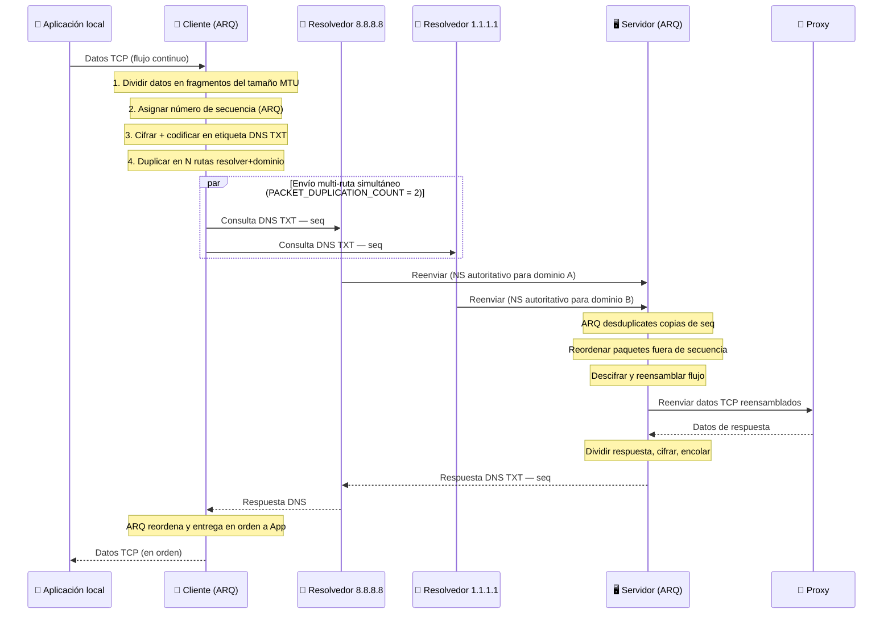

# 🚀 MasterDnsVPN

## [نسخه فارسی](https://github.com/masterking32/MasterDnsVPN/blob/main/README_FA.MD) | [English Version](https://github.com/masterking32/MasterDnsVPN/blob/main/README.MD) | [Spanish Version](https://github.com/masterking32/MasterDnsVPN/blob/main/README_ES.MD)


MasterDnsVPN es una herramienta de tunelización DNS de alto rendimiento diseñada para encapsular el tráfico VPN en consultas DNS. Este proyecto está diseñado específicamente para eludir la estricta censura de la red y los firewalls donde se bloquean los protocolos VPN tradicionales.

Cuenta con una implementación personalizada de **ARQ (solicitud de repetición automática)**, que garantiza una confiabilidad similar a la de TCP y un ordenamiento de paquetes a través del protocolo DNS basado en UDP, que es inherentemente poco confiable.

---

⭐ Si te parece útil o interesante este proyecto, ¡por favor apóyalo dándole una estrella al repositorio! ⭐

---

## ✨ Características principales
- 🛡️ **Elusión de censura:** Aprovecha el protocolo DNS para canalizar el tráfico a través de entornos restringidos.
- 🔐 **Seguridad robusta:** Admite múltiples métodos de cifrado, incluyendo XOR, ChaCha20, AES-128-CTR, AES-192-CTR y AES-256-CTR.
- ⚙️ **Gestión inteligente de MTU:** Sondea y sincroniza automáticamente la unidad máxima de transmisión (MTU) óptima tanto para carga como para descarga.
- 🔄 **Protocolo ARQ personalizado:** Soluciona problemas de pérdida de paquetes y entrega desordenada con retransmisión dinámica y control de flujo.
- ⚡ **Balanceo de carga del solucionador:** Admite múltiples solucionadores DNS con estrategias de balanceo adaptativo (aleatorio, round-robin, mejor pérdida).
- 🌐 **Multiplexación TCP:** Permite multiplexar múltiples conexiones TCP locales en una sola sesión DNS.
- 📡 **Duplicación de paquetes multi-ruta:** Cada paquete puede enviarse simultáneamente por múltiples rutas resolver+dominio para máxima fiabilidad en condiciones de red extremas.

---

## 🛠️ Requisitos previos de red (Configuración DNS)

Para que el túnel sea funcional, debe ser propietario de un dominio y configurar los siguientes registros en su panel de administración DNS (p. ej., Cloudflare):

1. **Registro A:** Cree un registro **A** que apunte a la IP pública de su servidor.
   - Ejemplo: `s.example.com` -> `1.2.3.4`
2. **Registro NS:** Cree un registro **NS** para el subdominio del túnel que apunte al registro A creado anteriormente.
   - Ejemplo: `v.example.com` -> `s.example.com`

> 💡 **Consejo profesional:** Cuanto más cortos sean los nombres de dominio y subdominio (p. ej., `v.ex.com`), más espacio queda para los datos útiles en cada paquete DNS, lo que aumenta significativamente el rendimiento.

---

## 📦 Requisitos

- 🐍 Python 3.7 o superior
- 🔐 `cryptography` (Requerida para métodos de cifrado AES/ChaCha20)
- 📝 `loguru` (Para un registro mejorado)

---

## 🚀 Instalación y uso

### Opción A: Descargar el ejecutable precompilado (Recomendado)

Puede descargar el binario precompilado más reciente para su plataforma, sin necesidad de instalar Python.

| Plataforma | Descarga |
|------------|----------|
| 🪟 Windows (AMD64) | [MasterDnsVPN_Client_Windows_AMD64.zip](https://github.com/masterking32/MasterDnsVPN/releases/latest/download/MasterDnsVPN_Client_Windows_AMD64.zip) |
| 🐧 Linux (AMD64) | [MasterDnsVPN_Client_Linux_AMD64.zip](https://github.com/masterking32/MasterDnsVPN/releases/latest/download/MasterDnsVPN_Client_Linux_AMD64.zip) |
| 🍎 macOS (ARM64) | [MasterDnsVPN_Client_MacOS_ARM64.zip](https://github.com/masterking32/MasterDnsVPN/releases/latest/download/MasterDnsVPN_Client_MacOS_ARM64.zip) |

Cada archivo ZIP contiene el ejecutable y una plantilla de configuración `client_config.toml`.

**Pasos:**

1. Extraiga el archivo ZIP.
2. Abra `client_config.toml` en cualquier editor de texto y configure los valores:
   - `ENCRYPTION_KEY` — cópielo del registro del servidor en la primera ejecución.
   - `DOMAINS` — su subdominio de túnel (p. ej., `v.example.com`).
   - `RESOLVER_DNS_SERVERS` — resolvers DNS públicos (p. ej., `8.8.8.8`).
3. Coloque `client_config.toml` en la **misma carpeta** que el ejecutable y ejecútelo.

---

### Opción B: Ejecutar desde el código fuente

#### 1. Instalar dependencias

Clonar el repositorio e instalar las bibliotecas de Python necesarias:
```bash
git clone https://github.com/masterking32/MasterDnsVPN.git
cd MasterDnsVPN
pip install -r requirements.txt
```

#### 2. Configuración del servidor

Copie la configuración de ejemplo:

```bash
cp server_config.toml.simple server_config.toml
```

Edite `server_config.toml` para incluir su dominio y la IP/Puerto de reenvío de destino.
- Instale un servidor proxy (p. ej., SOCKS5, VLESS, VMESS, SSH, MTProto, OpenVPN TCP, etc.) en el servidor para reenviar el tráfico a internet.
- Configure `FORWARD_IP` y `FORWARD_PORT` en `server_config.toml` para que apunten a su servidor proxy.
- Configure `DOMAIN` para que coincida con el subdominio que configuró en sus registros DNS (p. ej., `v.example.com`).

#### 3. Ejecutar el servidor

```bash
python server.py
```

En la primera ejecución, el servidor generará una clave de cifrado. **Guarde esta clave**; la necesitará para configurar el cliente.

#### 4. Configurar el cliente

Copie la configuración de ejemplo del cliente:

```bash
cp client_config.toml.simple client_config.toml
```

Edite `client_config.toml`:

- `DOMAINS`: Su subdominio de túnel (p. ej., `v.example.com`).

- `ENCRYPTION_KEY`: La clave que aparece en el registro del servidor.

- `RESOLVER_DNS_SERVERS`: Lista de resolvers DNS públicos (p. ej., `8.8.8.8`, `1.1.1.1`).

#### 5. Ejecutar el cliente

```bash
python client.py
```

El cliente inicia un proxy SOCKS5 local en `127.0.0.1:1080` (configurable mediante `LISTEN_IP` / `LISTEN_PORT`). Configure su navegador o aplicación para usar este proxy y enrutar el tráfico a través del túnel.

---

## 🚨 Consejo de emergencia: Interrupción grave de la red

> **Cuando la red está casi completamente caída y solo las consultas DNS están llegando (pérdida de paquetes y disrupciones extremas):**

1. **Recopile tantas IPs de resolvedores DNS como sea posible.** Agréguelas todas a `RESOLVER_DNS_SERVERS` en `client_config.py`. Puede usar resolvedores públicos de Google (`8.8.8.8`, `8.8.4.4`), Cloudflare (`1.1.1.1`, `1.0.0.1`), Quad9 (`9.9.9.9`), OpenDNS (`208.67.222.222`, `208.67.220.220`) y otros.

2. **Aumente `PACKET_DUPLICATION_COUNT`** en `client_config.py`. Este parámetro controla cuántas rutas resolver+dominio diferentes usa cada paquete **simultáneamente**.

   - Con 6 resolvedores y 2 dominios, tendrá **12 rutas potenciales**.
   - Configurar `PACKET_DUPLICATION_COUNT = 6` significa que cada paquete se envía por 6 rutas diferentes a la vez.
   - Incluso si 5 de las 6 rutas fallan, el paquete llega por la ruta superviviente.

   > ⚠️ **Compensación:** Una duplicación mayor aumenta proporcionalmente el uso de ancho de banda y CPU. Un valor de `3`–`6` es un buen equilibrio durante las interrupciones. La capa ARQ del servidor desduplicará automáticamente las copias recibidas para que su aplicación vea cada paquete solo una vez.

3. **Agregue múltiples dominios de túnel** (lista `DOMAINS`) para multiplicar aún más el número de rutas disponibles.

---

## 🛠️ Cómo funciona

### Arquitectura del sistema



### Flujo de paquetes (Diagrama de secuencia)



### Conceptos clave

| Concepto | Descripción |
|---|---|
| **Session** | Una conexión de cliente; hasta 255 sesiones concurrentes por servidor |
| **Stream** | Una conexión TCP multiplexada sobre una sesión |
| **MTU Probing** | Búsqueda binaria al inicio para encontrar el tamaño máximo de payload DNS en su ruta |
| **ARQ** | Números de secuencia + retransmisión garantizan que no se pierdan datos sobre UDP/DNS |
| **PACKET_DUPLICATION_COUNT** | Cada paquete se envía simultáneamente por este número de rutas resolver+dominio |
| **Resolver Balancing** | Estrategias: Aleatorio (1), Round-Robin (2), Menor pérdida (3) |

---

## 📝 Notas técnicas

- ⚡ **Optimización de MTU:** Al conectarse, el cliente realiza una búsqueda binaria para encontrar la MTU máxima posible para su ruta específica. Esto garantiza la máxima velocidad sin fragmentación de paquetes.

- 🔄 **Sondeo adaptativo:** El cliente utiliza mecanismos de retroceso inteligente y comprobación de inactividad para reducir la sobrecarga de DNS cuando no se transmite tráfico.

- 🔒 **Cifrado:** Para los métodos AES/ChaCha20 se requiere la biblioteca `cryptography`. Para dispositivos con recursos limitados, se recomienda XOR (Método 1).

- 🔁 **Múltiples servidores simultáneos:** Puede ejecutar múltiples instancias independientes del servidor MasterDnsVPN, cada una con un dominio de túnel diferente, y listar todos los dominios en el array `DOMAINS` del cliente. El cliente tratará cada combinación dominio+resolvedor como una ruta separada, distribuyendo y duplicando automáticamente el tráfico en todas ellas.

---

## 🤝 Contribuciones
¡Agradecemos sus contribuciones! Por favor, forkee el repositorio y cree una pull request con sus cambios.

---

## 📄 Licencia
Este proyecto está licenciado bajo la licencia MIT. Consulte el archivo de LICENCIA para obtener más información.

---

## 👨‍💻 Desarrollador
Desarrollado por [MasterkinG32](https://github.com/masterking32)
