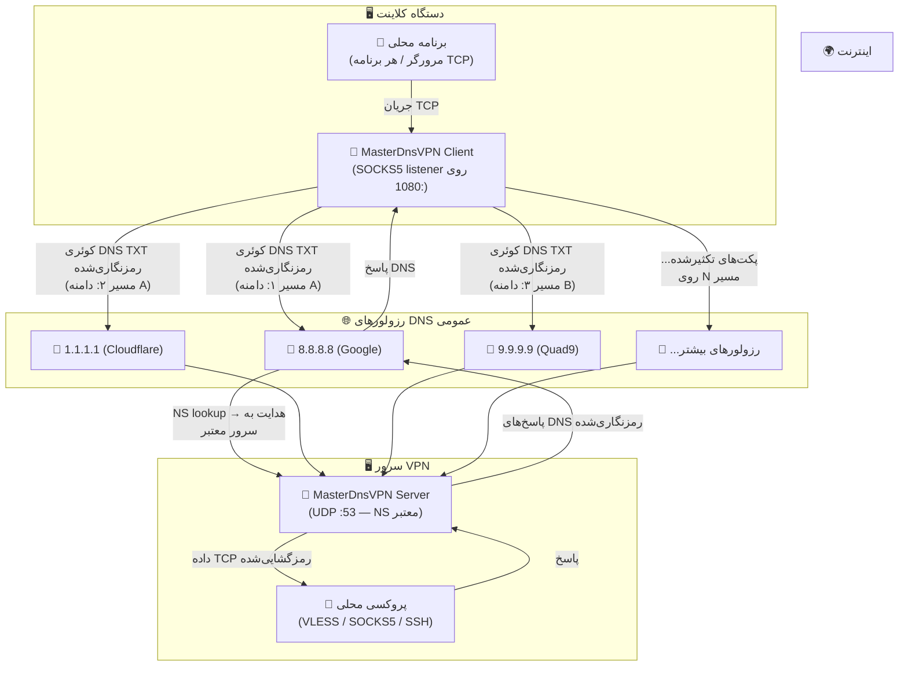
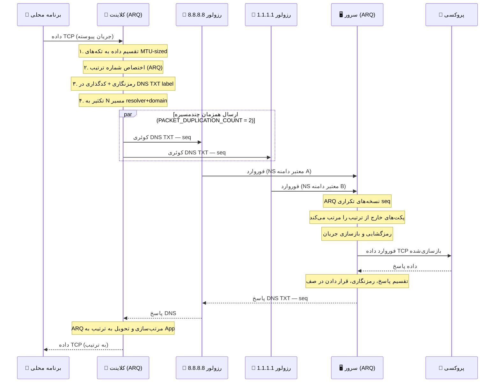

# پروژه MasterDnsVPN 🚀

## [نسخه فارسی](https://github.com/masterking32/MasterDnsVPN/blob/main/README_FA.MD) | [English Version](https://github.com/masterking32/MasterDnsVPN/blob/main/README.MD) | [Spanish Version](https://github.com/masterking32/MasterDnsVPN/blob/main/README_ES.MD)


پروژه **MasterDnsVPN** یک راهکار مقاوم، کم‌سربار و پیشرفته برای دور زدن فیلترینگ و سانسور اینترنت است که ترافیک TCP و پروتکل‌های مبتنی بر آن را به‌صورت بسته‌های رمزنگاری‌شده درون کوئری‌های DNS پنهان و منتقل می‌کند. 

این سامانه به‌طور خاص برای عبور از دیواره‌های آتش (Firewalls) سخت‌گیرانه و شرایطی طراحی شده است که روش‌های سنتی VPN، یا حتی سرویس‌های تونلینگ شناخته‌شده مانند **DNSTT** و **SlipStream** به‌دلیل اختلالات گسترده، محدودیت‌های شدید شبکه‌ای و مسدودسازی رزولورهای DNS دیگر کارآمد نیستند. 

هدف اصلی **MasterDnsVPN**، فراهم کردن تونلی امن، قابل‌اعتماد و انعطاف‌پذیر است که سربار (Overhead) پروتکل را به حداقل رسانده و در شبکه‌های دارای تلفات بسته (Packet Loss) بالا یا محدودیت‌های شدید MTU نیز عملکرد پایدار و قابل قبولی ارائه دهد.

---

## ویژگی‌های کلیدی و مزایا ✨

- **دور زدن سانسور شدید:** 🛡️ طراحی اختصاصی برای افزایش احتمال عبور از فایروال‌ها و سیاست‌های محدودکنندهٔ شبکه که پروتکل‌های VPN معمولی را مسدود می‌کنند.

- **توزیع بار و تعدد رزولورها (Load Balancing):** ⚡ پشتیبانی از چندین DNS Resolver مختلف با استراتژی‌های پیشرفتهٔ متعادل‌سازی بار بسته‌ها (شامل: انتخاب تصادفی، نوبت‌گردشی یا Round-Robin، و انتخاب بهترین رزولور بر اساس کمترین میزان تلفات).

- **تکثیر پکت چند‌مسیره (Packet Duplication):** 📡 قابلیت ارسال همزمان هر پکت از طریق چندین مسیر (رزولور و دامنهٔ مختلف). با این روش، هرکدام از پکت‌ها که زودتر به مقصد برسد پردازش می‌شود و در صورت افتادن (Drop) یک پکت در یک مسیر، همان پکت از طریق رزولور دیگر به‌سلامت می‌رسد. این تکنیک هرچند مصرف پهنای‌باند و منابع را افزایش می‌دهد، اما پایداری و اطمینان از ارسال را در شبکه‌های پر اختلال به‌شدت بالا می‌برد (این قابلیت قابل تنظیم بوده و امکان غیرفعال‌سازی آن نیز وجود دارد).

- **پروتکل ARQ سفارشی و بهینه‌سازی سربار:** 🔄 پیاده‌سازی لایهٔ بازفرست و ترتیب‌دهی بسته‌ها بر بستر UDP/DNS با استفاده از پروتکل اختصاصی ARQ به‌جای استفاده از QUIC. این کار نه‌تنها وابستگی و سربارهای اضافی QUIC را در شبکه‌های به‌شدت محدود حذف می‌کند، بلکه میزان MTU مورد نیاز را کاهش داده و با رزولورهایی که از EDNS پشتیبانی نمی‌کنند یا MTU کمتری دارند نیز کاملاً سازگار است. ساختار پکت‌ها تا حد امکان ساده شده تا کمترین دیتای سربار سمت برنامه تولید شود.

- **امنیت قوی و رمزنگاری انعطاف‌پذیر:** 🔐 پشتیبانی از روش‌های متنوع و قدرتمند رمزگذاری دیتا جهت حفظ امنیت کاربران، از جمله: `XOR`، `ChaCha20`، `AES-128-GCM`، `AES-192-GCM` و `AES-256-GCM`.

- **بررسی خودکار رزولورها و کاوش MTU:** 🧰 در هنگام اجرای برنامه، سیستم به‌صورت خودکار تمامی رزولورها را اسکن و بررسی می‌کند. این قابلیت کیفیت رزولورها را تست کرده، نتایج را به کاربر اطلاع می‌دهد و MTU بهینه را برای مسیرها تعیین می‌کند.

- **مولتی‌پلکس TCP:** 🌐 امکان مولتی‌پلکس کردن (Multiplexing) چندین اتصال محلی TCP بر روی یک نشست (Session) واحد DNS برای مدیریت بهتر منابع.

- **فشرده‌سازی و تجمیع پکت‌های کوچک:** 🗜️ در صورت نیاز و تنظیم توسط کاربر، این ویژگی امکان ادغام پکت‌های کوچک را تا اندازهٔ سقف MTU فراهم می‌کند. این کار باعث کاهش چشمگیر تعداد درخواست‌ها (Requests) شده و فضای مفید بیشتری را برای اطلاعات اصلی اختصاص می‌دهد.

- **بهینه‌سازی اختصاصی SOCKS5:** 🧦 در نسخه‌های جدید، بهینه‌سازی‌های ویژه‌ای برای پروتکل SOCKS5 صورت گرفته است. سیستم به‌صورت خودکار فورواردینگ اطلاعات را بر مبنای ساکس انجام داده و شما را از نصب سرویس‌های جانبی مانند X-UI، Dante و... بی‌نیاز می‌کند. همچنین اگر پروتکل برنامه روی SOCKS5 تنظیم شود، بخش زیادی از سربارها و پکت‌های اضافی مربوط به دست دادن (Handshake) ساکس حذف شده تا حجم درخواست‌ها و ترافیک به حداقل برسد.

- **قابلیت انتقال انواع پروتکل‌های TCP:** 🚀 علاوه بر انتقال بهینه و اختصاصی SOCKS5، شما می‌توانید ترافیک سایر سرویس‌ها نظیر `VLESS`، `ShadowSocks`، `VMESS` و سایر پروتکل‌های مبتنی بر TCP را نیز از طریق این تونل فوروارد و منتقل کنید.

---

لطفاً اگر از این پروژه استفاده می‌کنید یا به آن علاقه‌مند هستید، با دادن ستاره به ریپازیتوری از ما حمایت کنید! ⭐

---

# راه‌اندازی 🧑‍💻

## بخش ۱: پیش‌نیازهای شبکه (پیکربندی DNS) 🛠️

برای اینکه سرور شما بتواند درخواست‌های DNS را به‌طور مستقیم دریافت و پردازش کند، باید مدیریت (Delegation) یک زیردامنه را به سرور اختصاصی خودتان بسپارید. برای این کار، وارد پنل مدیریت DNS دامنهٔ خود (مانند Cloudflare، ArvanCloud و...) شوید و دقیقاً مطابق مراحل زیر دو رکورد ایجاد کنید:

### گام ۱.۱: ساخت رکورد A (معرفی IP سرور) 🅰️
ابتدا باید یک رکورد `A` بسازید تا یک زیردامنه را به آدرس IP عمومی (Public IP) سرورتان متصل کنید.
- **نوع رکورد (Type):** `A`
- **نام (Name):** یک نام کوتاه دلخواه (مثلاً `ns`)
- **آدرس (IPv4 address):** آدرس آی‌پی سرور شما (مثلاً `1.2.3.4`)
  > **نتیجه:** `ns.example.com -> 1.2.3.4`

### گام ۱.۲: ساخت رکورد NS (ارجاع زیردامنهٔ تونل) 🏷️
حالا باید یک رکورد `NS` (Name Server) ایجاد کنید. این رکورد به اینترنت می‌گوید که مسئول پاسخگویی به درخواست‌های این زیردامنه، همان سروری است که در مرحلهٔ قبل معرفی کردید. کلاینت شما از این آدرس برای برقراری ارتباط با تونل استفاده خواهد کرد.
- **نوع رکورد (Type):** `NS`
- **نام (Name):** زیردامنهٔ اصلی تونل (مثلاً `v`)
- **سرور نام (Target/Nameserver):** آدرس رکورد A که در مرحله قبل ساختید (مثلاً `ns.example.com`)
  > **نتیجه:** `v.example.com -> ns.example.com`

---

## بخش ۱.۳: اخطار بسیار مهم (مخصوص کاربران Cloudflare) ⚠️
اگر از پنل کلودفلر استفاده می‌کنید، **باید** وضعیت پروکسی (Proxy status) برای رکورد `A` روی حالت **DNS only (ابر خاکستری ☁️)** تنظیم شده باشد. اگر پروکسی روشن (ابر نارنجی) باشد، کلودفلر ترافیک UDP پورت ۵۳ را مسدود کرده و تونل شما **به‌هیچ‌وجه** کار نخواهد کرد!

## بخش ۱.۴: نکتهٔ طلایی برای افزایش سرعت (MTU) 💡
در پروتکل DNS، طول کاراکترهای دامنه بخشی از حجم محدود هر پکت را اشغال می‌کند. هرچه نام دامنه و زیردامنه‌های شما **کوتاه‌تر** باشند (مثلاً `v.ex.com` به‌جای `tunnel.my-long-domain.com`)، فضای خالی بیشتری برای انتقال داده‌های مفید (Payload) کاربر باقی می‌ماند که مستقیماً باعث افزایش پهنای باند، سرعت بالاتر و کاهش قطعی‌ها می‌شود.

---

## بخش ۲: نصب و راه‌اندازی (کلاینت و سرور) 🚀

شما می‌توانید این پروژه را به دو روش نصب و اجرا کنید. روش اول استفاده از فایل‌های از پیش آماده‌شده و اسکریپت‌های نصب خودکار است (که بسیار سریع‌تر و راحت‌تر است) و روش دوم اجرای مستقیم از روی سورس‌کد می‌باشد.

### گام ۲.۱: نصب و راه‌اندازی سریع سرور لینوکس 🐧

اگر قصد دارید سرور را روی یک سیستم لینوکسی راه‌اندازی کنید، ساده‌ترین راه استفاده از اسکریپت نصب خودکار است. کافی است دستور زیر را در ترمینال سرور وارد کنید:

```bash
curl -sL https://raw.githubusercontent.com/masterking32/MasterDnsVPN/main/server_linux_install.sh | sudo bash
```

این دستور یک اسکریپت را از مخزن گیت‌هاب دانلود کرده و تمام مراحل نصب و تنظیم سرور را به‌صورت خودکار انجام می‌دهد. پس از پایان نصب، سرور اجرا شده و یک **کلید رمزنگاری (Encryption Key)** در لاگ ترمینال به شما نمایش داده می‌شود. این کلید را حتماً کپی کنید، زیرا برای اتصال کلاینت به آن نیاز خواهید داشت.

> ⚠️ **نکتهٔ مهم ۱:** پیش از اجرای این اسکریپت، باید مالکیت یک دامنه را در اختیار داشته باشید و رکوردهای DNS (بخش ۱) را به‌درستی در پنل خود تنظیم کرده باشید.
> 
> ⚠️ **نکتهٔ مهم ۲:** این اسکریپت صرفاً سرور لینوکس را نصب می‌کند و شامل کلاینت نمی‌شود. برای اجرای کلاینت در سیستم شخصی خود، از روش «گام ۲.۲» استفاده کنید.
> 
> ⚠️ **نکتهٔ مهم ۳:** از این دستور می‌توانید برای آپدیت سرور نیز استفاده کنید. با انتشار نسخه‌های جدید، اجرای مجدد این اسکریپت باعث به‌روزرسانی خودکار سرور شما خواهد شد.

---

### گام ۲.۲: استفاده از نسخه‌های کامپایل‌شده کلاینت (روش پیشنهادی ✅)

برای راحتی شما، فایل‌های اجرایی کلاینت (و سرور برای سایر سیستم‌عامل‌ها) از قبل کامپایل شده‌اند. کافی است نسخهٔ مناسب با سیستم‌عامل خود را دانلود کرده و فایل را از حالت فشرده خارج کنید.

> 💡 **نکته:** هر فایل فشرده (ZIP) کلاینت، شامل فایل اجرایی کلاینت و یک فایل تنظیمات پایه به‌نام `client_config.toml` است. 

#### لینک‌های دانلود کلاینت (Client) 📥

| سیستم‌عامل (OS) | پردازنده (Architecture) | مناسب برای سیستم‌های... | لینک دانلود مستقیم |
| :--- | :--- | :--- | :--- |
| ویندوز (Windows) 🪟 | `AMD64` (64-bit) | ویندوز ۱۰ و ۱۱ | [دانلود نسخه ویندوز ⬇️](https://github.com/masterking32/MasterDnsVPN/releases/latest/download/MasterDnsVPN_Client_Windows_AMD64.zip) |
| مک‌اواس (macOS) 🍎 | `ARM64` | مک‌های جدید (سری M1 / M2 / M3) | [دانلود نسخه مک (Apple Silicon) ⬇️](https://github.com/masterking32/MasterDnsVPN/releases/latest/download/MasterDnsVPN_Client_MacOS_ARM64.zip) |
| لینوکس (Linux) 🐧 | `AMD64` (64-bit) | توزیع‌های جدید (اوبونتو ۲۲.۰۴+، دبیان ۱۲+) | [دانلود نسخه لینوکس (جدید) ⬇️](https://github.com/masterking32/MasterDnsVPN/releases/latest/download/MasterDnsVPN_Client_Linux_AMD64.zip) |
| لینوکس (Legacy) 🐧 | `AMD64` (64-bit) | توزیع‌های قدیمی (اوبونتو ۲۰.۰۴، دبیان ۱۱) | [دانلود نسخه لینوکس (سازگاری بالا) ⬇️](https://github.com/masterking32/MasterDnsVPN/releases/latest/download/MasterDnsVPN_Client_Linux-Legacy_AMD64.zip) |
| لینوکس (ARM) 🐧 | `ARM64` | سرورهای ARM، رزبری‌پای و بردهای مشابه | [دانلود نسخه لینوکس (ARM) ⬇️](https://github.com/masterking32/MasterDnsVPN/releases/latest/download/MasterDnsVPN_Client_Linux_ARM64.zip) |

*(کاربران ویندوز و مک، پس از استخراج فایل، می‌توانند مستقیماً به بخش ۳ برای پیکربندی مراجعه کنند).*

#### لینک‌های دانلود سرور (Server) 📤
*(در صورت عدم استفاده از اسکریپت نصب لینوکس)*

| سیستم‌عامل (OS) | پردازنده (Architecture) | مناسب برای سیستم‌های... | لینک دانلود مستقیم |
| :--- | :--- | :--- | :--- |
| ویندوز (Windows) 🪟 | `AMD64` (64-bit) | ویندوز سرور، ویندوز ۱۰ و ۱۱ | [دانلود سرور ویندوز ⬇️](https://github.com/masterking32/MasterDnsVPN/releases/latest/download/MasterDnsVPN_Server_Windows_AMD64.zip) |
| لینوکس (Linux) 🐧 | `AMD64` (64-bit) | سرورهای اوبونتو ۲۲.۰۴+، دبیان ۱۲+ | [دانلود سرور لینوکس (جدید) ⬇️](https://github.com/masterking32/MasterDnsVPN/releases/latest/download/MasterDnsVPN_Server_Linux_AMD64.zip) |
| لینوکس (Legacy) 🐧 | `AMD64` (64-bit) | سرورهای قدیمی (اوبونتو ۲۰.۰۴، دبیان ۱۱) | [دانلود سرور لینوکس (سازگاری بالا) ⬇️](https://github.com/masterking32/MasterDnsVPN/releases/latest/download/MasterDnsVPN_Server_Linux-Legacy_AMD64.zip) |
| لینوکس (ARM) 🐧 | `ARM64` | سرورهای ARM | [دانلود سرور لینوکس (ARM) ⬇️](https://github.com/masterking32/MasterDnsVPN/releases/latest/download/MasterDnsVPN_Server_Linux_ARM64.zip) |
| مک‌اواس (macOS) 🍎 | `ARM64` | مک‌های جدید (سری M1 / M2 / M3) | [دانلود سرور مک (Apple Silicon) ⬇️](https://github.com/masterking32/MasterDnsVPN/releases/latest/download/MasterDnsVPN_Server_MacOS_ARM64.zip) |

---

### گام ۲.۲.۱: آماده‌سازی و اجرا در لینوکس 🗂️

در لینوکس، پس از دانلود فایل ZIP، ابتدا باید ابزارهای استخراج و ویرایشگر متن را نصب کنید (در صورت عدم وجود):

```bash
sudo apt update
sudo apt install unzip nano
```

سپس فایل ZIP را استخراج کنید (نام فایل را بر اساس نسخهٔ دانلودی خود تغییر دهید):

```bash
# استخراج فایل کلاینت (یا سرور)
unzip MasterDnsVPN_Client_Linux_AMD64.zip

# مشاهده لیست فایل‌های استخراج شده
ls
```

در سیستم‌عامل‌های لینوکس و مک، برای اجرای برنامه‌ها باید مجوز اجرا (Execute Permission) به فایل داده شود. نام فایل را بر اساس خروجی دستور `ls` وارد کنید:

```bash
chmod +x MasterDnsVPN_Client_Linux_AMD64
```

اکنون فایل تنظیمات (`client_config.toml` یا `server_config.toml`) را با ویرایشگر `nano` باز کرده و اطلاعات خود را وارد کنید (توضیحات کانفیگ در بخش ۳ آمده است):

```bash
nano client_config.toml
```

> **نکته:** در `nano` برای ذخیره و خروج، کلیدهای `Ctrl + O`، سپس `Enter` و در نهایت `Ctrl + X` را فشار دهید.

پس از اعمال تغییرات، برنامه را با دستور زیر اجرا کنید:

```bash
./MasterDnsVPN_Client_Linux_AMD64
```

---

### گام ۲.۳: نصب و اجرا از طریق سورس‌کد (مخصوص توسعه‌دهندگان 🧑‍💻)

> ⚠️ **توجه:** اگر کاربر معمولی هستید، به این بخش نیازی ندارید. لطفاً از گام ۲.۲ استفاده کرده و مستقیماً به «بخش ۳: پیکربندی» بروید. این بخش مخصوص برنامه‌نویسانی است که قصد تغییر یا اجرای برنامه با پایتون را دارند.

برای اجرای سورس‌کد، باید پایتون نصب باشد. دستورات زیر را در ترمینال اجرا کنید:

```bash
# کلون کردن مخزن پروژه و نصب پیش‌نیازها
git clone https://github.com/masterking32/MasterDnsVPN.git
cd MasterDnsVPN
pip install -r requirements.txt

# کپی کردن فایل‌های نمونه کانفیگ
cp server_config.toml.simple server_config.toml
cp client_config.toml.simple client_config.toml

# اجرای سرور یا کلاینت پس از ویرایش کانفیگ
python server.py
python client.py
```

---

# بخش ۳: ساختار فایل پیکربندی (Config) 🛠️

## بخش ۳.۱: پیکربندی و اجرای سریع کلاینت 🚀

اگر سرور را از طریق اسکریپت نصب سریع (گام ۲.۱) راه‌اندازی کرده‌اید، فقط کافیست فایل `client_config.toml` را در کلاینت ویرایش کنید. سه مقدار اصلی که باید حتماً تنظیم شوند عبارتند از:

1. مقدار **`ENCRYPTION_KEY`**: کلید رمزنگاری که پس از نصب سرور در ترمینال نمایش داده شده (و در فایل `encrypt_key.txt` سرور نیز ذخیره شده است) را اینجا قرار دهید. بدون این کلید اتصال برقرار نمی‌شود!
2. مقدار **`DOMAINS`**: زیردامنهٔ تونل خود را دقیقاً وارد کنید (مثلاً `["v.example.com"]`). **توجه:** در حال حاضر فقط یک دامنه وارد کنید. پشتیبانی از چند دامنه در آپدیت‌های بعدی تکمیل خواهد شد.
3. مقدار **`RESOLVER_DNS_SERVERS`**: لیست سرورهای DNS عمومی جهت ارسال درخواست‌ها (مثلاً `["8.8.8.8", "1.1.1.1"]`).

> ⚠️ **نکتهٔ مهم ۱ (نوع رمزنگاری):** اسکریپت نصب سریع، نوع رمزنگاری سرور را روی `XOR` تنظیم می‌کند. اطمینان حاصل کنید که مقدار `DATA_ENCRYPTION_METHOD` در کلاینت نیز روی `1` تنظیم شده باشد تا با سرور همخوانی داشته باشد.
> 
> ⚠️ **نکتهٔ مهم ۲ (نحوهٔ اتصال):** پروتکل پیش‌فرض `SOCKS5` است. پس از اجرای کلاینت، باید برنامه‌های خود (مثل مرورگر، تلگرام و...) را به پروکسی SOCKS5 با آدرس `127.0.0.1` و پورت تنظیم‌شده (پیش‌فرض: `1080`) متصل کنید. در حالت پیش‌فرض، نام‌کاربری و رمزعبور این پروکسی `master_dns_vpn` است (قابل تغییر در کانفیگ).
> 
> ⚠️ **پشتیبانی:** اگر به مشکلی برخوردید، لطفاً لاگ خطاها را ضمیمه کرده و مشکل خود را منحصراً در بخش [Issues گیت‌هاب](https://github.com/masterking32/MasterDnsVPN/issues) مطرح کنید.

---

## بخش ۳.۲: پیکربندی سرور (در صورت نصب دستی) ⚙️

اگر از اسکریپت گام ۲.۱ استفاده **نکرده‌اید** و قصد دارید سرور را دستی کانفیگ کنید، باید فایل `server_config.toml` را ویرایش کنید. دقت کنید که مقادیر حیاتی مانند نوع رمزنگاری و دامنه باید دقیقاً در سرور و کلاینت **یکسان** باشند.

---

## بخش ۳.۳: راهنمای کامل متغیرهای پیکربندی کلاینت (`client_config.toml`) 📖

در جدول زیر تمامی تنظیمات موجود در کلاینت و کارکرد آن‌ها با جزئیات توضیح داده شده است:

| پارامتر | مقدار پیش‌فرض | مقادیر قابل قبول | توضیحات |
|---------|--------------|------------------|-------|
| `PROTOCOL_TYPE` | `"SOCKS5"` | `"SOCKS5"`, `"TCP"` | **نوع پروتکل تونل:**<br><br>• `"SOCKS5"`:<br> به‌شدت پیشنهاد می‌شود. کدهای ساکس در این پروژه بهینه‌سازی شده‌اند و سرعت بسیار بالاتری دارند.<br>• `"TCP"`:<br> برای انتقال خام پورت‌ها و پروتکل‌هایی نظیر VLESS یا OpenVPN استفاده می‌شود (سربار بیشتری دارد). |
| `DOMAINS` | `["v.domain.com"]` | لیست آرایه‌ای (مثلاً `["sub.site.com"]`) | آدرس زیردامنهٔ <br>NS<br> که در بخش ۱ تنظیم کردید. این مقدار باید در کلاینت و سرور کاملاً یکسان باشد. |
| `DATA_ENCRYPTION_METHOD` | `1` | `0` تا `5` | **الگوریتم رمزنگاری:**<br><br>`0`: خاموش (بدون امنیت)<br>`1`: الگوریتم XOR (توصیه شده - سرعت بالا، امنیت متوسط)<br>`2`: ChaCha20<br>`3`: AES-128-GCM<br>`4`: AES-192-GCM<br>`5`: AES-256-GCM (بالاترین امنیت، کمترین سرعت) |
| `ENCRYPTION_KEY` | `""` | رشته متنی (String) | کلید رمزنگاری هماهنگ با سرور. بدون این کلید ارتباط با سرور رد می‌شود. |
| `LISTEN_IP` | `"0.0.0.0"` | IP معتبر (مثلاً `127.0.0.1`) | آدرس IP محلی که کلاینت روی آن سرویس می‌دهد.<br><br>• `"127.0.0.1"`: فقط دستگاه خودتان (امن‌تر)<br>• `"0.0.0.0"`: دسترسی تمام دستگاه‌های متصل به شبکه محلی شما |
| `LISTEN_PORT` | `1080` | شماره پورت (مثلاً `1080`) | پورتی که کلاینت روی آن گوش می‌دهد تا برنامه‌های شما (تلگرام، مرورگر) به آن متصل شوند. |
| `SOCKS5_AUTH` | `true` | `true` یا `false` | فعال‌سازی احراز هویت پروکسی <br>SOCKS5<br> محلی. (اگر <br>`false`<br> باشد، اتصال به پروکسی شما نیازی به یوزر/پسورد ندارد). **نکته:** این تنظیم فقط برای امنیت سیستم خودتان است و ربطی به اتصال به سرور تونل ندارد و فقط در صورتی کار میکند که نوع پروتکل ارتباطی <br>SOCKS5<br> باشد. |
| `SOCKS5_USER` | `"master_dns_vpn"` | رشته متنی دلخواه | نام کاربری برای پروکسی محلی (در صورت فعال بودن `SOCKS5_AUTH`). |
| `SOCKS5_PASS` | `"master_dns_vpn"` | رشته متنی دلخواه | رمز عبور برای پروکسی محلی (در صورت فعال بودن `SOCKS5_AUTH`). |
| `RESOLVER_DNS_SERVERS` | `["8.8.8.8", "1.1.1.1"]` | لیست IP سرورهای DNS | لیست سرورهای عمومی دی ان اس ها (مانند گوگل یا کلودفلر) که ترافیک تونل از طریق آن‌ها ارسال می‌شود. می‌توانید برای پایداری بیشتر، چندین آی پی اضافه کنید، هرچه سرورها بیشتر باشد، ارتباط پایدار تر خواهد بود. |
| `PACKET_DUPLICATION_COUNT` | `3` | عدد صحیح مثبت (مثلاً `1` برای غیرفعال سازی یا `2` یا `3` و بیشتر) | تعداد دفعات تکثیر پکت‌ها. مثلاً عدد `3` یعنی هر بسته به‌طور همزمان به ۳ سرور دی ان اس مختلف ارسال می‌شود تا اولین پاسخی که رسید پذیرفته شود. این کار پهنای‌باند را مصرف می‌کند اما در شبکه‌های پر اختلال، قطعی را به حداقل می‌رساند. |
| `RESOLVER_BALANCING_STRATEGY` | `1` | `1`، `2`، `3` | **استراتژی توزیع بار بین دی ان اس ها:**<br><br>`1`: **تصادفی (Random)**: انتخاب رندوم سرور.<br>`2`: **نوبت‌گردشی (Round-Robin)**: استفاده چرخشی از تمام سرورهای لیست‌شده.<br>`3`: **کمترین‌تلفات (Least Loss)**: انتخاب هوشمند سروری که کمترین قطعی (Packet Loss) را دارد. |
| `MIN_UPLOAD_MTU` | `40` | عدد صحیح (بایت) | حداقل <BR>MTU<br> آپلود (بایت) که یک رزولور باید داشته باشد تا انتخاب شود، سرورهایی که <BR>MTU<br> آپلود آن‌ها کمتر از این مقدار باشد، حذف می‌شوند. برای غیرفعال کردن این بررسی، مقدار را روی `0` قرار دهید، درباره تنظیمات ام تی‌یو در بخش ۴ بیشتر بخوانید. |
| `MIN_DOWNLOAD_MTU` | `40` | عدد صحیح (بایت) | حداقل <BR>MTU<br> دانلود (بایت) که یک رزولور باید داشته باشد تا انتخاب شود، سرورهایی که <BR>MTU<br> دانلود آن‌ها کمتر از این مقدار باشد، حذف می‌شوند. برای غیرفعال کردن این بررسی، مقدار را روی `0` قرار دهید، درباره تنظیمات ام تی‌یو در بخش ۴ بیشتر بخوانید. |
| `MAX_UPLOAD_MTU` | `220` | عدد صحیح (بایت) | حداکثر <BR>MTU<br> آپلود (بایت) که در کاوش خودکار <BR>MTU<BR> استفاده می‌شود. این مقدار باید کمتر از بزرگ‌ترین <BR>MTU<br> قابل‌اعتماد در شبکه شما باشد. درباره تنظیمات ام تی‌یو در بخش ۴ بیشتر بخوانید. |
| `MTU_TEST_RETRIES` | `2` | عدد صحیح (مثلاً `1` یا `2` یا `3` و بیشتر) | تعداد دفعاتی که کلاینت در صورت شکست در تست <br>MTU<br> آن را تکرار می‌کند. افزایش این مقدار به ۳ یا ۴ برای شبکه‌های بسیار فیلتر شده توصیه می‌شود تا از حذف سرورهایی که موقتا تاخیر دارند جلوگیری شود.<br>**هشدار:** افزایش این مقدار باعث کند شدن قابل توجه زمان راه‌اندازی اولیه و مرحله تست سرور می‌شود، اما دقت را بسیار افزایش می‌دهد. |
| `MTU_TEST_TIMEOUT` | `1.0` | عدد اعشاری (ثانیه) | زمان تایم‌اوت (ثانیه) برای انتظار پاسخ در طول تست <BR>MTU<br>. افزایش این مقدار به ۲.۰ یا ۳.۰ در صورت داشتن تاخیر بالا یا تلفات بسته سنگین توصیه می‌شود.<br>**هشدار:** تایم‌اوت بالاتر به معنی زمان راه‌اندازی کندتر در صورت افتادن بسته‌ها است. |
| `MAX_CONNECTION_ATTEMPTS` | `10` | عدد صحیح (مثلاً `10` یا `20` یا `30`) | حداکثر تعداد تلاش‌هایی که کلاینت برای برقراری یک نشست (Session) با سرور انجام می‌دهد. در شبکه‌های بسیار پر اختلال، افزایش این مقدار به ۲۰ یا حتی ۳۰ ممکن است لازم باشد تا از شکست اتصال جلوگیری شود. |
| `ARQ_WINDOW_SIZE` | `3000` | عدد صحیح (مثلاً `300` یا `1000` یا `3000`) | اندازه پنجره  (تعداد بسته‌های بدون تایید که می‌توانند همزمان در جریان باشند). این مقدار باید متناسب با حافظه <br>RAM<br> کلاینت تنظیم شود. برای اکثر کاربران، مقدار ۳۰۰۰ تعادل خوبی بین عملکرد و مصرف منابع ایجاد می‌کند، اما اگر کلاینت شما <br>RAM<br> بسیار کمی دارد، کاهش این مقدار به ۳۰۰ ممکن است ضروری باشد. اما کاهش این مقدار ممکن است باعث قطع و وصل شدن ارتباطات شود.|
| `ARQ_INITIAL_RTO` | `1.0` | عدد اعشاری (ثانیه) | زمان اولیه تایم‌اوت  برای پروتکل <br>ARQ<br>در صورت عدم دریافت تایید برای یک بسته. این مقدار تعیین می‌کند که کلاینت پس از ارسال یک بسته، چقدر منتظر پاسخ بماند قبل از اینکه آن را مجدداً ارسال کند. افزایش این مقدار در شبکه‌های با تاخیر بالا یا تلفات سنگین توصیه می‌شود، اما ممکن است باعث کند شدن واکنش به بسته‌های گمشده شود. |
| `ARQ_MAX_RTO` | `3.0` | عدد اعشاری (ثانیه) | حداکثر زمان قابل افزایش برای ارسال مجدد پکت توسط <br>ARQ<br>. این مقدار تعیین می‌کند که در صورت تکرار نشدن دریافت تایید برای یک بسته، حداکثر چقدر زمان بین تلاش‌های مجدد افزایش یابد. تنظیم این مقدار به ۵.۰ یا حتی ۱۰.۰ در شبکه‌های بسیار پر اختلال ممکن است لازم باشد، اما توجه داشته باشید که مقادیر بسیار بالا ممکن است باعث شود کلاینت برای مدت طولانی منتظر بماند قبل از تلاش مجدد، که می‌تواند تجربه کاربری را تحت تأثیر قرار دهد. |
| `DNS_QUERY_TIMEOUT` | `5.0` | عدد اعشاری (ثانیه) | زمان (ثانیه) برای انتظار پاسخ یک کوئری DNS قبل از اینکه آن را گمشده در نظر گرفته و مجدداً ارسال کند. افزایش این مقدار در شبکه‌های با تاخیر بالا یا تلفات سنگین توصیه می‌شود، اما ممکن است باعث کند شدن واکنش به کوئری‌های گمشده شود. |
| `NUM_RX_WORKERS` | `2` | عدد صحیح (مثلاً `1` یا `2` یا `4`) | تعداد کارگرهای (Workers) دریافت‌کننده (RX) که مسئول پردازش بسته‌های ورودی هستند. افزایش این مقدار می‌تواند در شبکه‌های با ترافیک بالا یا تاخیر زیاد مفید باشد، اما مصرف منابع را نیز افزایش می‌دهد. |
| `NUM_DNS_WORKERS` | `3` | عدد صحیح (مثلاً `1` یا `3` یا `5`) | تعداد کارگرهای (Workers) DNS که مسئول ارسال کوئری‌های DNS و پردازش پاسخ‌ها هستند. افزایش این مقدار می‌تواند در شبکه‌های با ترافیک بالا یا تاخیر زیاد مفید باشد، اما مصرف منابع را نیز افزایش می‌دهد. |
| `SOCKET_BUFFER_SIZE` | `8388608` | عدد صحیح (بایت) | اندازه بافر سوکت UDP. این مقدار تعیین می‌کند که چقدر داده می‌تواند در بافر سوکت ذخیره شود قبل از اینکه سیستم عامل شروع به رد کردن بسته‌ها کند. افزایش این مقدار در شبکه‌های با ترافیک بالا یا تاخیر زیاد توصیه می‌شود، اما توجه داشته باشید که مقادیر بسیار بالا ممکن است باعث مصرف بیش از حد حافظه شود. |
| `LOG_LEVEL` | `"INFO"` | `"DEBUG"`, `"INFO"`, `"WARNING"`, `"ERROR"`, `"CRITICAL"` | سطح لاگ‌گیری برای کلاینت. تنظیم این مقدار به `DEBUG` می‌تواند در هنگام عیب‌یابی مفید باشد، اما ممکن است حجم زیادی از لاگ‌ها را تولید کند. برای استفاده روزمره، `INFO` یا `WARNING` معمولاً کافی است. |


# فایل آموزش درحال بروز رسانی است، لطفا طی 1-2 ساعت آینده مجددا مراجعه کنید.


# خود پروژه مشکلی نداره! فقط فایل آموزش در حال بروزرسانی و کامل شدن می باشد.


## 🚨 نکته اضطراری: قطعی شدید شبکه

> **وقتی شبکه به طور کامل قطع است و فقط DNS کار می‌کند (اختلال و packet loss بسیار زیاد):**

1. **تا جایی که می‌توانید DNS resolver پیدا کنید** و همه را به `RESOLVER_DNS_SERVERS` در `client_config.toml` اضافه کنید. از رزولورهای عمومی Google (`8.8.8.8`، `8.8.4.4`)، Cloudflare (`1.1.1.1`، `1.0.0.1`)، Quad9 (`9.9.9.9`)، OpenDNS (`208.67.222.222`، `208.67.220.220`) و دیگران استفاده کنید.

2. **مقدار `PACKET_DUPLICATION_COUNT` را افزایش دهید.** این پارامتر تعداد مسیرهای resolver+domain مختلفی را که هر پکت **به‌طور همزمان** از آن‌ها ارسال می‌شود کنترل می‌کند.

   - با ۶ رزولور و ۲ دامنه، **۱۲ مسیر بالقوه** خواهید داشت.
   - تنظیم `PACKET_DUPLICATION_COUNT = 6` یعنی هر پکت به‌طور همزمان از ۶ مسیر مختلف ارسال می‌شود.
   - حتی اگر ۵ مسیر از ۶ مسیر fail شوند، پکت از طریق مسیر باقیمانده می‌رسد.

   > ⚠️ **هزینه:** duplication بیشتر به‌نسبت مصرف پهنای باند و CPU را افزایش می‌دهد. مقدار `3` تا `6` در زمان قطعی تعادل خوبی ایجاد می‌کند. لایه ARQ روی سرور نسخه‌های تکراری دریافت‌شده را به‌طور خودکار حذف می‌کند تا برنامه شما هر پکت را فقط یک‌بار ببیند.


---

## ⚙️ مرجع پیکربندی

### 🖥️ سرور — `server_config.toml`

> 🔑 کلید رمزنگاری در **اولین اجرا به‌صورت خودکار** تولید شده و در فایل `encrypt_key.txt` در کنار فایل اجرایی سرور ذخیره می‌شود. این کلید در لاگ سرور نیز نمایش داده می‌شود. آن را در فیلد `ENCRYPTION_KEY` کلاینت قرار دهید. برای چرخش کلید، فایل `encrypt_key.txt` را حذف کرده و سرور را مجدداً راه‌اندازی کنید.


### 💻 کلاینت — `client_config.toml`

| پارامتر | مقدار پیش‌فرض | توضیح |
|---------|--------------|-------|
| `LOG_LEVEL` | `"INFO"` | سطح لاگ‌گیری: `DEBUG`، `INFO`، `WARNING`، `ERROR`، `CRITICAL` |
| `RESOLVER_DNS_SERVERS` | `["8.8.8.8"]` | رزولورهای عمومی DNS که کوئری‌های تونل به آن‌ها ارسال می‌شوند. برای افزایش پشتیبانی، چندین رزولور اضافه کنید. |
| `MIN_UPLOAD_MTU` | `40` | حداقل MTU آپلود (بایت) که یک رزولور باید داشته باشد. برای غیرفعال کردن `0` قرار دهید. |
| `MIN_DOWNLOAD_MTU` | `40` | حداقل MTU دانلود (بایت) که یک رزولور باید داشته باشد. برای غیرفعال کردن `0` قرار دهید. |
| `MAX_UPLOAD_MTU` | `160` | حد بالای (بایت) کاوش خودکار MTU آپلود. |
| `MAX_DOWNLOAD_MTU` | `200` | حد بالای (بایت) کاوش خودکار MTU دانلود. |
| `RESOLVER_BALANCING_STRATEGY` | `1` | استراتژی توزیع بار: `1`=تصادفی، `2`=Round-Robin، `3`=کمترین‌تلفات |
| `DOMAINS` | `["t.example.com"]` | دامنه(های) تونل که از طریق رکورد NS به سرور اشاره دارند. برای افزایش مسیرها چندین دامنه اضافه کنید. |
| `DATA_ENCRYPTION_METHOD` | `1` | الگوریتم رمزنگاری. **باید با سرور یکسان باشد.** `0`=بدون رمزنگاری، `1`=XOR، `2`=ChaCha20، `3`=AES-128-GCM، `4`=AES-192-GCM، `5`=AES-256-GCM |
| `ENCRYPTION_KEY` | `""` | کلیدی که از فایل `encrypt_key.txt` سرور یا لاگ اولین اجرا کپی می‌شود. باید با سرور یکسان باشد. |
| `DNS_QUERY_TIMEOUT` | `5` | ثانیه‌های انتظار برای دریافت پاسخ DNS قبل از در نظر گرفتن کوئری به‌عنوان ناموفق. |
| `LISTEN_IP` | `"127.0.0.1"` | آدرس IP محلی که پروکسی SOCKS5 روی آن گوش می‌دهد. |
| `LISTEN_PORT` | `1080` | پورت محلی پروکسی SOCKS5. برنامه خود را به این آدرس هدایت کنید. |
| `NUM_DNS_WORKERS` | `4` | تعداد وظایف async DNS موازی. برای ترافیک بالاتر افزایش دهید. |
| `PACKET_DUPLICATION_COUNT` | `3` | تعداد مسیرهای resolver+domain که هر پکت به‌طور همزمان از آن‌ها ارسال می‌شود. بیشتر = قابل‌اطمینان‌تر اما پهنای باند بیشتر. |
| `ARQ_WINDOW_SIZE` | `600` | اندازه پنجره ARQ (تعداد پکت‌های بدون تأیید که می‌توانند در جریان باشند). اندازه‌های بزرگ‌تر می‌توانند عملکرد را در اتصالات با تأخیر بالا بهبود بخشند اما ممکن است مصرف حافظه را افزایش دهند. |
| `SOCKET_BUFFER_SIZE` | `8388608` (8 MB) | اندازه بافر ارسال/دریافت سوکت UDP. اگر ترافیک بالایی دارید و می‌خواهید از دست رفتن بسته‌ها به دلیل سرریز بافر جلوگیری کنید، این مقدار را افزایش دهید. |
| `ARQ_INITIAL_RTO` | `0.8` | زمان اولیه تایم‌اوت بازفرست (ثانیه) برای ARQ. بر اساس تأخیر شبکه تنظیم کنید. |
| `ARQ_MAX_RTO` | `1.5` | حداکثر زمان تایم‌اوت بازفرست (ثانیه) برای ARQ. این مقدار، backoff نمایی را محدود می‌کند تا از تأخیرهای بیش از حد جلوگیری شود. |
| `NUM_RX_WORKERS` | `2` | تعداد وظایف async که بسته‌های دریافتی را پردازش می‌کنند. برای ترافیک بالاتر افزایش دهید. |
| `MAX_CONNECTION_ATTEMPTS` | `10` | حداکثر تعداد تلاش‌های اتصال قبل از تسلیم شدن. بر اساس قابلیت اطمینان شبکه تنظیم کنید. |


---

## 🛑 رفع مشکلات: پورت ۵۳ در حال استفاده (لینوکس)

در بسیاری از توزیع‌های لینوکس (مانند اوبونتو)، پورت ۵۳ قبلاً توسط systemd-resolved استفاده می‌شود. اگر سرور به دلیل تداخل پورت راه‌اندازی نشد، باید شنونده پیش‌فرض DNS stub را غیرفعال کنید:

- ویرایش تنظیمات: `sudo nano /etc/systemd/resolved.conf`
- خط را از حالت کامنت خارج کرده و تغییر دهید به: `DNSStubListener=no`
- سرویس را مجدداً راه‌اندازی کنید: `sudo systemctl restart systemd-resolved`

(اختیاری) به‌روزرسانی **resolv.conf**: `sudo ln -sf /run/systemd/resolve/resolv.conf /etc/resolv.conf`

---

## ⚙️ اجرای به‌عنوان سرویس پس‌زمینه (Systemd)

برای محیط‌های تولید، توصیه می‌شود سرور را به‌عنوان یک سرویس پس‌زمینه اجرا کنید تا به‌طور خودکار هنگام بوت سیستم شروع شود.

- ایجاد فایل سرویس: `sudo nano /etc/systemd/system/masterdnsvpn.service`
- پیکربندی زیر را جای‌گذاری کنید (مسیر `/path/to/` را تنظیم کنید)

```ini
[Unit]
Description=MasterDnsVPN Server
After=network.target

[Service]
Type=simple
WorkingDirectory=/path/to/MasterDnsVPN
ExecStart=/usr/bin/python3 server.py
Restart=on-failure
User=root

[Install]
WantedBy=multi-user.target

```
- ذخیره و خروج. سپس سرویس را فعال و راه‌اندازی کنید:

```bash
sudo systemctl daemon-reload
sudo systemctl enable masterdnsvpn
sudo systemctl start masterdnsvpn
sudo systemctl status masterdnsvpn
```

## 🛠️ نحوهٔ کار

### معماری سیستم



### جریان پکت (نمودار توالی)



### مفاهیم کلیدی

| مفهوم | توضیح |
|---|---|
| **Session** | یک اتصال کلاینت؛ حداکثر ۲۵۵ نشست همزمان در هر سرور |
| **Stream** | یک اتصال TCP که روی یک session مولتی‌پلکس شده |
| **MTU Probing** | جستجوی دودویی در شروع برای یافتن حداکثر اندازه payload DNS در مسیر شما |
| **ARQ** | شماره ترتیب + بازارسال تضمین می‌کند که هیچ داده‌ای روی UDP/DNS از دست نرود |
| **PACKET_DUPLICATION_COUNT** | هر پکت به‌طور همزمان از این تعداد مسیر resolver+domain ارسال می‌شود |
| **Resolver Balancing** | استراتژی‌ها: تصادفی (1)، Round-Robin (2)، کمترین‌تلفات (3) |

---

## 📝 نکات فنی

- ⚡ **بهینه‌سازی MTU:** هنگام اتصال، کلاینت با روش جستجوی دودویی حداکثر MTU قابل‌انتقال در مسیر را پیدا می‌کند تا حداکثر سرعت بدون قطعه‌قطعه شدن بسته‌ها فراهم شود.

- 🔄 **پولینگ تطبیقی:** کلاینت از سازوکارهای عقب‌نشینی هوشمند و بررسی بیکار بودن برای کاهش بار DNS هنگام عدم انتقال داده استفاده می‌کند.

- 🔒 **رمزنگاری:** برای روش‌های AES/ChaCha20 بستهٔ `cryptography` ضروری است. برای دستگاه‌های کم‌منابع، روش XOR (Method 1) پیشنهاد می‌شود.

- 🔁 **چند سرور همزمان:** می‌توانید چندین instance مستقل از MasterDnsVPN Server با دامنه‌های مختلف راه‌اندازی کنید و همه دامنه‌ها را در آرایه `DOMAINS` کلاینت قرار دهید. کلاینت هر ترکیب دامنه+رزولور را به‌عنوان یک مسیر جداگانه در نظر می‌گیرد و ترافیک را به‌طور خودکار در همه آن‌ها توزیع و تکثیر می‌کند.

---

## 🤝 مشارکت
مشارکت‌ها خوش‌آمد گفته می‌شود! لطفاً فورک کنید و تغییرات خود را با یک Pull Request ارسال کنید.

---

## 📄 مجوز
این پروژه تحت مجوز MIT منتشر شده است. برای جزئیات به فایل LICENSE مراجعه کنید.

---

## 👨‍💻 توسعه‌دهنده
توسعه‌دهنده: [MasterkinG32](https://github.com/masterking32)
