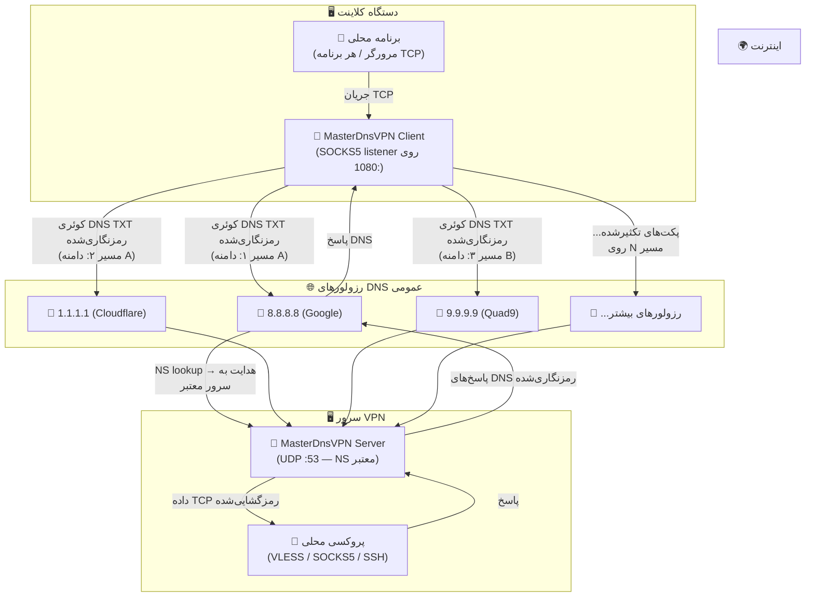
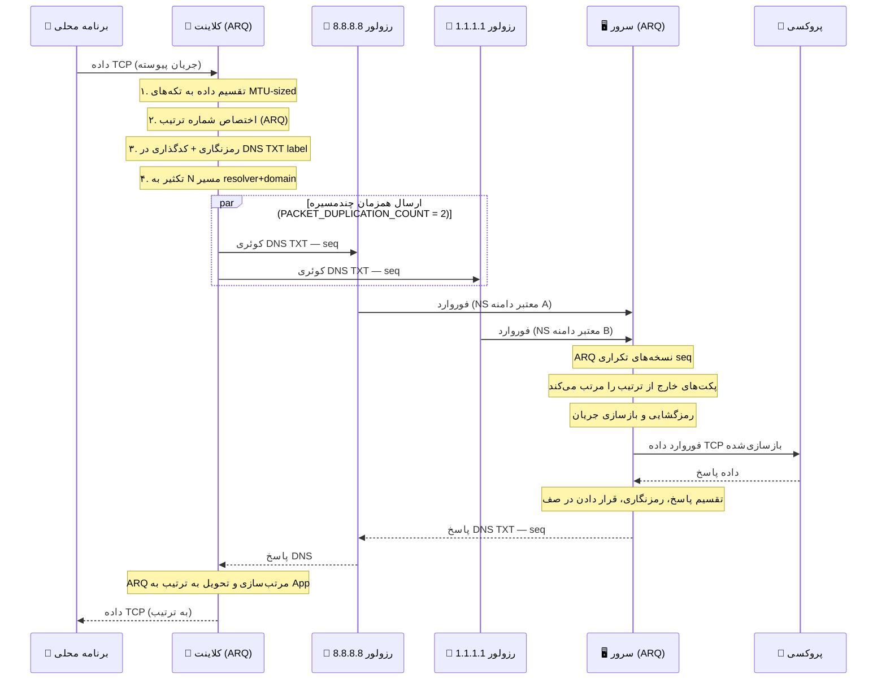

# 🚀 MasterDnsVPN

## [نسخه فارسی](https://github.com/masterking32/MasterDnsVPN/blob/main/README_FA.MD) | [English Version](https://github.com/masterking32/MasterDnsVPN/blob/main/README.MD) | [Spanish Version](https://github.com/masterking32/MasterDnsVPN/blob/main/README_ES.MD)

پروژه MasterDnsVPN یک ابزار تونل‌زنی DNS با کارایی بالا است که برای محصورسازی ترافیک VPN درون پرس‌وجوهای DNS طراحی شده است. این پروژه به‌خصوص برای عبور از سانسور شبکه و دیواره‌های آتش سخت‌گیرانه که پروتکل‌های معمول VPN مسدود می‌شوند، ساخته شده است.

این پروژه دارای پیاده‌سازی سفارشی **ARQ (درخواست تکرار خودکار)** است که قابلیت اطمینان شبیه TCP و ترتیب‌دهی بسته‌ها را روی پروتکل DNS که مبتنی بر UDP و به‌طور ذاتی غیرقابل‌اعتماد است، فراهم می‌کند.

---

⭐ اگر از این پروژه استفاده می‌کنید یا به آن علاقه‌مند هستید، لطفاً با دادن ستاره به ریپازیتوری حمایت کنید! ⭐

---

## ✨ ویژگی‌های کلیدی
- 🛡️ **دور زدن سانسور:** استفاده از پروتکل DNS برای تونل‌سازی ترافیک در محیط‌های محدود.
- 🔐 **امنیت قوی:** پشتیبانی از روش‌های رمزگذاری مختلف از جمله XOR، ChaCha20، AES-128-CTR، AES-192-CTR و AES-256-CTR.
- ⚙️ **مدیریت هوشمند MTU:** سنجش و همگام‌سازی خودکار حداکثر واحد انتقال (MTU) برای آپلود و دانلود.
- 🔄 **پروتکل ARQ سفارشی:** حل مشکل از دست رفتن بسته‌ها و تحویل خارج از ترتیب با بازارسال پویا و کنترل جریان.
- ⚡ **توزیع بار رزولورها:** پشتیبانی از چندین رزولور DNS با استراتژی‌های متعادل‌سازی (تصادفی، دورانی، بهترین بر اساس تلفات).
- 🌐 **مولتی‌پلکس TCP:** چندین اتصال محلی TCP را می‌توان روی یک نشست DNS واحد مولتی‌پلکس کرد.
- 📡 **تکثیر پکت چند‌مسیره:** هر پکت می‌تواند به‌طور همزمان از چندین مسیر resolver+domain ارسال شود تا در شرایط قطعی شدید شبکه بیشترین اطمینان حاصل شود.

---

## 🛠️ پیش‌نیازهای شبکه (پیکربندی DNS)

برای کارکرد تونل باید مالک یک دامنه باشید و رکوردهای زیر را در پنل مدیریت DNS خود (مثلاً Cloudflare) تنظیم کنید:

1. **ریکورد A:** یک رکورد `A` بسازید که به IP عمومی سرور شما اشاره کند.
   - مثال: `s.example.com` -> `1.2.3.4`
2. **ریکورد NS:** یک رکورد `NS` برای زیردامنهٔ تونل بسازید که به رکورد `A` اشاره کند.
   - مثال: `v.example.com` -> `s.example.com`

> 💡 **نکته:** هرچه نام دامنه و زیردامنه کوتاه‌تر باشد (مثلاً `v.ex.com`) فضای بیشتری برای داده‌های مفید در هر بسته DNS باقی می‌ماند و توان عملیاتی افزایش می‌یابد.

---

## 📦 نیازمندی‌ها

- 🐍 پایتون 3.7 یا بالاتر
- 🔐 بستهٔ `cryptography` (برای روش‌های AES/ChaCha20 الزامی)
- 📝 بستهٔ `loguru` (برای لاگ‌گیری پیشرفته)

---

## 🚀 نصب و اجرا

### 1. نصب وابستگی‌ها

ریپازیتوری را کلون کرده و بسته‌های موردنیاز را نصب کنید:

```bash
git clone https://github.com/masterking32/MasterDnsVPN.git
cd MasterDnsVPN
pip install -r requirements.txt
```

#### 🔌 نصب آفلاین (سرور بدون دسترسی به اینترنت)

اگر **سرور شما به اینترنت دسترسی ندارد** و نمی‌توانید مستقیماً `pip install` اجرا کنید، مراحل زیر را روی یک دستگاه که **به اینترنت وصل است** انجام دهید:

**مرحله ۱ — دانلود نصب‌کننده پایتون (در صورتی که پایتون روی سرور نصب نیست):**
```bash
# روی دستگاه متصل به اینترنت، نصب‌کننده لینوکس پایتون را دانلود کنید
wget https://www.python.org/ftp/python/3.11.9/Python-3.11.9.tgz
# فایل را از طریق scp، USB یا هر روش دیگری به سرور آفلاین منتقل کنید
scp Python-3.11.9.tgz user@your-server:/tmp/
```

**مرحله ۲ — نصب پایتون از سورس روی سرور آفلاین:**
```bash
# روی سرور آفلاین
cd /tmp
tar xzf Python-3.11.9.tgz
cd Python-3.11.9
./configure --enable-optimizations
make -j$(nproc)
sudo make altinstall
# تأیید نصب
python3.11 --version
```

**مرحله ۳ — دانلود پکیج‌های pip روی دستگاه متصل به اینترنت:**
```bash
# روی دستگاه متصل به اینترنت
mkdir pip_packages
pip download -r requirements.txt -d ./pip_packages
# پوشه را به سرور آفلاین منتقل کنید
scp -r pip_packages user@your-server:/tmp/
```

**مرحله ۴ — نصب پکیج‌ها از پوشه دانلود‌شده روی سرور آفلاین:**
```bash
# روی سرور آفلاین
pip install --no-index --find-links=/tmp/pip_packages -r requirements.txt
```

> 💡 مطمئن شوید که نسخه پایتون و معماری سیستم‌عامل هر دو دستگاه یکسان است (مثلاً هر دو Linux x86_64) تا فایل‌های wheel دانلود‌شده سازگار باشند.

---

### 2. پیکربندی سرور

نمونهٔ پیکربندی را کپی کنید:

```bash
cp server_config.py.simple server_config.py
```

فایل `server_config.py` را ویرایش کنید:
- یک پروکسی محلی (مثلاً SOCKS5، VLESS، VMESS، SSH، MTProto، OpenVPN TCP و غیره) روی سرور نصب کنید تا ترافیک را به اینترنت هدایت کند.
- مقدار `FORWARD_IP` و `FORWARD_PORT` را در `server_config.py` به آدرس پروکسی تنظیم کنید.
- مقدار `DOMAIN` را هم‌راستا با زیردامنه‌ای که در رکوردهای DNS تعریف کردید تنظیم کنید (مثلاً `v.example.com`). می‌توانید چندین دامنه برای redundancy اضافه کنید.
- مقدار `UDP_HOST` را برای دریافت روی همه رابط‌ها `"0.0.0.0"` تنظیم کنید.
- بعد از اولین اجرا، مقادیر MTU بهینه برای دانلود و آپلود را یادداشت کنید و سپس `MAX_UPLOAD_MTU` و `MAX_DOWNLOAD_MTU` را تنظیم کنید. این کار سرعت اجرای‌های بعدی را به‌طور قابل‌توجهی افزایش می‌دهد.

### 3. اجرای سرور

```bash
python server.py
```

در اجرای اول، سرور یک کلید رمزنگاری تولید خواهد کرد؛ این کلید را **ذخیره کنید** زیرا برای پیکربندی کلاینت لازم است.

### 4. پیکربندی کلاینت

نمونهٔ پیکربندی کلاینت را کپی کنید:

```bash
cp client_config.py.simple client_config.py
```

فایل `client_config.py` را تنظیم کنید:

- **`DOMAINS`**: زیردامنهٔ تونل شما (مثلاً `v.example.com`). برای redundancy چندین دامنه اضافه کنید.
- **`ENCRYPTION_KEY`**: کلیدی که سرور در اولین اجرا نمایش داده است.
- **`RESOLVER_DNS_SERVERS`**: لیست رزولورهای عمومی DNS (مثلاً `8.8.8.8`, `1.1.1.1`, `9.9.9.9`). هرچه بیشتر باشد بهتر است.
- **`PACKET_DUPLICATION_COUNT`**: تعداد مسیرهای resolver+domain که هر پکت به‌طور همزمان از آن‌ها ارسال می‌شود (به نکته اضطراری زیر توجه کنید).

### 5. اجرای کلاینت

```bash
python client.py
```

کلاینت یک پروکسی SOCKS5 روی `127.0.0.1:1080` راه‌اندازی می‌کند (قابل تغییر با `LISTEN_IP` و `LISTEN_PORT`). مرورگر یا برنامهٔ خود را روی این پروکسی تنظیم کنید تا ترافیک از تونل عبور کند.

---

## 🚨 نکته اضطراری: قطعی شدید شبکه

> **وقتی شبکه به طور کامل قطع است و فقط DNS کار می‌کند (اختلال و packet loss بسیار زیاد):**

1. **تا جایی که می‌توانید DNS resolver پیدا کنید** و همه را به `RESOLVER_DNS_SERVERS` در `client_config.py` اضافه کنید. از رزولورهای عمومی Google (`8.8.8.8`، `8.8.4.4`)، Cloudflare (`1.1.1.1`، `1.0.0.1`)، Quad9 (`9.9.9.9`)، OpenDNS (`208.67.222.222`، `208.67.220.220`) و دیگران استفاده کنید.

2. **مقدار `PACKET_DUPLICATION_COUNT` را افزایش دهید.** این پارامتر تعداد مسیرهای resolver+domain مختلفی را که هر پکت **به‌طور همزمان** از آن‌ها ارسال می‌شود کنترل می‌کند.

   - با ۶ رزولور و ۲ دامنه، **۱۲ مسیر بالقوه** خواهید داشت.
   - تنظیم `PACKET_DUPLICATION_COUNT = 6` یعنی هر پکت به‌طور همزمان از ۶ مسیر مختلف ارسال می‌شود.
   - حتی اگر ۵ مسیر از ۶ مسیر fail شوند، پکت از طریق مسیر باقیمانده می‌رسد.

   > ⚠️ **هزینه:** duplication بیشتر به‌نسبت مصرف پهنای باند و CPU را افزایش می‌دهد. مقدار `3` تا `6` در زمان قطعی تعادل خوبی ایجاد می‌کند. لایه ARQ روی سرور نسخه‌های تکراری دریافت‌شده را به‌طور خودکار حذف می‌کند تا برنامه شما هر پکت را فقط یک‌بار ببیند.

3. **چندین دامنه تونل اضافه کنید** (لیست `DOMAINS`) تا تعداد مسیرهای موجود بیشتر شود.

---

## 🛠️ نحوهٔ کار

### معماری سیستم



### جریان پکت (نمودار توالی)



### مفاهیم کلیدی

| مفهوم | توضیح |
|---|---|
| **Session** | یک اتصال کلاینت؛ حداکثر ۲۵۵ نشست همزمان در هر سرور |
| **Stream** | یک اتصال TCP که روی یک session مولتی‌پلکس شده |
| **MTU Probing** | جستجوی دودویی در شروع برای یافتن حداکثر اندازه payload DNS در مسیر شما |
| **ARQ** | شماره ترتیب + بازارسال تضمین می‌کند که هیچ داده‌ای روی UDP/DNS از دست نرود |
| **PACKET_DUPLICATION_COUNT** | هر پکت به‌طور همزمان از این تعداد مسیر resolver+domain ارسال می‌شود |
| **Resolver Balancing** | استراتژی‌ها: تصادفی (1)، Round-Robin (2)، کمترین‌تلفات (3) |

---

## 📝 نکات فنی

- ⚡ **بهینه‌سازی MTU:** هنگام اتصال، کلاینت با روش جستجوی دودویی حداکثر MTU قابل‌انتقال در مسیر را پیدا می‌کند تا حداکثر سرعت بدون قطعه‌قطعه شدن بسته‌ها فراهم شود.

- 🔄 **پولینگ تطبیقی:** کلاینت از سازوکارهای عقب‌نشینی هوشمند و بررسی بیکار بودن برای کاهش بار DNS هنگام عدم انتقال داده استفاده می‌کند.

- 🔒 **رمزنگاری:** برای روش‌های AES/ChaCha20 بستهٔ `cryptography` ضروری است. برای دستگاه‌های کم‌منابع، روش XOR (Method 1) پیشنهاد می‌شود.

- 🔁 **چند سرور همزمان:** می‌توانید چندین instance مستقل از MasterDnsVPN Server با دامنه‌های مختلف راه‌اندازی کنید و همه دامنه‌ها را در آرایه `DOMAINS` کلاینت قرار دهید. کلاینت هر ترکیب دامنه+رزولور را به‌عنوان یک مسیر جداگانه در نظر می‌گیرد و ترافیک را به‌طور خودکار در همه آن‌ها توزیع و تکثیر می‌کند.

---

## 🤝 مشارکت
مشارکت‌ها خوش‌آمد گفته می‌شود! لطفاً فورک کنید و تغییرات خود را با یک Pull Request ارسال کنید.

---

## 📄 مجوز
این پروژه تحت مجوز MIT منتشر شده است. برای جزئیات به فایل LICENSE مراجعه کنید.

---

## 👨‍💻 توسعه‌دهنده
توسعه‌دهنده: [MasterkinG32](https://github.com/masterking32)
