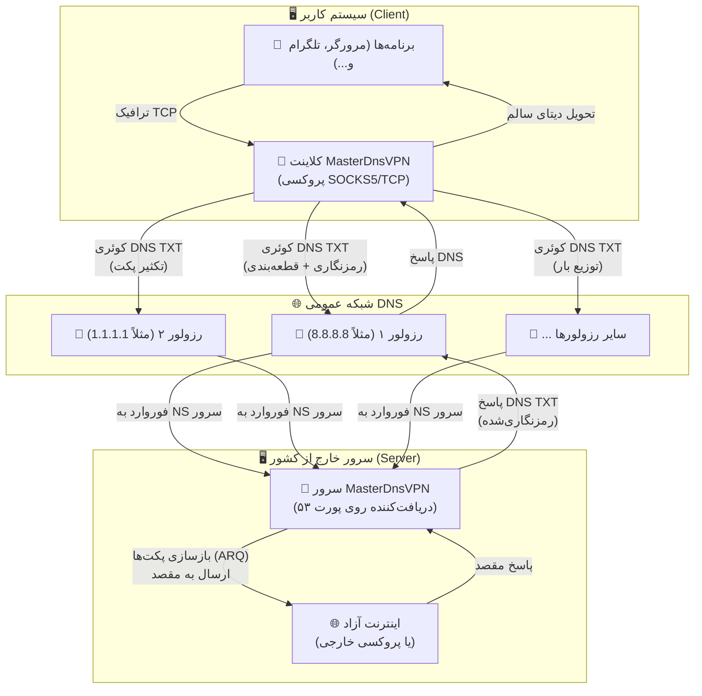
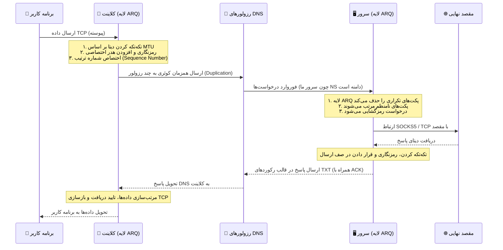

# پروژه MasterDnsVPN 🚀

## [نسخه فارسی](https://github.com/masterking32/MasterDnsVPN/blob/main/README_FA.MD) | [English Version](https://github.com/masterking32/MasterDnsVPN/blob/main/README.MD) | [Spanish Version](https://github.com/masterking32/MasterDnsVPN/blob/main/README_ES.MD)


پروژه **MasterDnsVPN** یک راهکار مقاوم، کم‌سربار و پیشرفته برای دور زدن فیلترینگ و سانسور اینترنت است که ترافیک TCP و پروتکل‌های مبتنی بر آن را به‌صورت بسته‌های رمزنگاری‌شده درون کوئری‌های DNS پنهان و منتقل می‌کند. 

این سامانه به‌طور خاص برای عبور از دیواره‌های آتش (Firewalls) سخت‌گیرانه و شرایطی طراحی شده است که روش‌های سنتی VPN، یا حتی سرویس‌های تونلینگ شناخته‌شده مانند **DNSTT** و **SlipStream** به‌دلیل اختلالات گسترده، محدودیت‌های شدید شبکه‌ای و مسدودسازی رزولورهای DNS دیگر کارآمد نیستند. 

هدف اصلی **MasterDnsVPN**، فراهم کردن تونلی امن، قابل‌اعتماد و انعطاف‌پذیر است که سربار (Overhead) پروتکل را به حداقل رسانده و در شبکه‌های دارای تلفات بسته (Packet Loss) بالا یا محدودیت‌های شدید MTU نیز عملکرد پایدار و قابل قبولی ارائه دهد.

---

رفع مسئولیت: این پروژه فقط جنبه آموزشی و تحقیقاتی دارد، استفاده از آن ممکن است به ساختار شبکه آسیب بزند، همچنین استفاده از آن برای دور زدن قوانین کشورها ممنوع میباشد و ما هیچ مسئولیتی در مقابل این موضوعات نداریم.

---

# کانال اطلاع رسانی تغییرات برنامه 📢

### برای اطلاع از آخرین اخبار، آپدیت‌ها و تغییرات این پروژه، لطفاً کانال تلگرام ما را دنبال کنید: [Telegram Channel](https://t.me/masterdnsvpn)

---

شما به راحتی میتوانید با زدن روی دکمه ⭐ به صورت رایگان از این پروژه حمایت کنید.

در صورتی که  علاقه مند به حمایت مالی هستید، میتوانید از طریق لینک زیر اقدام کنید:

TON: `masterking32.ton`

EVM-compatible blockchains: `0x517f07305D6ED781A089322B6cD93d1461bF8652`

TRC20 chain: `TLApdY8APWkFHHoxebxGY8JhMeChiETqFH`

---

## ویژگی‌های کلیدی و مزایا ✨

- **دور زدن سانسور شدید:** 🛡️ طراحی اختصاصی برای افزایش احتمال عبور از فایروال‌ها و سیاست‌های محدودکنندهٔ شبکه که پروتکل‌های VPN معمولی را مسدود می‌کنند.

- **توزیع بار و تعدد رزولورها (Load Balancing):** ⚡ پشتیبانی از چندین DNS Resolver مختلف با استراتژی‌های پیشرفتهٔ متعادل‌سازی بار بسته‌ها (شامل: انتخاب تصادفی، نوبت‌گردشی یا Round-Robin، و انتخاب بهترین رزولور بر اساس کمترین میزان تلفات).

- **تکثیر پکت چند‌مسیره (Packet Duplication):** 📡 قابلیت ارسال همزمان هر پکت از طریق چندین مسیر (رزولور و دامنهٔ مختلف). با این روش، هرکدام از پکت‌ها که زودتر به مقصد برسد پردازش می‌شود و در صورت افتادن (Drop) یک پکت در یک مسیر، همان پکت از طریق رزولور دیگر به‌سلامت می‌رسد. این تکنیک هرچند مصرف پهنای‌باند و منابع را افزایش می‌دهد، اما پایداری و اطمینان از ارسال را در شبکه‌های پر اختلال به‌شدت بالا می‌برد (این قابلیت قابل تنظیم بوده و امکان غیرفعال‌سازی آن نیز وجود دارد).

- **پروتکل ARQ سفارشی و بهینه‌سازی سربار:** 🔄 پیاده‌سازی لایهٔ بازفرست و ترتیب‌دهی بسته‌ها بر بستر UDP/DNS با استفاده از پروتکل اختصاصی ARQ به‌جای استفاده از QUIC. این کار نه‌تنها وابستگی و سربارهای اضافی QUIC را در شبکه‌های به‌شدت محدود حذف می‌کند، بلکه میزان MTU مورد نیاز را کاهش داده و با رزولورهایی که از EDNS پشتیبانی نمی‌کنند یا MTU کمتری دارند نیز کاملاً سازگار است. ساختار پکت‌ها تا حد امکان ساده شده تا کمترین دیتای سربار سمت برنامه تولید شود.

- **امنیت قوی و رمزنگاری انعطاف‌پذیر:** 🔐 پشتیبانی از روش‌های متنوع و قدرتمند رمزگذاری دیتا جهت حفظ امنیت کاربران، از جمله: `XOR`، `ChaCha20`، `AES-128-GCM`، `AES-192-GCM` و `AES-256-GCM`.

- **بررسی خودکار رزولورها و کاوش MTU:** 🧰 در هنگام اجرای برنامه، سیستم به‌صورت خودکار تمامی رزولورها را اسکن و بررسی می‌کند. این قابلیت کیفیت رزولورها را تست کرده، نتایج را به کاربر اطلاع می‌دهد و MTU بهینه را برای مسیرها تعیین می‌کند.

- **مولتی‌پلکس TCP:** 🌐 امکان مولتی‌پلکس کردن (Multiplexing) چندین اتصال محلی TCP بر روی یک نشست (Session) واحد DNS برای مدیریت بهتر منابع.

- **فشرده‌سازی و تجمیع پکت‌های کوچک:** 🗜️ در صورت نیاز و تنظیم توسط کاربر، این ویژگی امکان ادغام پکت‌های کوچک را تا اندازهٔ سقف MTU فراهم می‌کند. این کار باعث کاهش چشمگیر تعداد درخواست‌ها (Requests) شده و فضای مفید بیشتری را برای اطلاعات اصلی اختصاص می‌دهد.

- **بهینه‌سازی اختصاصی SOCKS5:** 🧦 در نسخه‌های جدید، بهینه‌سازی‌های ویژه‌ای برای پروتکل SOCKS5 صورت گرفته است. سیستم به‌صورت خودکار فورواردینگ اطلاعات را بر مبنای ساکس انجام داده و شما را از نصب سرویس‌های جانبی مانند X-UI، Dante و... بی‌نیاز می‌کند. همچنین اگر پروتکل برنامه روی SOCKS5 تنظیم شود، بخش زیادی از سربارها و پکت‌های اضافی مربوط به دست دادن (Handshake) ساکس حذف شده تا حجم درخواست‌ها و ترافیک به حداقل برسد.

- **قابلیت انتقال انواع پروتکل‌های TCP:** 🚀 علاوه بر انتقال بهینه و اختصاصی SOCKS5، شما می‌توانید ترافیک سایر سرویس‌ها نظیر `VLESS`، `ShadowSocks`، `VMESS` و سایر پروتکل‌های مبتنی بر TCP را نیز از طریق این تونل فوروارد و منتقل کنید.

---

# راه‌اندازی 🧑‍💻

## بخش ۱: پیش‌نیازهای شبکه (پیکربندی DNS) 🛠️

برای اینکه سرور شما بتواند درخواست‌های DNS را به‌طور مستقیم دریافت و پردازش کند، باید مدیریت (Delegation) یک زیردامنه را به سرور اختصاصی خودتان بسپارید. برای این کار، وارد پنل مدیریت DNS دامنهٔ خود (مانند Cloudflare، ArvanCloud و...) شوید و دقیقاً مطابق مراحل زیر دو رکورد ایجاد کنید:

### گام ۱.۱: ساخت رکورد A (معرفی IP سرور) 🅰️
ابتدا باید یک رکورد `A` بسازید تا یک زیردامنه را به آدرس IP عمومی (Public IP) سرورتان متصل کنید.
- **نوع رکورد (Type):** `A`
- **نام (Name):** یک نام کوتاه دلخواه (مثلاً `ns`)
- **آدرس (IPv4 address):** آدرس آی‌پی سرور شما (مثلاً `1.2.3.4`)
  > **نتیجه:** `ns.example.com -> 1.2.3.4`

### گام ۱.۲: ساخت رکورد NS (ارجاع زیردامنهٔ تونل) 🏷️
حالا باید یک رکورد `NS` (Name Server) ایجاد کنید. این رکورد به اینترنت می‌گوید که مسئول پاسخگویی به درخواست‌های این زیردامنه، همان سروری است که در مرحلهٔ قبل معرفی کردید. کلاینت شما از این آدرس برای برقراری ارتباط با تونل استفاده خواهد کرد.
- **نوع رکورد (Type):** `NS`
- **نام (Name):** زیردامنهٔ اصلی تونل (مثلاً `v`)
- **سرور نام (Target/Nameserver):** آدرس رکورد A که در مرحله قبل ساختید (مثلاً `ns.example.com`)
  > **نتیجه:** `v.example.com -> ns.example.com`

---

## بخش ۱.۳: اخطار بسیار مهم (مخصوص کاربران Cloudflare) ⚠️
اگر از پنل کلودفلر استفاده می‌کنید، **باید** وضعیت پروکسی (Proxy status) برای رکورد `A` روی حالت **DNS only (ابر خاکستری ☁️)** تنظیم شده باشد. اگر پروکسی روشن (ابر نارنجی) باشد، کلودفلر ترافیک UDP پورت ۵۳ را مسدود کرده و تونل شما **به‌هیچ‌وجه** کار نخواهد کرد!

## بخش ۱.۴: نکتهٔ طلایی برای افزایش سرعت (MTU) 💡
در پروتکل DNS، طول کاراکترهای دامنه بخشی از حجم محدود هر پکت را اشغال می‌کند. هرچه نام دامنه و زیردامنه‌های شما **کوتاه‌تر** باشند (مثلاً `v.ex.com` به‌جای `tunnel.my-long-domain.com`)، فضای خالی بیشتری برای انتقال داده‌های مفید (Payload) کاربر باقی می‌ماند که مستقیماً باعث افزایش پهنای باند، سرعت بالاتر و کاهش قطعی‌ها می‌شود.

---

## بخش ۲: نصب و راه‌اندازی (کلاینت و سرور) 🚀

شما می‌توانید این پروژه را به دو روش نصب و اجرا کنید. روش اول استفاده از فایل‌های از پیش آماده‌شده و اسکریپت‌های نصب خودکار است (که بسیار سریع‌تر و راحت‌تر است) و روش دوم اجرای مستقیم از روی سورس‌کد می‌باشد.

### گام ۲.۱: نصب و راه‌اندازی سریع سرور لینوکس 🐧

اگر قصد دارید سرور را روی یک سیستم لینوکسی راه‌اندازی کنید، ساده‌ترین راه استفاده از اسکریپت نصب خودکار است. کافی است دستور زیر را در ترمینال سرور وارد کنید:

```bash
bash <(curl -Ls https://raw.githubusercontent.com/masterking32/MasterDnsVPN/main/server_linux_install.sh)
```

این دستور یک اسکریپت را از مخزن گیت‌هاب دانلود کرده و تمام مراحل نصب و تنظیم سرور را به‌صورت خودکار انجام می‌دهد. پس از پایان نصب، سرور اجرا شده و یک **کلید رمزنگاری (Encryption Key)** در لاگ ترمینال به شما نمایش داده می‌شود. این کلید را حتماً کپی کنید (البته این کلید جهت اطمینان در فایلی به نام `encrypt_key.txt` در کنار فایل اجرایی سرور نیز ذخیره می‌شود)، زیرا برای اتصال کلاینت به آن نیاز خواهید داشت.

> ⚠️ **نکتهٔ مهم ۱:** پیش از اجرای این اسکریپت، باید مالکیت یک دامنه را در اختیار داشته باشید و رکوردهای DNS (بخش ۱) را به‌درستی در پنل خود تنظیم کرده باشید.
> 
> ⚠️ **نکتهٔ مهم ۲:** این اسکریپت صرفاً سرور لینوکس را نصب می‌کند و شامل کلاینت نمی‌شود. برای اجرای کلاینت در سیستم شخصی خود، از روش «گام ۲.۲» استفاده کنید.
> 
> ⚠️ **نکتهٔ مهم ۳:** از این دستور می‌توانید برای آپدیت سرور نیز استفاده کنید. با انتشار نسخه‌های جدید، اجرای مجدد این اسکریپت باعث به‌روزرسانی خودکار سرور شما خواهد شد.

---

### گام ۲.۲: استفاده از نسخه‌های کامپایل‌شده کلاینت (روش پیشنهادی ✅)

برای راحتی شما، فایل‌های اجرایی کلاینت (و سرور برای سایر سیستم‌عامل‌ها) از قبل کامپایل شده‌اند. کافی است نسخهٔ مناسب با سیستم‌عامل خود را دانلود کرده و فایل را از حالت فشرده خارج کنید.

> 💡 **نکته:** هر فایل ZIP کلاینت شامل فایل اجرایی، `client_config.toml` و فایل `client_resolvers.txt` (لیست رزولورها) است.

#### لینک‌های دانلود کلاینت (Client) 📥

| سیستم‌عامل (OS) | پردازنده (Architecture) | مناسب برای سیستم‌های... | لینک دانلود مستقیم |
| :--- | :--- | :--- | :--- |
| ویندوز (Windows) 🪟 | `AMD64` (64-bit) | ویندوز ۱۰ و ۱۱ | [دانلود نسخه ویندوز ⬇️](https://github.com/masterking32/MasterDnsVPN/releases/latest/download/MasterDnsVPN_Client_Windows_AMD64.zip) |
| مک‌اواس (macOS) 🍎 | `ARM64` | مک‌های جدید (سری M1 / M2 / M3) | [دانلود نسخه مک (Apple Silicon) ⬇️](https://github.com/masterking32/MasterDnsVPN/releases/latest/download/MasterDnsVPN_Client_MacOS_ARM64.zip) |
| لینوکس (Linux) 🐧 | `AMD64` (64-bit) | توزیع‌های جدید (اوبونتو ۲۲.۰۴+، دبیان ۱۲+) | [دانلود نسخه لینوکس (جدید) ⬇️](https://github.com/masterking32/MasterDnsVPN/releases/latest/download/MasterDnsVPN_Client_Linux_AMD64.zip) |
| لینوکس (Legacy) 🐧 | `AMD64` (64-bit) | توزیع‌های قدیمی (اوبونتو ۲۰.۰۴، دبیان ۱۱) | [دانلود نسخه لینوکس (سازگاری بالا) ⬇️](https://github.com/masterking32/MasterDnsVPN/releases/latest/download/MasterDnsVPN_Client_Linux-Legacy_AMD64.zip) |
| لینوکس (ARM) 🐧 | `ARM64` | سرورهای ARM، رزبری‌پای و بردهای مشابه | [دانلود نسخه لینوکس (ARM) ⬇️](https://github.com/masterking32/MasterDnsVPN/releases/latest/download/MasterDnsVPN_Client_Linux_ARM64.zip) |

*(کاربران ویندوز و مک، پس از استخراج فایل، می‌توانند مستقیماً به بخش ۳ برای پیکربندی مراجعه کنند).*

#### لینک‌های دانلود سرور (Server) 📤
*(در صورت عدم استفاده از اسکریپت نصب لینوکس)*

| سیستم‌عامل (OS) | پردازنده (Architecture) | مناسب برای سیستم‌های... | لینک دانلود مستقیم |
| :--- | :--- | :--- | :--- |
| ویندوز (Windows) 🪟 | `AMD64` (64-bit) | ویندوز سرور، ویندوز ۱۰ و ۱۱ | [دانلود سرور ویندوز ⬇️](https://github.com/masterking32/MasterDnsVPN/releases/latest/download/MasterDnsVPN_Server_Windows_AMD64.zip) |
| لینوکس (Linux) 🐧 | `AMD64` (64-bit) | سرورهای اوبونتو ۲۲.۰۴+، دبیان ۱۲+ | [دانلود سرور لینوکس (جدید) ⬇️](https://github.com/masterking32/MasterDnsVPN/releases/latest/download/MasterDnsVPN_Server_Linux_AMD64.zip) |
| لینوکس (Legacy) 🐧 | `AMD64` (64-bit) | سرورهای قدیمی (اوبونتو ۲۰.۰۴، دبیان ۱۱) | [دانلود سرور لینوکس (سازگاری بالا) ⬇️](https://github.com/masterking32/MasterDnsVPN/releases/latest/download/MasterDnsVPN_Server_Linux-Legacy_AMD64.zip) |
| لینوکس (ARM) 🐧 | `ARM64` | سرورهای ARM | [دانلود سرور لینوکس (ARM) ⬇️](https://github.com/masterking32/MasterDnsVPN/releases/latest/download/MasterDnsVPN_Server_Linux_ARM64.zip) |
| مک‌اواس (macOS) 🍎 | `ARM64` | مک‌های جدید (سری M1 / M2 / M3) | [دانلود سرور مک (Apple Silicon) ⬇️](https://github.com/masterking32/MasterDnsVPN/releases/latest/download/MasterDnsVPN_Server_MacOS_ARM64.zip) |

---

### گام ۲.۲.۱: آماده‌سازی و اجرا در لینوکس 🗂️

در لینوکس، پس از دانلود فایل ZIP، ابتدا باید ابزارهای استخراج و ویرایشگر متن را نصب کنید (در صورت عدم وجود):

```bash
sudo apt update
sudo apt install unzip nano
```

سپس فایل ZIP را استخراج کنید (نام فایل را بر اساس نسخهٔ دانلودی خود تغییر دهید):

```bash
# استخراج فایل کلاینت (یا سرور)
unzip MasterDnsVPN_Client_Linux_AMD64.zip

# مشاهده لیست فایل‌های استخراج شده
ls
```

در سیستم‌عامل‌های لینوکس و مک، برای اجرای برنامه‌ها باید مجوز اجرا (Execute Permission) به فایل داده شود. نام فایل را بر اساس خروجی دستور `ls` وارد کنید:

```bash
chmod +x MasterDnsVPN_Client_Linux_AMD64
```

اکنون فایل تنظیمات (`client_config.toml` یا `server_config.toml`) را با ویرایشگر `nano` باز کرده و اطلاعات خود را وارد کنید (توضیحات کانفیگ در بخش ۳ آمده است):

```bash
nano client_config.toml
```

> **نکته:** در `nano` برای ذخیره و خروج، کلیدهای `Ctrl + O`، سپس `Enter` و در نهایت `Ctrl + X` را فشار دهید.

پس از اعمال تغییرات، برنامه را با دستور زیر اجرا کنید:

```bash
./MasterDnsVPN_Client_Linux_AMD64
```

---

### گام ۲.۳: نصب و اجرا از طریق سورس‌کد (مخصوص توسعه‌دهندگان 🧑‍💻)

> ⚠️ **توجه:** اگر کاربر معمولی هستید، به این بخش نیازی ندارید. لطفاً از گام ۲.۲ استفاده کرده و مستقیماً به «بخش ۳: پیکربندی» بروید. این بخش مخصوص برنامه‌نویسانی است که قصد تغییر یا اجرای برنامه با پایتون را دارند.

برای اجرای سورس‌کد، باید پایتون نصب باشد. دستورات زیر را در ترمینال اجرا کنید:

```bash
# کلون کردن مخزن پروژه و نصب پیش‌نیازها
git clone https://github.com/masterking32/MasterDnsVPN.git
cd MasterDnsVPN
pip install -r requirements.txt

# کپی کردن فایل‌های نمونه کانفیگ
cp server_config.toml.simple server_config.toml
cp client_config.toml.simple client_config.toml
cp client_resolvers.simple.txt client_resolvers.txt

# اجرای سرور یا کلاینت پس از ویرایش کانفیگ
python server.py
python client.py
```

---

# بخش ۳: ساختار فایل پیکربندی (Config) 🛠️

## بخش ۳.۱: پیکربندی و اجرای سریع کلاینت 🚀

اگر سرور را از طریق اسکریپت نصب سریع (گام ۲.۱) راه‌اندازی کرده‌اید، فقط کافیست فایل `client_config.toml` را در کلاینت ویرایش کنید. سه مقدار اصلی که باید حتماً تنظیم شوند عبارتند از:

1. مقدار **`ENCRYPTION_KEY`**: کلید رمزنگاری که پس از نصب سرور در ترمینال نمایش داده شده (و در فایل `encrypt_key.txt` سرور نیز ذخیره شده است) را اینجا قرار دهید. بدون این کلید اتصال برقرار نمی‌شود!
2. مقدار **`DOMAINS`**: زیردامنهٔ تونل خود را دقیقاً وارد کنید (مثلاً `["v.example.com"]`). **توجه:** در حال حاضر فقط یک دامنه وارد کنید. پشتیبانی از چند دامنه در آپدیت‌های بعدی تکمیل خواهد شد.
3. مقدار **`client_resolvers.txt`**: فایل لیست رزولورها با فرمت‌های `IP`، `IP:PORT`، `CIDR` و `CIDR:PORT` (مثلا `8.8.8.8`، `8.8.8.8:5353`، `1.1.1.0/24` یا `1.1.1.0/24:99`). خطوط خالی یا نامعتبر نادیده گرفته می‌شوند. اگر فایل وجود نداشته باشد یا هیچ ورودی معتبری نداشته باشد، کلاینت اجرا نمی‌شود.

> 💡 **نکتهٔ طلایی:** حتما در ادامه همین فایل برای بهبود سرعت و کیفیت و همچنین، افزایش سرعت اجرای برنامه بخش مربوط به توضیحات MTU را که به صورت گام به گام در بخش "درک بهتر از MTU و تنظیمات طلایی برای اجرای سریع" آمده است، مطالعه کنید. 💡

> ⚠️ **نکتهٔ مهم ۱ (نوع رمزنگاری):** اسکریپت نصب سریع، نوع رمزنگاری سرور را روی `XOR` تنظیم می‌کند. اطمینان حاصل کنید که مقدار `DATA_ENCRYPTION_METHOD` در کلاینت نیز روی `1` تنظیم شده باشد تا با سرور همخوانی داشته باشد.
> 
> ⚠️ **نکتهٔ مهم ۲ (نحوهٔ اتصال):** پروتکل پیش‌فرض `SOCKS5` است. پس از اجرای کلاینت، باید برنامه‌های خود (مثل مرورگر، تلگرام و...) را به پروکسی SOCKS5 با آدرس `127.0.0.1` و پورت تنظیم‌شده (پیش‌فرض: `1080`) متصل کنید. در حالت پیش‌فرض، نام‌کاربری و رمزعبور این پروکسی `master_dns_vpn` است (قابل تغییر در کانفیگ).
> 
> ⚠️ **پشتیبانی:** اگر به مشکلی برخوردید، لطفاً لاگ خطاها را ضمیمه کرده و مشکل خود را منحصراً در بخش [Issues گیت‌هاب](https://github.com/masterking32/MasterDnsVPN/issues) مطرح کنید و از ارسال پیام به توسعه در شبکه‌های اجتماعی یا ایمیل خودداری کنید. این کار به ما کمک می‌کند تا مشکلات را سریع‌تر شناسایی و رفع کنیم.

---

## بخش ۳.۲: پیکربندی سرور (در صورت نصب دستی) ⚙️

اگر از اسکریپت گام ۲.۱ استفاده **نکرده‌اید** و قصد دارید سرور را دستی کانفیگ کنید، باید فایل `server_config.toml` را ویرایش کنید. دقت کنید که مقادیر حیاتی مانند نوع رمزنگاری و دامنه باید دقیقاً در سرور و کلاینت **یکسان** باشند.

---

## بخش ۳.۳: راهنمای کامل متغیرهای پیکربندی کلاینت (`client_config.toml`) 📖

جدول زیر با فایل `client_config.toml.simple` و رفتار فعلی `client.py` هماهنگ است:

| پارامتر | مقدار پیش‌فرض | مقادیر قابل قبول | توضیحات |
|---------|--------------|------------------|---------|
| `PROTOCOL_TYPE` | `"SOCKS5"` | `"SOCKS5"`, `"TCP"` | نوع تونل بین کلاینت و سرور. `SOCKS5` حالت اصلی و بهینه برای مرورگر و برنامه‌ها است. `TCP` برای تونل خام TCP استفاده می‌شود و معمولاً سربار بیشتری دارد. باید با تنظیم سرور یکی باشد. |
| `DOMAINS` | `["v.domain.com"]` | لیست رشته | دامنه یا زیردامنه‌ای که کلاینت روی آن query می‌فرستد. این مقدار باید دقیقاً با `DOMAIN` در سرور و رکورد `NS` شما هماهنگ باشد. |
| `DATA_ENCRYPTION_METHOD` | `1` | `0` تا `5` | الگوریتم رمزنگاری payload تونل. `0` خاموش، `1` XOR، `2` ChaCha20، `3` AES-128-GCM، `4` AES-192-GCM، `5` AES-256-GCM. باید با سرور یکی باشد. |
| `ENCRYPTION_KEY` | `""` | رشته | کلید مشترک بین کلاینت و سرور. بدون آن نشست ساخته نمی‌شود. |
| `BASE_ENCODE_DATA` | `false` | `true` یا `false` | اگر روشن باشد payload قبل از حمل در DNS به فرم base-safe تبدیل می‌شود. سازگاری را بالا می‌برد ولی سربار و مصرف CPU را بیشتر می‌کند. |
| `LISTEN_IP` | `"0.0.0.0"` | IP معتبر | آدرسی که پراکسی محلی کلاینت روی آن گوش می‌دهد. `127.0.0.1` فقط برای همان سیستم است، `0.0.0.0` برای کل شبکه محلی هم در دسترس می‌شود. |
| `LISTEN_PORT` | `1080` | پورت معتبر | پورتی که برنامه‌های محلی به پراکسی کلاینت وصل می‌شوند. |
| `SOCKS5_AUTH` | `true` | `true` یا `false` | احراز هویت پراکسی محلی SOCKS5 را روشن/خاموش می‌کند. این تنظیم فقط برای کاربران محلی این کلاینت است و ربطی به احراز هویت سمت سرور ندارد. |
| `SOCKS5_USER` | `"master_dns_vpn"` | رشته | نام کاربری پراکسی محلی در صورت فعال بودن `SOCKS5_AUTH`. |
| `SOCKS5_PASS` | `"master_dns_vpn"` | رشته | رمز عبور پراکسی محلی در صورت فعال بودن `SOCKS5_AUTH`. |
| `SOCKS_HANDSHAKE_TIMEOUT` | `300.0` | عدد اعشاری (ثانیه) | حداکثر زمانی که کلاینت برای کامل شدن فعال‌سازی یک stream محلی SOCKS صبر می‌کند. در شبکه‌های کند یا پرloss بهتر است کمی بزرگ‌تر بماند تا stream سالم بی‌دلیل abort نشود. |
| `client_resolvers.txt` (فایل) | کنار فایل اجرایی/ZIP | `IP`، `IP:PORT`، `CIDR`، `CIDR:PORT` در هر خط | منبع رزولورها است. خطوط خالی و نامعتبر رد می‌شوند. اگر فایل وجود نداشته باشد یا هیچ ورودی معتبری نداشته باشد، کلاینت بالا نمی‌آید. |
| `PACKET_DUPLICATION_COUNT` | `2` | عدد صحیح مثبت | هر query چند بار روی رزولورهای مختلف فرستاده شود. `1` یعنی بدون duplication. `2` نقطه شروع مناسب برای لینک‌های ناپایدار است. مقادیر بالاتر پهنای باند و CPU را سریع بالا می‌برند. |
| `STREAM_RESOLVER_FAILOVER_RESEND_THRESHOLD` | `2` | عدد صحیح مثبت | اگر یک stream به این تعداد `STREAM_RESEND` پشت‌سرهم بخورد، کلاینت resolver ترجیحی همان stream را به یک resolver سالم دیگر جابه‌جا می‌کند. این منطق فقط برای data-plane است تا reorder کمتر شود ولی stream روی resolver خراب گیر نکند. |
| `STREAM_RESOLVER_FAILOVER_COOLDOWN` | `1.0` | عدد اعشاری (ثانیه) | حداقل فاصله بین دو بار تعویض resolver ترجیحی یک stream. جلوی thrash شدن بین resolverها را می‌گیرد. |
| `MAX_PACKETS_PER_BATCH` | `100` | عدد صحیح مثبت | سقف بسته‌بندی control blockهای کوچک در یک عملیات DNS. مقدار واقعی در زمان اجرا علاوه بر این عدد، با MTU مذاکره‌شده هم محدود می‌شود. `1` یعنی batching خاموش است. |
| `RESOLVER_BALANCING_STRATEGY` | `2` | `1`، `2`، `3`، `4` | روش انتخاب resolver: `1` تصادفی، `2` نوبت‌گردشی، `3` کمترین loss، `4` کمترین latency. |
| `DNS_QUERY_TIMEOUT` | `5.0` | عدد اعشاری (ثانیه) | timeout پایه برای یک query DNS معمولی. اگر پاسخ در این بازه نرسد، در health accounting به‌عنوان timeout ثبت می‌شود و مسیر retry/failover می‌تواند فعال شود. |
| `UPLOAD_COMPRESSION_TYPE` | `0` | `0`، `1`، `2`، `3` | فشرده‌سازی payload کلاینت به سرور: `0` خاموش، `1` ZSTD، `2` LZ4، `3` ZLIB. بسته‌های خیلی کوچک معمولاً فشرده نمی‌شوند تا CPU کمتر مصرف شود. |
| `DOWNLOAD_COMPRESSION_TYPE` | `0` | `0`، `1`، `2`، `3` | فشرده‌سازی payload سرور به کلاینت با همان enum بالا. در شروع نشست، کلاینت و سرور روی مقدار مجاز مشترک توافق می‌کنند. |
| `MIN_UPLOAD_MTU` | `70` | عدد صحیح (بایت) | حداقل MTU قابل قبول برای آپلود. رزولوری که کمتر از این مقدار تحمل کند از مدار خارج می‌شود. `0` یعنی این حداقل غیرفعال شود. |
| `MIN_DOWNLOAD_MTU` | `150` | عدد صحیح (بایت) | حداقل MTU قابل قبول برای دانلود. رزولورهای ضعیف‌تر از این حد کنار گذاشته می‌شوند. |
| `MAX_UPLOAD_MTU` | `150` | عدد صحیح (بایت) | سقف اولیه‌ای که binary search آپلود از آن شروع می‌کند. بهتر است محافظه‌کارانه باشد تا startup طولانی نشود. |
| `MAX_DOWNLOAD_MTU` | `200` | عدد صحیح (بایت) | سقف اولیه تست MTU دانلود. اگر زیاد بزرگ باشد startup طولانی‌تر و ناپایداری بیشتر می‌شود. |
| `MTU_TEST_RETRIES` | `2` | عدد صحیح مثبت | تعداد تکرار هر تست MTU قبل از fail شدن آن probe. برای شبکه‌های ناپایدار زیاد کردنش دقت را بیشتر و زمان شروع را طولانی‌تر می‌کند. |
| `MTU_TEST_TIMEOUT` | `2.0` | عدد اعشاری (ثانیه) | timeout هر probe مربوط به MTU. اگر رزولورها کند هستند، این مقدار را کمی بالاتر ببرید. |
| `AUTO_SCALE_PROFILES` | `true` | `true` یا `false` | اگر روشن باشد، کلاینت بر اساس تعداد domain/resolverها، بعضی مقادیر startup و recheck را خودکار تنظیم می‌کند تا روی لیست‌های کوچک و بزرگ رفتار متعادل‌تری داشته باشد. |
| `MTU_TEST_PARALLELISM` | `6` | عدد صحیح مثبت | تعداد زوج‌های resolver-domain که همزمان در اسکن اولیه MTU تست می‌شوند. بالا بردن آن startup را سریع‌تر و فشار CPU/شبکه را بیشتر می‌کند. |
| `SAVE_MTU_SERVERS_TO_FILE` | `false` | `true` یا `false` | اگر فعال باشد، نتیجه رزولورهای موفق MTU در فایل ذخیره می‌شود. |
| `MTU_SERVERS_FILE_NAME` | `"masterdnsvpn_success_test_{time}.txt"` | رشته | نام فایل خروجی نتایج MTU. اگر `{time}` وجود داشته باشد با timestamp جایگزین می‌شود. |
| `MTU_SERVERS_FILE_FORMAT` | `"{IP} - UP: {UP_MTU} DOWN: {DOWN-MTU}"` | رشته | قالب هر خط خروجی رزولور موفق. placeholderهایی مثل `{IP}`، `{UP_MTU}`، `{DOWN-MTU}`، `{DOMAIN}` و `{TIME}` پشتیبانی می‌شوند. |
| `MTU_USING_SECTION_SEPARATOR_TEXT` | `"---- Active MTU Testing Results ----"` | رشته | یک متن جداکننده که بعد از پایان تست اولیه MTU یک‌بار به فایل خروجی افزوده می‌شود. رشته خالی یعنی غیرفعال. |
| `MTU_REMOVED_SERVER_LOG_FORMAT` | `"IP {IP} removed from list at {TIME} due to {CAUSE}"` | رشته | قالب خطی که وقتی یک resolver در زمان اجرا به‌خاطر timeout یا fail شدن از مدار خارج می‌شود، در فایل MTU ثبت می‌شود. |
| `MTU_ADDED_SERVER_LOG_FORMAT` | `"Server {IP} re-added at {TIME} (UP MTU: {UP_MTU}, DOWN MTU: {DOWN_MTU})"` | رشته | قالب خطی که وقتی یک resolver غیرفعال دوباره با موفقیت recheck شود، ثبت می‌شود. |
| `AUTO_DISABLE_TIMEOUT_SERVERS` | `true` | `true` یا `false` | اگر یک resolver-domain pair در پنجره زمانی تعیین‌شده ۱۰۰٪ timeout داشته باشد و هنوز resolver فعال دیگری وجود داشته باشد، موقتاً از مدار خارج می‌شود. |
| `AUTO_DISABLE_TIMEOUT_WINDOW_SECONDS` | `120` | عدد اعشاری/صحیح (ثانیه) | پنجره لغزان بررسی سلامت رزولورها برای timeoutهای زمان اجرا. |
| `AUTO_DISABLE_TIMEOUT_MIN_OBSERVATIONS` | `3` | عدد صحیح مثبت | حداقل تعداد نمونه لازم از timeout/success تا کلاینت مجاز به disable کردن یک resolver-domain شود. |
| `AUTO_DISABLE_CHECK_INTERVAL_SECONDS` | `1.0` | عدد اعشاری (ثانیه) | فاصله زمانی worker بررسی سلامت رزولورها. |
| `RECHECK_INACTIVE_SERVERS_ENABLED` | `true` | `true` یا `false` | اگر فعال باشد، رزولورهای غیرفعال‌شده یا ردشده در تست MTU در پس‌زمینه دوباره بررسی می‌شوند. |
| `RECHECK_INACTIVE_INTERVAL_SECONDS` | `300` | عدد اعشاری/صحیح (ثانیه) | فاصله بین دو چرخه کامل recheck رزولورهای غیرفعال. |
| `RECHECK_SERVER_INTERVAL_SECONDS` | `3.0` | عدد اعشاری (ثانیه) | فاصله بین تست دو resolver-domain pair در یک چرخه recheck. |
| `RECHECK_BATCH_SIZE` | `5` | عدد صحیح مثبت | حداکثر تعداد resolver-domain pair غیرفعال که در هر چرخه recheck تست می‌شوند. |
| `MAX_CONNECTION_ATTEMPTS` | `10` | عدد صحیح مثبت | تعداد تلاش برای ساخت session اولیه. در شبکه‌های بسیار بد اگر نشست ساخته نمی‌شود، این مقدار را می‌توان بالاتر برد. |
| `ARQ_WINDOW_SIZE` | `1000` | عدد صحیح مثبت | اندازه پنجره data-plane ARQ. هرچه بیشتر باشد داده بیشتری می‌تواند همزمان در پرواز باشد ولی RAM بیشتری مصرف می‌شود. |
| `ARQ_INITIAL_RTO` | `0.5` | عدد اعشاری (ثانیه) | timeout اولیه بازفرست برای داده‌ها در ARQ. |
| `ARQ_MAX_RTO` | `3.0` | عدد اعشاری (ثانیه) | سقف backoff بازفرست برای داده‌ها در ARQ. |
| `ARQ_CONTROL_INITIAL_RTO` | `0.5` | عدد اعشاری (ثانیه) | timeout اولیه بازفرست برای control packetهای قابل‌اعتماد مثل SYN/FIN/RST و پیام‌های control مربوط به SOCKS. |
| `ARQ_CONTROL_MAX_RTO` | `3.0` | عدد اعشاری (ثانیه) | سقف backoff برای control plane. |
| `ARQ_CONTROL_MAX_RETRIES` | `80` | عدد صحیح مثبت | حداکثر retry برای control packetهای قابل‌اعتماد قبل از abort شدن مسیر stream/session. |
| `NUM_RX_WORKERS` | `2` | عدد صحیح مثبت | تعداد workerهای دریافت و parse پاسخ‌های ورودی. |
| `NUM_DNS_WORKERS` | `2` | عدد صحیح مثبت | تعداد workerهای ارسال queryهای DNS. |
| `CPU_WORKER_THREADS` | `0` | `-1`، `0`، عدد صحیح مثبت | اندازه thread pool برای parse/codec/compression. `0` یعنی تشخیص خودکار بر اساس تعداد واقعی هسته‌ها، `-1` یعنی pool خاموش. |
| `RX_SEMAPHORE_LIMIT` | `256` | عدد صحیح مثبت | سقف تعداد پردازش‌های RX همزمان. بالا بردن آن backpressure را کمتر و مصرف RAM را بیشتر می‌کند. |
| `MAX_CLOSED_STREAM_RECORDS` | `2000` | عدد صحیح مثبت | سقف رکورد streamهای بسته‌شده برای جلوگیری از پردازش close تکراری و raceهای cleanup دیررس. |
| `SOCKET_BUFFER_SIZE` | `8388608` | عدد صحیح (بایت) | اندازه بافر UDP socket سمت کلاینت. برای burst و packet loss بالا مفید است ولی RAM بیشتری می‌خواهد. |
| `LOG_LEVEL` | `"INFO"` | `"DEBUG"`, `"INFO"`, `"WARNING"`, `"ERROR"`, `"CRITICAL"` | سطح جزئیات لاگ کلاینت. |
| `CONFIG_VERSION` | `5.0` | عدد | نسخه ساختار کانفیگ برای چک سازگاری با کد فعلی. |

---

## بخش ۳.۴: راهنمای کامل متغیرهای پیکربندی سرور (`server_config.toml`) 📖

جدول زیر با فایل `server_config.toml.simple` و رفتار فعلی `server.py` هماهنگ است:

| پارامتر | مقدار پیش‌فرض | مقادیر قابل قبول | توضیحات |
|---------|--------------|------------------|---------|
| `UDP_HOST` | `"0.0.0.0"` | IP معتبر | آدرسی که سرور روی آن برای دریافت queryهای DNS گوش می‌دهد. |
| `UDP_PORT` | `53` | پورت معتبر | پورت DNS سرور. برای استفاده واقعی معمولاً باید ۵۳ باشد. |
| `DOMAIN` | `["v.domain.com"]` | لیست رشته | دامنه‌هایی که این سرور برای آن‌ها authoritative است. باید با `DOMAINS` کلاینت و رکوردهای `NS` یکی باشد. |
| `PROTOCOL_TYPE` | `"SOCKS5"` | `"SOCKS5"`, `"TCP"` | نوع forwarding سمت سرور. `SOCKS5` مسیر اصلی و بهینه است، `TCP` برای تونل خام TCP استفاده می‌شود. باید با کلاینت یکسان باشد. |
| `USE_EXTERNAL_SOCKS5` | `false` | `true` یا `false` | اگر `false` باشد سرور مستقیماً به مقصد وصل می‌شود. اگر `true` باشد سرور به یک SOCKS5 upstream خارجی روی `FORWARD_IP:FORWARD_PORT` chain می‌شود. |
| `FORWARD_IP` | `"127.0.0.1"` | IP معتبر | آدرس upstream خارجی در حالت `USE_EXTERNAL_SOCKS5=true` یا مقصد forward در حالت `TCP`. |
| `FORWARD_PORT` | `1080` | پورت معتبر | پورت upstream خارجی یا مقصد forward. |
| `SOCKS5_AUTH` | `false` | `true` یا `false` | اگر روشن باشد، سرور برای SOCKS5 خارجی upstream از نام کاربری و رمز عبور استفاده می‌کند. |
| `SOCKS5_USER` | `"admin"` | رشته | نام کاربری SOCKS5 خارجی. |
| `SOCKS5_PASS` | `"123456"` | رشته | رمز عبور SOCKS5 خارجی. |
| `SOCKS_HANDSHAKE_TIMEOUT` | `180.0` | عدد اعشاری (ثانیه) | حداکثر زمان فعال‌سازی streamهای در حال connect یا handshake. اگر upstream یا resolverها کند هستند، این مقدار زودتر از موعد stream را kill نکند. |
| `MAX_CONCURRENT_SOCKS_CONNECTS` | `16` | عدد صحیح مثبت | سقف streamهایی که همزمان در فاز `CONNECTING` یا `SOCKS_CONNECTING` هستند. streamهای از قبل متصل را محدود نمی‌کند؛ فقط burst ساخت اتصال جدید را کنترل می‌کند. |
| `INVALID_COOKIE_ERROR_THRESHOLD` | `10` | عدد صحیح مثبت | اگر برای یک `(session_id, expected_cookie, packet_cookie)` در پنجره زمانی تعیین‌شده این تعداد mismatch ثبت شود، سرور `ERROR_DROP` می‌فرستد تا کلاینت session را restart کند. |
| `INVALID_COOKIE_WINDOW_SECONDS` | `2.0` | عدد اعشاری (ثانیه) | پنجره لغزان برای شمارش خطاهای invalid cookie. |
| `DATA_ENCRYPTION_METHOD` | `1` | `0` تا `5` | الگوریتم رمزنگاری payload. باید دقیقاً با کلاینت یکی باشد. |
| `SUPPORTED_UPLOAD_COMPRESSION_TYPES` | `[0, 1, 2, 3]` | لیست اعداد `0..3` | الگوریتم‌های فشرده‌سازی مجاز برای داده‌ای که کلاینت به سرور می‌فرستد. مقادیر نامعتبر حذف می‌شوند و `0` همیشه fallback معتبر است. |
| `SUPPORTED_DOWNLOAD_COMPRESSION_TYPES` | `[0, 1, 2, 3]` | لیست اعداد `0..3` | الگوریتم‌های فشرده‌سازی مجاز برای داده‌ای که سرور به کلاینت می‌فرستد. |
| `ARQ_WINDOW_SIZE` | `1000` | عدد صحیح مثبت | اندازه پنجره ARQ سمت سرور برای data-plane. |
| `ARQ_INITIAL_RTO` | `0.5` | عدد اعشاری (ثانیه) | timeout اولیه بازفرست برای داده‌ها در ARQ سمت سرور. |
| `ARQ_MAX_RTO` | `3.0` | عدد اعشاری (ثانیه) | سقف backoff بازفرست داده‌ها. |
| `ARQ_CONTROL_INITIAL_RTO` | `0.5` | عدد اعشاری (ثانیه) | timeout اولیه بازفرست برای control packetهای قابل‌اعتماد سمت سرور مثل SYN/FIN/RST و controlهای SOCKS. |
| `ARQ_CONTROL_MAX_RTO` | `3.0` | عدد اعشاری (ثانیه) | سقف backoff برای control plane. |
| `ARQ_CONTROL_MAX_RETRIES` | `80` | عدد صحیح مثبت | حداکثر retry برای control packetها قبل از abort شدن مسیر. |
| `SESSION_TIMEOUT` | `300` | عدد صحیح (ثانیه) | اگر یک session این مدت بیکار بماند، منقضی می‌شود و منابعش آزاد می‌شود. |
| `SESSION_CLEANUP_INTERVAL` | `30` | عدد صحیح (ثانیه) | فاصله loop پاک‌سازی sessionهای منقضی. |
| `MAX_SESSIONS` | `255` | عدد صحیح مثبت تا `255` | سقف sessionهای فعال. محدودیت سخت پروتکل همین ۲۵۵ است. |
| `MAX_CONCURRENT_REQUESTS` | `500` | عدد صحیح مثبت | اندازه صف bounded درخواست‌های DNS که منتظر workerها هستند. این مقدار دیگر «task بی‌نهایت» نیست و مستقیماً روی فشار RAM و backpressure اثر دارد. |
| `DNS_REQUEST_WORKERS` | `4` | عدد صحیح مثبت | تعداد workerهای ثابت پردازش درخواست DNS. |
| `CPU_WORKER_THREADS` | `0` | `-1`، `0`، عدد صحیح مثبت | اندازه thread pool برای parse/codec/compression در سرور. `0` یعنی auto بر اساس تعداد واقعی هسته‌ها. |
| `MAX_PACKETS_PER_BATCH` | `1000` | عدد صحیح مثبت | سقف user-level برای بسته‌بندی control blockهای کوچک در پاسخ‌های سرور. مقدار واقعی در زمان اجرا با MTU دانلود مذاکره‌شده هم محدود می‌شود. |
| `SOCKET_BUFFER_SIZE` | `8388608` | عدد صحیح (بایت) | بافر UDP socket سمت سرور. در burst بالا و packet loss کمک می‌کند. |
| `LOG_LEVEL` | `"INFO"` | `"DEBUG"`, `"INFO"`, `"WARNING"`, `"ERROR"`, `"CRITICAL"` | سطح جزئیات لاگ سرور. |
| `CONFIG_VERSION` | `5.0` | عدد | نسخه ساختار کانفیگ برای چک سازگاری با کد فعلی. |

## بخش ۳.۵: درک بهتر از MTU و تنظیمات طلایی برای اجرای سریع ⚠️

### بخش ۳.۵.۱: مفهوم MTU در تونل DNS 📦
کلمه **MTU** مخفف **Maximum Transmission Unit** است و به حداکثر اندازهٔ یک بستهٔ داده (پکت) اشاره دارد که می‌تواند در یک درخواست یا پاسخ شبکه منتقل شود. 
در شبکه‌های فیلترشده یا پر اختلال، اگر بسته‌های داده خیلی بزرگ باشند، احتمال از بین رفتن (Drop) آن‌ها به‌شدت بالا می‌رود. بنابراین، کاهش مقدار MTU می‌تواند پایداری ارتباط را تضمین کند. اما از طرفی، اگر MTU را خیلی پایین تنظیم کنید، اطلاعات به تکه‌های بسیار کوچکی تقسیم می‌شوند که باعث افزایش شدید سربار (Overhead) و در نتیجه افت سرعت خواهد شد.

در پروتکل DNS معمولاً محدودیت‌های شدیدی وجود دارد:
- **آپلود (DNS Query):** محدودیت بسیار شدیدتر است. میانگین MTU مفید برای آپلود، بسته به طول نام دامنهٔ شما، معمولاً بین `۵۰` تا `۲۰۰` بایت است.
- **دانلود (DNS Response):** فضای بیشتری دارد. در حالت عادی بین `۱۰۰` تا `۴۵۰` بایت و اگر ریزالور (Resolver) شما از EDNS پشتیبانی کند، می‌تواند بین `۴۵۰` تا `۴۰۰۰` بایت باشد.

در این پروژه، کلاینت به‌صورت کاملاً هوشمند و با استفاده از الگوریتم *جستجوی باینری (Binary Search)*، حداکثر MTU قابل پشتیبانی برای تک‌تک ریزالورها را تست می‌کند و در نهایت، **کمترین مقدار مشترک (Lowest Common Denominator)** را برای کل ارتباط در نظر می‌گیرد تا ترافیک شما روی هیچ ریزالوری با خطا مواجه نشود.

---

### بخش ۳.۵.۲: آموزش تنظیم بهترین MTU (گام‌به‌گام) 🚀

تست شدن تک‌تک ریزالورها برای پیدا کردن MTU زمان‌بر است. با انجام مراحل زیر می‌توانید بهترین مقادیر را پیدا کرده و سرعت اجرای برنامه را در اجراهای بعدی به شدت کاهش دهید:

#### گام اول: اجرای اولیه و کشف سقف MTU 🕵️‍♂️
پس از راه‌اندازی سرور، کلاینت را با تنظیمات پیش‌فرض اجرا کنید. در همان ثانیه‌های اول اجرا، کلاینت بر اساس طول دامنه و سربار رمزنگاری، حداکثر MTU تئوری را محاسبه کرده و پیامی مشابه زیر نمایش می‌دهد:
```text
Domain: v.example.com -> MIN and MAX_UPLOAD_MTU = 133 | MIN and MAX_DOWNLOAD_MTU = 129
```

به محض دیدن این پیام، برنامه را ببندید! این اعداد سقف تئوری شما هستند.
فایل `client_config.toml` را باز کرده و مقدار `MAX_UPLOAD_MTU` را دقیقاً روی عدد پیشنهادی (مثلاً `133`) تنظیم کنید. این کار باعث می‌شود برنامه در اجراهای بعدی، مقادیر بی‌فایده و بزرگ‌تر از این عدد را تست نکند.

#### گام دوم: تست کامل ریزالورها 🧪

حالا تمام ریزالورهای DNS مورد نظر خود را در فایل کانفیگ وارد کنید و اجازه دهید کلاینت یک‌بار به‌طور کامل اجرا شود. این فرآیند ممکن است کمی طول بکشد؛ صبور باشید تا سیستم تمام ریزالورها را تست کند.
پس از پایان تست، جدولی از تمام ریزالورهای موفق و مقدار MTU آپلود و دانلودِ اختصاصیِ هرکدام به شما نمایش داده می‌شود.

#### گام سوم: تعیین کفِ قابل قبول (فیلتر کردن ریزالورهای ضعیف) 🧹

با بررسی جدول، یک میانگین منطقی پیدا کنید. فرض کنید اکثر ریزالورهای شما آپلود `133` را با موفقیت پاس کرده‌اند، اما چند ریزالور ضعیف فقط آپلود `50` را قبول کرده‌اند.
از آنجایی که سیستم همیشه کمترین MTU را برای کل شبکه در نظر می‌گیرد، وجود آن چند ریزالور ضعیف باعث افت سرعت کل تونل شما می‌شود!
برای حل این مشکل، مقدار `MIN_UPLOAD_MTU` را در فایل کانفیگ روی همان `133` تنظیم کنید. با این کار، کلاینت ریزالورهای ضعیف را به‌طور خودکار حذف کرده و از آن‌ها استفاده نمی‌کند. همین منطق را برای `MIN_DOWNLOAD_MTU` نیز پیاده کنید.

> 💡 نکته: هرچه مقدار MIN را پایین‌تر بیاورید، تعداد ریزالورهای متصل بیشتر می‌شود اما سرعت و کیفیت کلی کاهش می‌یابد. و هرچه MIN بالاتر باشد، کیفیت عالی می‌شود اما ممکن است ریزالورهای کمتری از آن پشتیبانی کنند. شما باید تعادل را پیدا کنید.

### بخش ۳.۵.۳: ترفند طلایی برای اجرای لحظه‌ای (Fast Boot) ⚡

اگر می‌خواهید کلاینت شما در اجراهای بعدی بدون معطلی و در یک چشم‌به‌هم‌زدن اجرا شود و زمان خود را صرف پیدا کردن MTU نکند، تکنیک زیر را به کار ببرید:

مقادیر MIN و MAX را در فایل کانفیگ دقیقاً برابر با هم تنظیم کنید!
مثلاً اگر در تست‌ها متوجه شدید عدد `133` برای آپلود و `129` برای دانلود روی اکثر ریزالورهای شما به‌خوبی کار می‌کند، کانفیگ را این‌گونه تغییر دهید:

```toml
MIN_UPLOAD_MTU = 133
MAX_UPLOAD_MTU = 129

MIN_DOWNLOAD_MTU = 133
MAX_DOWNLOAD_MTU = 129
```

چه اتفاقی می‌افتد؟ الگوریتم جستجوی باینریِ کلاینت متوجه می‌شود که کف و سقف جستجو یکی است؛ بنابراین جستجو را لغو کرده و فقط یک‌بار همان عدد را تست می‌کند. اگر ریزالور جواب داد، تایید می‌شود و اگر جواب نداد، بلافاصله حذف می‌شود. این ترفند سرعت اجرای برنامه را بالا می‌برد!

> ⚠️ شرایط فوق اضطراری: در زمان اختلالات و فیلترینگ بسیار شدید، اگر متوجه شدید ارتباط مکرراً قطع می‌شود، می‌توانید هر دو مقدار MIN و MAX را روی اعداد بسیار پایین (مثلاً ۵۰ یا ۶۰) قفل کنید. سرعت شما در این حالت به‌شدت افت خواهد کرد، اما ارتباطی پایدار و بدون قطعی خواهید داشت که از سدهای محدودکننده عبور می‌کند.

به طور کلی در این پروژه محاسبه MTU و تنظیم مقادیر مناسب خیلی اهمیت دارد و هم سرعت اجرا شدن برنامه و هم پایداری شما را بیشتر می‌کند، پس حتما این بخش را با دقت انجام دهید و بهترین مقادیر را برای شبکه خود پیدا کنید. 

سرعت شما و کیفیت ارتباط شما علاوه بر استفاده از Resolver های خوب و تعداد بالای Resolver ها به تنظیم MTU مناسب هم بستگی دارد، پس حتما این بخش را با دقت انجام دهید و بهترین مقادیر را برای شبکه خود پیدا کنید. شما میتوانید با MTU های بالاتر نیز تست کنید، با توجه به شرایط ریزالورها و اینترنت شما ممکن است ارتباط بهتری بگیرید، پس تست و دستکاری MTU ها را فراموش نکنید.

---

## بخش ۴: راهنمای استفاده در موبایل (اندروید و آیفون) 📱

از آنجایی که در حال حاضر اپلیکیشن مستقیم برای اندروید یا iOS ساخته نشده است، شما می‌توانید به راحتی از طریق ۳ روش زیر، قدرت این تونل را به گوشی خود بیاورید:

### روش اول: استفاده همزمان با کامپیوتر (اشتراک‌گذاری در شبکه Wi-Fi) 📶
*این روش ساده‌ترین راه برای زمانی است که لپ‌تاپ یا کامپیوتر شما روشن است و می‌خواهید گوشی هم از همان اتصال پایدار استفاده کند.*

1.  **آماده‌سازی کلاینت:** در فایل `client_config.toml` روی کامپیوتر، مقدار `LISTEN_IP` را از `"127.0.0.1"` به `"0.0.0.0"` تغییر دهید و برنامه را اجرا کنید.
2.  **اتصال به شبکه مشترک:** مطمئن شوید گوشی و کامپیوتر هر دو به یک مودم (Wi-Fi) متصل هستند.
3.  **پیدا کردن آی‌پی کامپیوتر (ویندوز):**
    * منوی Start را باز کرده، عبارت `cmd` را تایپ و اینتر بزنید.
    * در پنجره مشکی باز شده عبارت `ipconfig` را بنویسید و اینتر بزنید.
    * عددی که جلوی عبارت `IPv4 Address` نوشته شده را یادداشت کنید (مثلاً: `192.168.1.10`).
4.  **تنظیم پروکسی در گوشی:**
    * **در تلگرام:** به بخش `Settings > Data and Storage > Proxy Settings` بروید. یک پروکسی **SOCKS5** اضافه کنید. در بخش Server، همان آی‌پی کامپیوتر و در بخش Port، پورت تنظیم شده در فایل (پیش‌فرض `1080`) را وارد کنید.
    * **در کل گوشی:** اگر گوشی شما به صورت پیشفرض Socks5 را پشتیبانی نمیکند میتوانید از برنامه هایی نظیر `v2Box` یا `v2rayNG` و ... استفاده کنید و در آن‌ها پروکسی Socks5 را تنظیم کنید و برای آدرس سرور، همان آی‌پی کامپیوتر و برای پورت، پورت تنظیم شده در فایل (پیش‌فرض `1080`) را وارد کنید.

---

### روش دوم: استفاده از «سرور واسطه» (ایران به خارج) 🏗️
*مناسب برای کاربرانی که سرور ایران دارند و می‌خواهند بدون نیاز به روشن بودن کامپیوتر شخصی، روی گوشی اینترنت آزاد داشته باشند.*

1.  **سرور خارج:** نسخه Server را روی سرور خارج نصب و اجرا کنید.
2.  **سرور ایران:** نسخه Client را روی سرور ایران نصب کنید و به سرور خارج متصل شوید.
3.  **تنظیم دسترسی:** در فایل کانفیگ کلاینت (روی سرور ایران)، `LISTEN_IP` را روی `0.0.0.0` بگذارید.
4.  **اتصال گوشی:** حالا در گوشی خود (در برنامه تلگرام یا تنظیمات پروکسی)، آدرس آی‌پی **سرور ایران** و پورت کلاینت را وارد کنید.

**نکات امنیتی:** روی سرور ایران حتما از یک پورت دیگه بجای `1080` استفاده کنید و حتماً برای بخش SOCKS5 در تنظیمات سرور، بخش نیاز به نام کاربری و رمز عبور را فعال کنید تا افراد غریبه نتوانند از سرور شما استفاده کنند.

---

### روش سوم: ترکیب با پنل‌های V2Ray (حرفه‌ای) 🛠️

اگر روی سرور ایران خود پنل‌های مدیریت مثل X-UI دارید:
1.  کلاینت MasterDnsVPN را روی همان سرور ایران اجرا کنید تا یک پورت SOCKS5 محلی (مثلاً روی `127.0.0.1:1080`) به شما بدهد.
2.  در پنل X-UI، یک کانفیگ جدید (مثلاً VLESS) بسازید.
3.  بخش **Outbound** پنل را طوری تنظیم کنید که ترافیک خروجی را به جای اینترنت مستقیم، به پورت SOCKS5 این برنامه هدایت کند.
4.  لینک VLESS را در گوشی خود وارد کنید. حالا دیتای شما در ظاهر VLESS اما در باطن از تونل DNS عبور می‌کند.

**نکات امنیتی:** اگر روی همان سرور قرار است به کلاینت متصل شوید، حتما `LISTEN_IP` را روی `127.0.0.1` قرار دهید و یا مطمئن باشید پورت ساکس کلاینت در اینترنت در دسترس نباشد، تا از دسترسی افراد غریبه جلوگیری شود.

---

### ⚠️ نکات حیاتی برای کاربران موبایل
* **دیواره آتش (Firewall):** اگر گوشی به کامپیوتر وصل نمی‌شود، احتمالاً فایروال ویندوز جلوی دسترسی را گرفته است. باید پورت `1080` را در بخش `Inbound Rules` فایروال ویندوز باز کنید.
* **امنیت:** وقتی `LISTEN_IP` را روی `0.0.0.0` می‌گذارید، حتماً در فایل تنظیمات برای بخش SOCKS5 **نام کاربری و رمز عبور** تعریف کنید تا افراد غریبه نتوانند از سرور شما استفاده کنند.

---
---

## بخش ۵: نکات اضطراری و رفع مشکلات 🚨

### بخش ۵.۱: تنظیمات در شرایط قطعی شدید شبکه (اینترنت ملی) ⚠️
زمانی که شبکه به‌طور کامل قطع است، پکت‌لاس (Packet Loss) بسیار بالاست و تنها ترافیک DNS عبور می‌کند، تغییرات زیر را در فایل `client_config.toml` اعمال کنید تا ارتباط شما تضمین شود:

۱. **افزایش تعداد رزولورها:** تا جایی که می‌توانید رزولورهای DNS عمومی و معتبر را پیدا کرده و در فایل `client_resolvers.txt` قرار دهید. فرمت‌های پشتیبانی‌شده `IP`، `IP:PORT`، `CIDR` و `CIDR:PORT` هستند. استفاده از ترکیب سرورهای مختلف (مثل گوگل `8.8.8.8`، کلودفلر `1.1.1.1`، کوادناین `9.9.9.9` و اوپن‌دی‌ان‌اس `208.67.222.222`) تنوع مسیرها را به حداکثر می‌رساند.

۲. **افزایش تکثیر پکت‌ها (Packet Duplication):** مقدار پارامتر `PACKET_DUPLICATION_COUNT` را افزایش دهید. این متغیر تعیین می‌کند که هر قطعه از اطلاعات شما **به‌طور همزمان** از طریق چند رزولور مختلف ارسال شود. 
- **مثال:** اگر این مقدار را روی `5` تنظیم کنید، کلاینت یک پکت را همزمان به ۵ رزولور می‌فرستد. حتی اگر ۴ مسیر مسدود شده یا پکت را گم کنند، پکت از طریق مسیر پنجم به سرور می‌رسد! سرور با استفاده از لایهٔ ARQ، پکت‌های تکراری را تشخیص داده و دور می‌ریزد تا مشکلی در ترافیک ایجاد نشود.
- **توصیه:** در زمان قطعی شدید، مقادیر بین `3` تا `6` تعادل خوبی ایجاد می‌کنند. توجه داشته باشید که تکثیر بی‌رویه بدون داشتن رزولورهای کافی، باعث فشار مضاعف روی همان چند رزولور و افت کیفیت می‌شود.

### بخش ۵.۲: رفع مشکل اشغال بودن پورت ۵۳ (در سرور لینوکس) 🛑
در اکثر توزیع‌های لینوکس (مانند اوبونتو)، پورت `53` به‌طور پیش‌فرض توسط سرویس `systemd-resolved` اشغال شده است. اگر هنگام اجرای سرور با خطای تداخل پورت مواجه شدید، باید شنوندهٔ پیش‌فرض (Stub Listener) را غیرفعال کنید. دستورات زیر را به‌ترتیب در ترمینال سرور وارد کنید:

۱. فایل تنظیمات را برای ویرایش باز کنید:
```bash
sudo nano /etc/systemd/resolved.conf
```
۲. عبارت `#DNSStubListener=yes` را پیدا کرده، علامت `#` را حذف کنید و مقدار آن را به `no` تغییر دهید (به این شکل: `DNSStubListener=no`). سپس فایل را ذخیره کنید (در نانو: `Ctrl+O` سپس `Enter` و `Ctrl+X`).

۳. سرویس را ری‌استارت کنید تا تغییرات اعمال شود:
```bash
sudo systemctl restart systemd-resolved
```
۴. (اختیاری) در برخی سیستم‌ها برای جلوگیری از اختلال در دسترسی اینترنت خود سرور، لینک نمادین `resolv.conf` را به‌روز کنید:
```bash
sudo ln -sf /run/systemd/resolve/resolv.conf /etc/resolv.conf
```

> ⚠️ **اخطار مهم:** شما نمی‌توانید روی یک سرور، همزمان چند پروژهٔ تونلینگ DNS (مثل DNSTT، SlipStream و MasterDnsVPN) را اجرا کنید! پورت ۵۳ فقط می‌تواند در اختیار یک برنامه باشد. اجرای همزمان آن‌ها باعث اختلال در عملکرد تمامی پروژه‌ها خواهد شد.

---

## بخش ۶: معماری و نحوهٔ کار سیستم 🛠️

پروژه **MasterDnsVPN** با ترکیب یک سیستم مدیریت نشست (Session Multiplexing) و یک لایهٔ اطمینان اختصاصی (ARQ) بر بستر پروتکل UDP/DNS، توانسته محدودیت‌های تونل‌های معمول را دور بزند.

### بخش ۶.۱: نمای کلی معماری دیاگرام 



### بخش ۶.۲: جریان و چرخهٔ حیات پکت‌ها 🔄



### بخش ۶.۳: مفاهیم کلیدی استفاده‌شده 🧠

| مفهوم (Concept) | توضیح کارکرد در سیستم |
| :--- | :--- |
| **نشست (Session)** | یک اتصال کلی بین کلاینت و سرور. هر سرور می‌تواند همزمان ۲۵۵ نشست مستقل را مدیریت کند. |
| **استریم (Stream)** | هر اتصال TCP (مثلاً باز کردن یک سایت جدید) یک استریم محسوب شده که روی یک Session واحد مولتی‌پلکس (Multiplex) می‌شود. |
| **پروتکل ARQ** | جایگزین سبک‌تری برای QUIC. این لایه با استفاده از شماره‌ترتیب (Sequence Number) و تاییدیه (ACK)، بازارسال پکت‌های گم‌شده روی بستر ناپایدار UDP/DNS را تضمین می‌کند. |
| **توزیع بار (Balancing)** | کلاینت با استراتژی‌های تصادفی، نوبت‌گردشی (Round-Robin) یا «کمترین میزان تلفات (Least Loss)» بار ترافیک را بین رزولورها پخش می‌کند. |
| **ادغام تاییدیه‌ها (Packed Control Blocks)** | برای جلوگیری از هدررفت پهنای باند، سرور تاییدیه‌های رسیدن پکت‌ها (ACK) را جمع‌آوری کرده و چندین ACK را در یک بستهٔ کوچک جاسازی می‌کند. |

---

## بخش ۷: نکات فنی پیشرفته ⚙️

- ⚡ **اتصال مستقیم SOCKS5 (Fast-Connect):** در صورتی که در سرور `USE_EXTERNAL_SOCKS5` را روی `false` تنظیم کنید، سرور پایتون به‌طور مستقیم و بدون نیاز به برنامه‌های واسط (مانند Dante یا Xray) ترافیک کلاینت را به مقصد نهایی متصل می‌کند که باعث کاهش شدید تاخیر (Latency) می‌شود.
- 🔄 **پولینگ تطبیقی (Adaptive Polling):** کلاینت دارای سازوکار عقب‌نشینی هوشمند (Ping Manager) است. زمانی که دیتایی برای انتقال وجود نداشته باشد، کلاینت سرعت ارسال درخواست‌های نگه‌دارنده (Keep-Alive) را کاهش می‌دهد تا بار اضافی از روی DNS برداشته شود.
- 🔒 **کتابخانه Cryptography:** برای استفاده از روش‌های رمزنگاری پیشرفته (AES-GCM و ChaCha20) نصب این کتابخانه ضروری است. اما برای دستگاه‌هایی مثل روترها که منابع محدودی دارند، الگوریتم بهینه و اختصاصی `XOR` (روش شماره 1) درون خود برنامه پیاده‌سازی شده و بالاترین سرعت را ارائه می‌دهد.


---

## 🤝 مشارکت (Contributing)
ما از تمام مشارکت‌ها استقبال می‌کنیم! لطفاً در صورت داشتن ایده، رفع باگ یا بهبود عملکرد، پروژه را Fork کرده و تغییرات خود را از طریق Pull Request برای ما ارسال کنید. تمام گزارش‌های مشکل (Bug Reports) را نیز منحصراً در بخش [Issues](https://github.com/masterking32/MasterDnsVPN/issues) مطرح نمایید.

---

## 📄 مجوز (License)
این پروژه تحت مجوز **MIT** منتشر شده است. استفاده، تغییر و توزیع آن با رعایت شرایط مجوز آزاد است. برای جزئیات کامل به فایل `LICENSE` مراجعه کنید.

---

## 👨‍💻 توسعه‌دهنده (Developer)
توسعه‌داده‌شده با ❤️ توسط: [**MasterkinG32**](https://github.com/masterking32)
